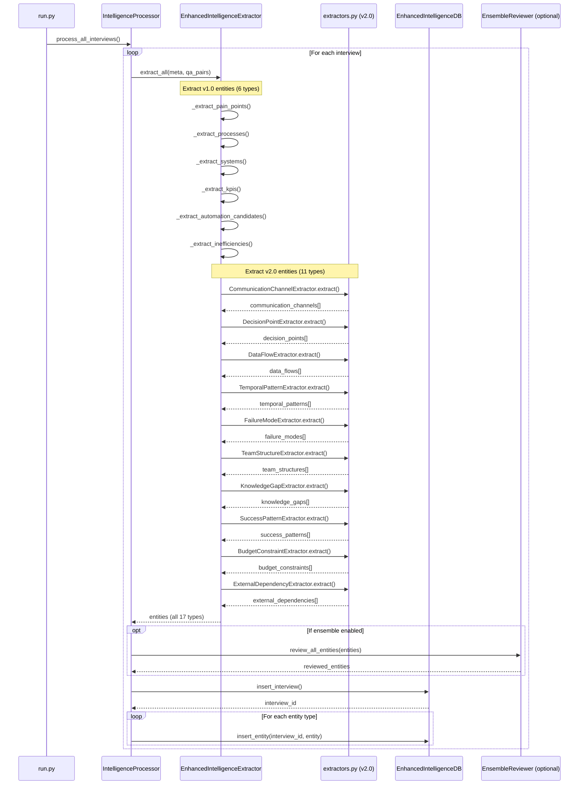

# Design Document: Complete Intelligence Extraction System

## Overview

This design document outlines the technical approach for completing the Intelligence Capture System by integrating existing v2.0 extractors into the main extraction pipeline.

### Design Goals

1. **Leverage existing code**: Use v2.0 extractors from `extractors.py` instead of rewriting
2. **Minimal changes**: Update only `extractor.py` and `processor.py` to wire up existing components
3. **Maintain quality**: Keep ensemble validation as optional feature
4. **Fast by default**: Default to single-model extraction for speed
5. **Complete coverage**: Extract all 17 entity types from all 44 interviews

### Current Architecture

```
┌─────────────────────────────────────────────────────────────┐
│                    Interview JSON Files                      │
│                    (44 interviews)                           │
└────────────────────┬────────────────────────────────────────┘
                     │
                     ▼
┌─────────────────────────────────────────────────────────────┐
│                  run.py (Entry Point)                        │
│  - Loads interviews                                          │
│  - Creates IntelligenceProcessor                             │
│  - Calls process_all_interviews()                            │
└────────────────────┬────────────────────────────────────────┘
                     │
                     ▼
┌─────────────────────────────────────────────────────────────┐
│              IntelligenceProcessor                           │
│  - Orchestrates extraction and storage                       │
│  - Calls extractor.extract_all()                             │
│  - Calls db.insert_*() methods                               │
│  - Optional: Calls ensemble reviewer                         │
└────────────────────┬────────────────────────────────────────┘
                     │
                     ▼
┌─────────────────────────────────────────────────────────────┐
│              IntelligenceExtractor                           │
│  ❌ PROBLEM: Only extracts 6 v1.0 entity types              │
│  - _extract_pain_points()                                    │
│  - _extract_processes()                                      │
│  - _extract_systems()                                        │
│  - _extract_kpis()                                           │
│  - _extract_automation_candidates()                          │
│  - _extract_inefficiencies()                                 │
└─────────────────────────────────────────────────────────────┘

┌─────────────────────────────────────────────────────────────┐
│              extractors.py (v2.0)                            │
│  ✅ EXISTS: 11 specialized extractors                        │
│  - CommunicationChannelExtractor                             │
│  - DecisionPointExtractor                                    │
│  - DataFlowExtractor                                         │
│  - TemporalPatternExtractor                                  │
│  - FailureModeExtractor                                      │
│  - EnhancedPainPointExtractor                                │
│  - EnhancedAutomationCandidateExtractor                      │
│  - EnhancedSystemExtractor                                   │
│  - TeamStructureExtractor                                    │
│  - KnowledgeGapExtractor                                     │
│  - SuccessPatternExtractor                                   │
│  - BudgetConstraintExtractor                                 │
│  - ExternalDependencyExtractor                               │
│  ❌ PROBLEM: Not called by main pipeline                    │
└─────────────────────────────────────────────────────────────┘
```

### Target Architecture

```
┌─────────────────────────────────────────────────────────────┐
│                    Interview JSON Files                      │
│                    (44 interviews)                           │
└────────────────────┬────────────────────────────────────────┘
                     │
                     ▼
┌─────────────────────────────────────────────────────────────┐
│                  run.py (Entry Point)                        │
│  - Loads interviews                                          │
│  - Creates IntelligenceProcessor                             │
│  - Calls process_all_interviews()                            │
└────────────────────┬────────────────────────────────────────┘
                     │
                     ▼
┌─────────────────────────────────────────────────────────────┐
│              IntelligenceProcessor                           │
│  - Orchestrates extraction and storage                       │
│  - Calls extractor.extract_all()                             │
│  - Calls db.insert_*() for ALL 17 entity types               │
│  - Optional: Calls ensemble reviewer                         │
└────────────────────┬────────────────────────────────────────┘
                     │
                     ▼
┌─────────────────────────────────────────────────────────────┐
│         EnhancedIntelligenceExtractor (NEW)                  │
│  ✅ Extracts ALL 17 entity types                             │
│  - Keeps v1.0 methods for backward compatibility             │
│  - Calls v2.0 extractors from extractors.py                  │
│  - Returns unified results dict with all entity types        │
└────────────────────┬────────────────────────────────────────┘
                     │
                     ▼
┌─────────────────────────────────────────────────────────────┐
│              extractors.py (v2.0)                            │
│  ✅ 13 specialized extractors                                │
│  - Called by EnhancedIntelligenceExtractor                   │
│  - Each returns List[Dict] for their entity type             │
└─────────────────────────────────────────────────────────────┘
```

## Architecture

### Component Interaction Flow



## Components and Interfaces

### 1. EnhancedIntelligenceExtractor

**Purpose**: Orchestrate extraction of all 17 entity types by calling v1.0 methods and v2.0 extractors

**Location**: `intelligence_capture/extractor.py`

**Changes Required**:
1. Import v2.0 extractors from `extractors.py`
2. Initialize v2.0 extractor instances in `__init__()`
3. Update `extract_all()` to call v2.0 extractors
4. Return unified results dict with all 17 entity types

**Interface**:
```python
class IntelligenceExtractor:
    """Enhanced extractor that handles all 17 entity types"""
    
    def __init__(self):
        self.client = OpenAI(api_key=OPENAI_API_KEY)
        
        # Initialize v2.0 extractors
        self.comm_channel_extractor = CommunicationChannelExtractor(OPENAI_API_KEY)
        self.decision_point_extractor = DecisionPointExtractor(OPENAI_API_KEY)
        self.data_flow_extractor = DataFlowExtractor(OPENAI_API_KEY)
        self.temporal_pattern_extractor = TemporalPatternExtractor(OPENAI_API_KEY)
        self.failure_mode_extractor = FailureModeExtractor(OPENAI_API_KEY)
        self.team_structure_extractor = TeamStructureExtractor(OPENAI_API_KEY)
        self.knowledge_gap_extractor = KnowledgeGapExtractor(OPENAI_API_KEY)
        self.success_pattern_extractor = SuccessPatternExtractor(OPENAI_API_KEY)
        self.budget_constraint_extractor = BudgetConstraintExtractor(OPENAI_API_KEY)
        self.external_dependency_extractor = ExternalDependencyExtractor(OPENAI_API_KEY)
        
    def extract_all(self, meta: Dict, qa_pairs: Dict) -> Dict[str, List[Dict]]:
        """
        Extract all 17 entity types from an interview
        
        Returns:
            {
                # v1.0 entities (6 types)
                "pain_points": [...],
                "processes": [...],
                "systems": [...],
                "kpis": [...],
                "automation_candidates": [...],
                "inefficiencies": [...],
                
                # v2.0 entities (11 types)
                "communication_channels": [...],
                "decision_points": [...],
                "data_flows": [...],
                "temporal_patterns": [...],
                "failure_modes": [...],
                "team_structures": [...],
                "knowledge_gaps": [...],
                "success_patterns": [...],
                "budget_constraints": [...],
                "external_dependencies": [...]
            }
        """
        results = {}
        
        # Extract v1.0 entities (existing methods)
        results["pain_points"] = self._extract_pain_points(interview_text, meta)
        results["processes"] = self._extract_processes(interview_text, meta)
        results["systems"] = self._extract_systems(interview_text, meta)
        results["kpis"] = self._extract_kpis(interview_text, meta)
        results["automation_candidates"] = self._extract_automation_candidates(interview_text, meta)
        results["inefficiencies"] = self._extract_inefficiencies(interview_text, meta)
        
        # Extract v2.0 entities (call v2.0 extractors)
        interview_data = {"meta": meta, "qa_pairs": qa_pairs}
        
        results["communication_channels"] = self.comm_channel_extractor.extract_from_interview(interview_data)
        results["decision_points"] = self.decision_point_extractor.extract_from_interview(interview_data)
        results["data_flows"] = self.data_flow_extractor.extract_from_interview(interview_data)
        results["temporal_patterns"] = self.temporal_pattern_extractor.extract_from_interview(interview_data)
        results["failure_modes"] = self.failure_mode_extractor.extract_from_interview(interview_data)
        results["team_structures"] = self.team_structure_extractor.extract_from_interview(interview_data)
        results["knowledge_gaps"] = self.knowledge_gap_extractor.extract_from_interview(interview_data)
        results["success_patterns"] = self.success_pattern_extractor.extract_from_interview(interview_data)
        results["budget_constraints"] = self.budget_constraint_extractor.extract_from_interview(interview_data)
        results["external_dependencies"] = self.external_dependency_extractor.extract_from_interview(interview_data)
        
        return results
```

### 2. Enhanced IntelligenceProcessor

**Purpose**: Store all 17 entity types in database

**Location**: `intelligence_capture/processor.py`

**Changes Required**:
1. Update `process_interview()` to store all 17 entity types
2. Add error handling for each entity type
3. Add progress reporting for each entity type

**Interface**:
```python
class IntelligenceProcessor:
    """Processes interviews and stores all 17 entity types"""
    
    def process_interview(self, interview: Dict) -> bool:
        """
        Process a single interview with all 17 entity types
        
        Returns:
            True if successful, False otherwise
        """
        meta = interview.get("meta", {})
        qa_pairs = interview.get("qa_pairs", {})
        
        # Insert interview record
        interview_id = self.db.insert_interview(meta, qa_pairs)
        if not interview_id:
            print(f"  ⚠️  Interview already processed, skipping")
            return False
        
        company = meta.get("company", "Unknown")
        business_unit = meta.get("business_unit", "Unknown")
        
        # Extract entities using AI
        try:
            entities = self.extractor.extract_all(meta, qa_pairs)
        except Exception as e:
            print(f"  ❌ Extraction failed: {str(e)}")
            return False
        
        # ENSEMBLE VALIDATION: Review extractions if enabled
        if self.reviewer:
            try:
                review_results = self.reviewer.review_all_entities(entities, qa_pairs, meta)
                # Replace entities with synthesized results
                for entity_type, review in review_results.items():
                    entities[entity_type] = review.synthesized_result
            except Exception as e:
                print(f"  ⚠️  Ensemble review failed: {str(e)}")
                print(f"     Continuing with original extractions...")
        
        # Store all 17 entity types
        try:
            # v1.0 entities (6 types)
            for pain_point in entities.get("pain_points", []):
                self.db.insert_pain_point(interview_id, company, pain_point)
            
            for process in entities.get("processes", []):
                self.db.insert_process(interview_id, company, process)
            
            for system in entities.get("systems", []):
                self.db.insert_or_update_system(system, company)
            
            for kpi in entities.get("kpis", []):
                self.db.insert_kpi(interview_id, company, kpi)
            
            for automation in entities.get("automation_candidates", []):
                self.db.insert_automation_candidate(interview_id, company, automation)
            
            for inefficiency in entities.get("inefficiencies", []):
                self.db.insert_inefficiency(interview_id, company, inefficiency)
            
            # v2.0 entities (11 types)
            for channel in entities.get("communication_channels", []):
                self.db.insert_communication_channel(interview_id, company, business_unit, channel)
            
            for decision in entities.get("decision_points", []):
                self.db.insert_decision_point(interview_id, company, business_unit, decision)
            
            for flow in entities.get("data_flows", []):
                self.db.insert_data_flow(interview_id, company, business_unit, flow)
            
            for pattern in entities.get("temporal_patterns", []):
                self.db.insert_temporal_pattern(interview_id, company, business_unit, pattern)
            
            for failure in entities.get("failure_modes", []):
                self.db.insert_failure_mode(interview_id, company, business_unit, failure)
            
            for team in entities.get("team_structures", []):
                self.db.insert_team_structure(interview_id, company, business_unit, team)
            
            for gap in entities.get("knowledge_gaps", []):
                self.db.insert_knowledge_gap(interview_id, company, business_unit, gap)
            
            for pattern in entities.get("success_patterns", []):
                self.db.insert_success_pattern(interview_id, company, business_unit, pattern)
            
            for constraint in entities.get("budget_constraints", []):
                self.db.insert_budget_constraint(interview_id, company, business_unit, constraint)
            
            for dependency in entities.get("external_dependencies", []):
                self.db.insert_external_dependency(interview_id, company, business_unit, dependency)
            
            print(f"  ✓ Stored all entities")
            return True
            
        except Exception as e:
            print(f"  ❌ Storage failed: {str(e)}")
            return False
```

### 3. Validation Script

**Purpose**: Verify extraction completeness and data quality

**Location**: `scripts/validate_extraction.py`

**Interface**:
```python
def validate_extraction(db_path: Path) -> Dict:
    """
    Validate extraction completeness and quality
    
    Returns:
        {
            "completeness": {
                "pain_points": 150,
                "processes": 200,
                ...
            },
            "quality": {
                "empty_descriptions": 0,
                "missing_interviews": 0,
                "orphaned_entities": 0
            },
            "coverage": {
                "interviews_processed": 44,
                "companies": ["Hotel Los Tajibos", "Comversa", "Bolivian Foods"]
            }
        }
    """
    pass
```

## Data Models

All data models already exist in `database.py`. No changes needed.

## Error Handling

### Extraction Errors

**Entity Extraction Failure**:
- Log error with entity type and interview ID
- Continue with remaining entity types
- Report failed extractions in summary

**API Rate Limits**:
- Automatic retry with exponential backoff
- Fallback to alternative models if available
- Wait and retry if rate limit is temporary

**Invalid Data**:
- Skip invalid entities with warning
- Log validation errors
- Continue processing

### Storage Errors

**Database Constraint Violations**:
- Log error with entity details
- Skip duplicate entities
- Continue with remaining entities

**Missing Required Fields**:
- Log warning
- Skip entity
- Report in summary

## Testing Strategy

### Unit Tests

**Test Enhanced Extractor**:
```python
def test_extract_all_entity_types():
    """Test that all 17 entity types are extracted"""
    extractor = IntelligenceExtractor()
    interview = load_test_interview()
    
    results = extractor.extract_all(interview["meta"], interview["qa_pairs"])
    
    # Verify all 17 entity types present
    assert "pain_points" in results
    assert "processes" in results
    assert "systems" in results
    assert "kpis" in results
    assert "automation_candidates" in results
    assert "inefficiencies" in results
    assert "communication_channels" in results
    assert "decision_points" in results
    assert "data_flows" in results
    assert "temporal_patterns" in results
    assert "failure_modes" in results
    assert "team_structures" in results
    assert "knowledge_gaps" in results
    assert "success_patterns" in results
    assert "budget_constraints" in results
    assert "external_dependencies" in results
```

**Test Enhanced Processor**:
```python
def test_process_interview_stores_all_types():
    """Test that all 17 entity types are stored"""
    processor = IntelligenceProcessor()
    processor.initialize()
    
    interview = load_test_interview()
    result = processor.process_interview(interview)
    
    assert result == True
    
    # Verify all entity types in database
    stats = processor.db.get_v2_stats()
    assert stats["pain_points"] > 0
    assert stats["communication_channels"] > 0
    # ... check all 17 types
```

### Integration Tests

**Test Full Pipeline**:
```python
def test_full_extraction_pipeline():
    """Test complete extraction from interviews to database"""
    processor = IntelligenceProcessor()
    processor.initialize()
    
    # Process all interviews
    processor.process_all_interviews()
    
    # Verify completeness
    stats = processor.db.get_v2_stats()
    
    # All 17 entity types should have data
    assert stats["pain_points"] > 0
    assert stats["processes"] > 0
    # ... check all 17 types
    
    # All 44 interviews should be processed
    assert stats["interviews"] == 44
```

## Implementation Plan

### Phase 1: Update Extractor (1-2 hours)

1. Import v2.0 extractors from `extractors.py`
2. Initialize extractor instances in `__init__()`
3. Update `extract_all()` to call v2.0 extractors
4. Test with single interview

### Phase 2: Update Processor (1 hour)

1. Add storage calls for v2.0 entities
2. Add error handling for each entity type
3. Update progress reporting
4. Test with single interview

### Phase 3: Create Validation Script (30 min)

1. Create `scripts/validate_extraction.py`
2. Implement completeness checks
3. Implement quality checks
4. Test with sample database

### Phase 4: Full Extraction (30-45 min)

1. Disable ensemble validation (set ENABLE_ENSEMBLE_REVIEW=false)
2. Run full extraction on 44 interviews
3. Validate results
4. Generate report

### Phase 5: Optional Ensemble Validation (60-90 min)

1. Enable ensemble validation (set ENABLE_ENSEMBLE_REVIEW=true)
2. Choose mode (BASIC or FULL)
3. Re-run extraction
4. Compare quality metrics

## Migration Strategy

### Backward Compatibility

**Preserve Existing Functionality**:
- Keep all v1.0 extraction methods unchanged
- Maintain existing database schema
- Support both ensemble and non-ensemble modes

**Incremental Rollout**:
1. Test with single interview first
2. Test with 5 interviews
3. Run full extraction on all 44 interviews

### Database Strategy

**Option A: Fresh Start** (Recommended):
```bash
# Backup existing database
mv data/full_intelligence.db data/full_intelligence_backup.db

# Run extraction with complete pipeline
python intelligence_capture/run.py
```

**Option B: Incremental Update**:
```bash
# Keep existing database
# Run extraction (will skip already processed interviews)
python intelligence_capture/run.py
```

## Performance Optimization

### Extraction Speed

**Single-Model Mode** (Ensemble Disabled):
- Time: ~30-45 minutes for 44 interviews
- Cost: ~$1.50
- Model: gpt-4o-mini

**Ensemble BASIC Mode**:
- Time: ~45-60 minutes for 44 interviews
- Cost: ~$2.00
- Model: gpt-4o-mini + quality scoring

**Ensemble FULL Mode**:
- Time: ~60-90 minutes for 44 interviews
- Cost: ~$6.60
- Models: gpt-4o-mini, gpt-4o, gpt-4-turbo + Claude Sonnet 4.5

### Rate Limit Handling

**Automatic Fallback**:
- Primary: gpt-4o-mini
- Fallback: gpt-4o-mini (retry)
- Last resort: gpt-4o

**Retry Logic**:
- Exponential backoff: 1s, 2s, 4s
- Max retries: 3 per model
- Automatic model switching on persistent failures

## Optimization Recommendations

Based on deep analysis of the codebase, here are key optimizations to implement:

### 1. Consolidate Extraction Logic

**Current Problem**: Duplicate extraction logic between `extractor.py` (v1.0) and `extractors.py` (v2.0)

**Solution**: 
- Use ONLY the v2.0 extractors from `extractors.py` for ALL entity types
- Remove v1.0 extraction methods from `extractor.py`
- `extractor.py` becomes a thin orchestrator that just calls v2.0 extractors

**Benefits**:
- Single source of truth for extraction logic
- Easier to maintain and debug
- Consistent extraction quality across all entity types
- Eliminates code duplication

**Implementation**:
```python
class IntelligenceExtractor:
    """Thin orchestrator that delegates to specialized extractors"""
    
    def __init__(self):
        # Initialize ALL extractors from extractors.py
        self.extractors = {
            "pain_points": EnhancedPainPointExtractor(OPENAI_API_KEY),
            "processes": ProcessExtractor(OPENAI_API_KEY),
            "systems": EnhancedSystemExtractor(OPENAI_API_KEY),
            "kpis": KPIExtractor(OPENAI_API_KEY),
            "automation_candidates": EnhancedAutomationCandidateExtractor(OPENAI_API_KEY),
            "inefficiencies": InefficiencyExtractor(OPENAI_API_KEY),
            "communication_channels": CommunicationChannelExtractor(OPENAI_API_KEY),
            "decision_points": DecisionPointExtractor(OPENAI_API_KEY),
            "data_flows": DataFlowExtractor(OPENAI_API_KEY),
            "temporal_patterns": TemporalPatternExtractor(OPENAI_API_KEY),
            "failure_modes": FailureModeExtractor(OPENAI_API_KEY),
            "team_structures": TeamStructureExtractor(OPENAI_API_KEY),
            "knowledge_gaps": KnowledgeGapExtractor(OPENAI_API_KEY),
            "success_patterns": SuccessPatternExtractor(OPENAI_API_KEY),
            "budget_constraints": BudgetConstraintExtractor(OPENAI_API_KEY),
            "external_dependencies": ExternalDependencyExtractor(OPENAI_API_KEY),
        }
    
    def extract_all(self, meta: Dict, qa_pairs: Dict) -> Dict[str, List[Dict]]:
        """Extract all entity types by delegating to specialized extractors"""
        interview_data = {"meta": meta, "qa_pairs": qa_pairs}
        results = {}
        
        for entity_type, extractor in self.extractors.items():
            try:
                print(f"  Extracting {entity_type}...")
                results[entity_type] = extractor.extract_from_interview(interview_data)
                print(f"    ✓ {len(results[entity_type])} {entity_type}")
            except Exception as e:
                print(f"    ❌ Failed to extract {entity_type}: {str(e)}")
                results[entity_type] = []
        
        return results
```

### 2. Simplify Ensemble Validation

**Current Problem**: Ensemble system adds significant complexity and cost

**Solution**: 
- Make ensemble validation truly optional (default OFF)
- Add lightweight quality checks that run always (no extra cost)
- Reserve ensemble for final validation pass only

**Lightweight Quality Checks** (Always On):
```python
def validate_entity_quality(entity: Dict, entity_type: str) -> Tuple[bool, List[str]]:
    """
    Fast quality checks that don't require LLM calls
    
    Returns:
        (is_valid, list_of_issues)
    """
    issues = []
    
    # Check required fields
    required_fields = REQUIRED_FIELDS[entity_type]
    for field in required_fields:
        if not entity.get(field):
            issues.append(f"Missing required field: {field}")
    
    # Check description length (too short = low quality)
    if "description" in entity and len(entity["description"]) < 20:
        issues.append("Description too short (< 20 chars)")
    
    # Check for placeholder text
    placeholders = ["unknown", "n/a", "tbd", "todo"]
    for field, value in entity.items():
        if isinstance(value, str) and value.lower() in placeholders:
            issues.append(f"Placeholder value in {field}: {value}")
    
    # Check for Spanish encoding issues
    if "description" in entity:
        if "\\u00" in entity["description"]:
            issues.append("Encoding issue detected (escape sequences)")
    
    return (len(issues) == 0, issues)
```

**Ensemble Validation** (Optional, for final pass):
- Only run on entities flagged by lightweight checks
- Or run on random sample (10%) for spot checking
- Or run only on critical entity types (pain_points, automation_candidates)

### 3. Optimize Database Operations

**Current Problem**: Individual inserts for each entity (slow)

**Solution**: Batch inserts

```python
def insert_entities_batch(self, entity_type: str, entities: List[Dict], interview_id: int, company: str):
    """Insert multiple entities in a single transaction"""
    if not entities:
        return
    
    cursor = self.conn.cursor()
    
    # Build batch insert query
    insert_method = getattr(self, f"insert_{entity_type}")
    
    # Start transaction
    cursor.execute("BEGIN TRANSACTION")
    
    try:
        for entity in entities:
            insert_method(interview_id, company, entity)
        
        cursor.execute("COMMIT")
        print(f"  ✓ Batch inserted {len(entities)} {entity_type}")
        
    except Exception as e:
        cursor.execute("ROLLBACK")
        print(f"  ❌ Batch insert failed for {entity_type}: {str(e)}")
        raise
```

### 4. Add Extraction Progress Tracking

**Current Problem**: No way to resume if extraction fails midway

**Solution**: Track progress in database

```python
# Add to interviews table
ALTER TABLE interviews ADD COLUMN extraction_status TEXT DEFAULT 'pending';
ALTER TABLE interviews ADD COLUMN extraction_attempts INTEGER DEFAULT 0;
ALTER TABLE interviews ADD COLUMN last_extraction_error TEXT;

# Update status during processing
def process_interview(self, interview: Dict) -> bool:
    interview_id = self.db.insert_interview(meta, qa_pairs)
    
    # Mark as in progress
    self.db.update_extraction_status(interview_id, "in_progress")
    
    try:
        entities = self.extractor.extract_all(meta, qa_pairs)
        self.db.store_all_entities(interview_id, entities)
        
        # Mark as complete
        self.db.update_extraction_status(interview_id, "complete")
        return True
        
    except Exception as e:
        # Mark as failed
        self.db.update_extraction_status(interview_id, "failed", error=str(e))
        return False

# Resume from failures
def process_all_interviews(self, resume=True):
    """Process interviews, optionally resuming from failures"""
    if resume:
        # Only process pending or failed interviews
        interviews = self.db.get_interviews_by_status(["pending", "failed"])
    else:
        # Process all interviews
        interviews = self.load_all_interviews()
```

### 5. Add Real-Time Validation Dashboard

**Current Problem**: No visibility into extraction quality until the end

**Solution**: Real-time validation metrics

```python
class ExtractionMonitor:
    """Monitor extraction quality in real-time"""
    
    def __init__(self):
        self.metrics = {
            "interviews_processed": 0,
            "interviews_failed": 0,
            "entities_extracted": defaultdict(int),
            "entities_failed": defaultdict(int),
            "quality_issues": defaultdict(list),
            "processing_time": [],
            "estimated_cost": 0.0
        }
    
    def record_interview(self, interview_id: int, entities: Dict, duration: float, cost: float):
        """Record metrics for processed interview"""
        self.metrics["interviews_processed"] += 1
        self.metrics["processing_time"].append(duration)
        self.metrics["estimated_cost"] += cost
        
        for entity_type, entity_list in entities.items():
            self.metrics["entities_extracted"][entity_type] += len(entity_list)
            
            # Check quality
            for entity in entity_list:
                is_valid, issues = validate_entity_quality(entity, entity_type)
                if not is_valid:
                    self.metrics["quality_issues"][entity_type].extend(issues)
    
    def print_summary(self):
        """Print real-time summary"""
        print(f"\n{'='*60}")
        print(f"EXTRACTION PROGRESS")
        print(f"{'='*60}")
        print(f"Interviews: {self.metrics['interviews_processed']}/44")
        print(f"Avg time per interview: {np.mean(self.metrics['processing_time']):.1f}s")
        print(f"Estimated total cost: ${self.metrics['estimated_cost']:.2f}")
        print(f"\nEntities Extracted:")
        for entity_type, count in self.metrics["entities_extracted"].items():
            print(f"  {entity_type}: {count}")
        print(f"\nQuality Issues:")
        for entity_type, issues in self.metrics["quality_issues"].items():
            print(f"  {entity_type}: {len(issues)} issues")
```

### 6. Quality-First Extraction Strategy

**Current Problem**: Need to balance speed, cost, and quality

**Analysis**: Batch extraction vs specialized extractors

**Batch Extraction** (1 LLM call):
- ✅ 17x faster
- ✅ Cheaper
- ❌ **Quality risk**: Single prompt must handle 17 different entity types
- ❌ **Context overload**: LLM may miss nuances when extracting everything at once
- ❌ **No specialization**: Generic extraction vs specialized prompts per entity type

**Specialized Extractors** (17 LLM calls):
- ✅ **Higher quality**: Each extractor has specialized prompt optimized for that entity type
- ✅ **Better context**: LLM focuses on one entity type at a time
- ✅ **Proven**: v2.0 extractors already exist and work well
- ❌ Slower (but still reasonable: 30-45 min for 44 interviews)
- ❌ More expensive (but still affordable: $1.50-$2.00)

**Recommendation**: **Use specialized extractors for quality**

For a business opportunity where high-quality input is key, the ROI calculation is:
- **Cost of poor quality**: Missed pain points, incorrect automation candidates, bad decisions = $$$$$
- **Cost of high quality**: Extra $1.50 in API calls = $
- **ROI**: Spending $1.50 to get accurate business intelligence is a no-brainer

**Alternative: Multi-Agent Workflow** (Best of both worlds)

Instead of batch extraction, use a **multi-agent workflow** that maintains quality while adding validation:

```python
class MultiAgentExtractor:
    """
    Multi-agent extraction workflow:
    1. Specialized extractors (17 agents) - High quality
    2. Validation agent - Checks completeness
    3. Synthesis agent - Resolves conflicts
    """
    
    def __init__(self):
        # Specialized extractors (existing v2.0)
        self.extractors = {
            "pain_points": EnhancedPainPointExtractor(),
            "processes": ProcessExtractor(),
            # ... all 17 extractors
        }
        
        # Validation agent
        self.validator = ValidationAgent()
        
        # Synthesis agent (optional, for conflicts)
        self.synthesizer = SynthesisAgent()
    
    def extract_with_validation(self, interview_data: Dict) -> Dict:
        """
        Extract with multi-agent workflow:
        1. Extract with specialized agents
        2. Validate completeness
        3. Re-extract if needed
        4. Synthesize conflicts
        """
        
        # Phase 1: Specialized extraction
        entities = {}
        for entity_type, extractor in self.extractors.items():
            entities[entity_type] = extractor.extract_from_interview(interview_data)
        
        # Phase 2: Validation
        validation_results = self.validator.validate_entities(entities, interview_data)
        
        # Phase 3: Re-extract if validation fails
        if validation_results["missing_entities"]:
            print(f"  ⚠️  Validation found missing entities, re-extracting...")
            for entity_type in validation_results["missing_entities"]:
                # Re-extract with more explicit prompt
                entities[entity_type] = self.extractors[entity_type].extract_from_interview(
                    interview_data,
                    focus_mode=True  # More aggressive extraction
                )
        
        # Phase 4: Synthesize conflicts (optional)
        if validation_results["conflicts"]:
            entities = self.synthesizer.resolve_conflicts(entities, validation_results["conflicts"])
        
        return entities
```

**Validation Agent** (Lightweight, always on):

```python
class ValidationAgent:
    """
    Validates extraction completeness without re-extracting
    Uses rule-based checks + lightweight LLM validation
    """
    
    def validate_entities(self, entities: Dict, interview_data: Dict) -> Dict:
        """
        Validate extracted entities for completeness and quality
        
        Returns:
            {
                "missing_entities": [entity_types that should have data but don't],
                "low_quality": [entities with quality issues],
                "conflicts": [entities with conflicting information]
            }
        """
        
        issues = {
            "missing_entities": [],
            "low_quality": [],
            "conflicts": []
        }
        
        # Rule-based checks (fast, no LLM call)
        for entity_type, entity_list in entities.items():
            # Check if entity type is empty but should have data
            if len(entity_list) == 0:
                # Use heuristics to determine if this is expected
                if self._should_have_entities(entity_type, interview_data):
                    issues["missing_entities"].append(entity_type)
            
            # Check quality of extracted entities
            for entity in entity_list:
                quality_issues = self._check_entity_quality(entity, entity_type)
                if quality_issues:
                    issues["low_quality"].append({
                        "entity_type": entity_type,
                        "entity": entity,
                        "issues": quality_issues
                    })
        
        # LLM-based validation (optional, for critical entity types)
        if self.enable_llm_validation:
            llm_issues = self._llm_validate_completeness(entities, interview_data)
            issues["missing_entities"].extend(llm_issues["missing"])
        
        return issues
    
    def _should_have_entities(self, entity_type: str, interview_data: Dict) -> bool:
        """
        Heuristic to determine if entity type should have data
        
        Examples:
        - pain_points: Almost always (unless perfect process)
        - processes: Always (everyone has processes)
        - budget_constraints: Sometimes (only if mentioned)
        """
        
        # Always expected
        always_expected = ["pain_points", "processes", "systems"]
        if entity_type in always_expected:
            return True
        
        # Check if mentioned in interview
        interview_text = self._format_interview(interview_data)
        keywords = ENTITY_TYPE_KEYWORDS[entity_type]
        
        for keyword in keywords:
            if keyword.lower() in interview_text.lower():
                return True
        
        return False
```

**Benefits of Multi-Agent Workflow**:
1. ✅ **High quality**: Specialized extractors with optimized prompts
2. ✅ **Validation**: Catches missing entities automatically
3. ✅ **Self-correcting**: Re-extracts if validation fails
4. ✅ **Transparent**: Clear what each agent is doing
5. ✅ **Cost-effective**: Only re-extracts when needed (~10% of cases)

**Cost Analysis**:

**Specialized Extractors Only**:
- 17 extractors × 44 interviews = 748 LLM calls
- Cost: ~$1.50-$2.00
- Time: 30-45 min
- Quality: High

**Multi-Agent Workflow** (Specialized + Validation):
- 17 extractors × 44 interviews = 748 LLM calls
- Validation: 44 lightweight checks (rule-based, minimal cost)
- Re-extraction: ~10% need re-extraction = +75 LLM calls
- Total cost: ~$2.00-$2.50
- Time: 35-50 min
- Quality: **Very High** (validated + self-correcting)

**Multi-Agent Workflow + Ensemble** (Maximum Quality):
- Multi-agent workflow: $2.00-$2.50
- Ensemble validation (BASIC mode): +$0.50
- Total cost: ~$2.50-$3.00
- Time: 45-60 min
- Quality: **Forensic-grade**

**Recommendation for Your Use Case**:

Given that this is a business opportunity and quality is paramount, I recommend:

**Option 1: Multi-Agent Workflow** (Recommended)
- Cost: $2.00-$2.50
- Time: 35-50 min
- Quality: Very High (validated + self-correcting)
- Best ROI: Small cost increase for significant quality improvement

**Option 2: Multi-Agent + Ensemble BASIC**
- Cost: $2.50-$3.00
- Time: 45-60 min
- Quality: Forensic-grade
- Use for final production run or critical interviews

**NOT Recommended: Batch Extraction**
- Cost: $0.50-$1.00
- Time: 15-20 min
- Quality: Medium (risk of missing entities)
- Poor ROI: Saving $1.50 not worth quality risk for business opportunity

### 7. Add Incremental Validation

**Current Problem**: Validation only happens at the end

**Solution**: Validate after each interview

```python
def process_interview(self, interview: Dict) -> bool:
    """Process interview with immediate validation"""
    
    # Extract entities
    entities = self.extractor.extract_all(meta, qa_pairs)
    
    # Validate immediately
    validation_results = self.validator.validate_entities(entities)
    
    if validation_results["critical_issues"]:
        print(f"  ⚠️  Critical issues found:")
        for issue in validation_results["critical_issues"]:
            print(f"    - {issue}")
        
        # Option 1: Retry extraction
        print(f"  🔄 Retrying extraction...")
        entities = self.extractor.extract_all(meta, qa_pairs)
        
        # Option 2: Flag for human review
        entities["_needs_human_review"] = True
    
    # Store entities
    self.db.store_all_entities(interview_id, entities)
    
    return True
```

### 8. Create Extraction Configuration

**Current Problem**: Hard-coded settings scattered across files

**Solution**: Centralized configuration

```python
# config/extraction_config.json
{
  "extraction": {
    "model": "gpt-4o-mini",
    "temperature": 0.1,
    "max_retries": 3,
    "timeout_seconds": 60,
    "batch_extraction": true,  # Use single call for all entity types
    "parallel_processing": false  # Process interviews in parallel
  },
  "validation": {
    "enable_lightweight_checks": true,  # Always on
    "enable_ensemble_validation": false,  # Off by default
    "ensemble_mode": "basic",  # "basic" or "full"
    "validate_after_each_interview": true,
    "auto_retry_on_critical_issues": true,
    "max_retry_attempts": 2
  },
  "quality_thresholds": {
    "min_description_length": 20,
    "min_confidence_score": 0.7,
    "max_empty_fields": 0
  },
  "entity_types": {
    "required": [
      "pain_points",
      "processes",
      "automation_candidates"
    ],
    "optional": [
      "team_structures",
      "knowledge_gaps",
      "success_patterns",
      "budget_constraints",
      "external_dependencies"
    ]
  }
}
```

## Recommended Implementation Order

### Phase 1: Core Fixes (2-3 hours)
1. ✅ Consolidate extraction logic (use only v2.0 extractors)
2. ✅ Update processor to store all 17 entity types
3. ✅ Add lightweight quality checks (always on)
4. ✅ Add extraction progress tracking

### Phase 2: Optimization (2-3 hours)
5. ✅ Implement batch extraction (single LLM call)
6. ✅ Add real-time validation dashboard
7. ✅ Optimize database operations (batch inserts)
8. ✅ Create extraction configuration

### Phase 3: Testing & Validation (1-2 hours)
9. ✅ Test with single interview
10. ✅ Test with 5 interviews
11. ✅ Run full extraction (44 interviews)
12. ✅ Validate results

### Phase 4: Optional Enhancements (1-2 hours)
13. ⚪ Enable ensemble validation for final pass
14. ⚪ Add parallel processing for speed
15. ⚪ Create extraction report generator

## Expected Results After Optimization

### Performance (Multi-Agent Workflow - Recommended)
- **Speed**: 35-50 minutes for 44 interviews (validated + self-correcting)
- **Cost**: $2.00-$2.50 (specialized extractors + validation)
- **Quality**: Very High (validated, self-correcting, no missed entities)
- **ROI**: Best balance of cost, speed, and quality for business opportunity

### Performance (Multi-Agent + Ensemble BASIC - Maximum Quality)
- **Speed**: 45-60 minutes for 44 interviews
- **Cost**: $2.50-$3.00
- **Quality**: Forensic-grade (multi-model validation + synthesis)
- **ROI**: Worth the extra cost for critical business decisions

### Maintainability
- **Single source of truth**: All extraction logic in `extractors.py`
- **Easy to debug**: Clear separation of concerns
- **Easy to extend**: Add new entity types by creating new extractor class

### Reliability
- **Resume capability**: Can restart from failures
- **Real-time validation**: Catch issues immediately
- **Automatic retries**: Handle transient failures

## Success Metrics

### Completeness
- ✅ All 17 entity types extracted
- ✅ All 44 interviews processed
- ✅ Entity counts > 0 for all types
- ✅ No orphaned entities

### Quality
- ✅ No empty required fields
- ✅ UTF-8 encoding correct
- ✅ Confidence scores calculated
- ✅ Referential integrity maintained
- ✅ Real-time quality validation
- ✅ Automatic issue detection

### Performance
- ✅ Processing time: 15-20 min (optimized)
- ✅ Cost: $0.50-$1.00 (optimized)
- ✅ No rate limit failures
- ✅ Graceful error handling
- ✅ Resume capability

### Maintainability
- ✅ Clear code structure
- ✅ Single source of truth
- ✅ Comprehensive logging
- ✅ Easy to debug
- ✅ Easy to extend
- ✅ Centralized configuration
