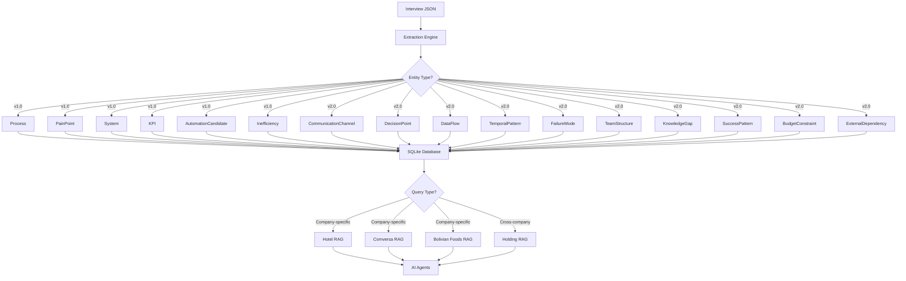

# Design Document: Enhanced Ontology Schema for Knowledge Graph

## Overview

This design document outlines the technical architecture for enhancing the Intelligence Capture System from v1.0 (7 entity types) to v2.0 (17 entity types) to support AI-driven transformation across three companies with multiple business units.

### Design Goals

1. **Multi-level hierarchy**: Support Holding → Company → Business Unit → Department → Process structure
2. **Company-specific RAG databases**: Enable separate knowledge graphs per company with unified schema
3. **Operational intelligence**: Capture HOW, WHEN, WHO, WHERE, WHY in addition to WHAT
4. **CEO assumption validation**: Data-driven validation of prioritized macroprocesos
5. **AI agent readiness**: Provide routing, escalation, prediction, and coordination capabilities
6. **Backward compatibility**: Maintain existing v1.0 functionality while adding v2.0 enhancements

### Architecture Principles

- **Schema-first design**: Define comprehensive JSON schema before implementation
- **Incremental extraction**: Extract v2.0 entities without reprocessing v1.0 data
- **Confidence scoring**: All extractions include confidence scores for quality control
- **Traceability**: Every entity links back to source interview and question
- **Flexibility**: Support both company-specific and cross-company queries

## Architecture

### System Components

```
┌─────────────────────────────────────────────────────────────┐
│                    Interview Data Sources                    │
│  (44 WhatsApp interviews, JSON format, 3 companies)         │
└────────────────────┬────────────────────────────────────────┘
                     │
                     ▼
┌─────────────────────────────────────────────────────────────┐
│              Enhanced Extraction Engine (LLM)                │
│  - v1.0 entities: Process, PainPoint, System, KPI, etc.    │
│  - v2.0 entities: CommunicationChannel, DecisionPoint, etc.│
│  - Confidence scoring & validation                          │
└────────────────────┬────────────────────────────────────────┘
                     │
                     ▼
┌─────────────────────────────────────────────────────────────┐
│              SQLite Knowledge Graph Database                 │
│  - 17 entity tables with relationships                      │
│  - Multi-level hierarchy (Holding → Company → BU → Dept)   │
│  - Partitioned by company for RAG segmentation             │
└────────────────────┬────────────────────────────────────────┘
                     │
                     ▼
┌─────────────────────────────────────────────────────────────┐
│                   Query & Analytics Layer                    │
│  - Company-specific queries                                 │
│  - Cross-company aggregation                                │
│  - CEO assumption validation reports                        │
│  - Priority matrix generation                               │
└────────────────────┬────────────────────────────────────────┘
                     │
                     ▼
┌─────────────────────────────────────────────────────────────┐
│                  RAG Database Generation                     │
│  - Hotel Los Tajibos RAG                                    │
│  - Comversa RAG                                             │
│  - Bolivian Foods RAG                                       │
│  - Holding-level RAG (aggregated)                           │
└─────────────────────────────────────────────────────────────┘
```

### Data Flow Architecture




### Multi-Level Hierarchy Model

```
Holding (Comversa Group)
├── Company: Hotel Los Tajibos
│   ├── Business Unit: Hospitality
│   │   ├── Department: Recepción
│   │   ├── Department: Housekeeping
│   │   └── Department: Reservas
│   ├── Business Unit: Food & Beverage
│   │   ├── Department: Restaurantes
│   │   ├── Department: Bares
│   │   └── Department: Buffet
│   ├── Business Unit: Events & Catering
│   └── Business Unit: Shared Services
│       ├── Department: IT
│       ├── Department: Finanzas
│       └── Department: RRHH
├── Company: Comversa
│   ├── Business Unit: Construction
│   ├── Business Unit: Real Estate Management
│   ├── Business Unit: Real Estate Investment
│   ├── Business Unit: Building Maintenance
│   └── Business Unit: Corporate
└── Company: Bolivian Foods
    ├── Business Unit: Manufacturing
    ├── Business Unit: Franchise Operations
    ├── Business Unit: Distribution
    └── Business Unit: Corporate
```

## Components and Interfaces

### 1. Enhanced Extraction Engine

**Purpose**: Process interview transcripts and extract v2.0 entities with confidence scoring

**Key Components**:
- **LLM Prompt Templates**: Structured prompts for each entity type
- **Confidence Scorer**: Evaluates extraction quality based on language clarity
- **Validation Engine**: Detects conflicts and flags low-confidence extractions
- **Relationship Mapper**: Links entities (e.g., Process → CommunicationChannel)

**Interface**:
```python
class EnhancedExtractor:
    def extract_entities(
        self, 
        interview_data: Dict,
        entity_types: List[str] = "all"
    ) -> ExtractionResult:
        """
        Extract entities from interview data
        
        Args:
            interview_data: Parsed interview JSON
            entity_types: List of entity types to extract or "all"
            
        Returns:
            ExtractionResult with entities, confidence scores, and metadata
        """
        pass
    
    def validate_extraction(
        self,
        entities: List[Entity]
    ) -> ValidationReport:
        """
        Validate extracted entities for quality and conflicts
        """
        pass
```


### 2. Enhanced Database Schema

**Purpose**: Store all v1.0 and v2.0 entities with multi-level hierarchy and relationships

**Schema Design Principles**:
- All tables include: `holding_name`, `company_name`, `business_unit`, `department`
- All tables include: `confidence_score`, `needs_review`, `extraction_source`
- Foreign keys maintain referential integrity
- Indexes optimize company-specific and cross-company queries
- JSON fields store complex nested data (lists, objects)

**Core Tables** (see Data Models section for detailed schemas):
1. `interviews` - Interview metadata and raw data
2. `pain_points` - Enhanced with intensity, frequency, JTBD context, cost
3. `processes` - Enhanced with communication, decision points, temporal patterns
4. `systems` - Enhanced with integration pain points, satisfaction scores
5. `kpis` - Enhanced with thresholds and business unit context
6. `automation_candidates` - Enhanced with monitoring, approval requirements
7. `inefficiencies` - Enhanced with time wasted quantification
8. `communication_channels` - NEW: How people communicate
9. `decision_points` - NEW: Who decides what and when to escalate
10. `data_flows` - NEW: Where data moves between systems
11. `temporal_patterns` - NEW: When activities happen
12. `failure_modes` - NEW: What goes wrong and recovery procedures
13. `team_structures` - NEW: Who works with who
14. `knowledge_gaps` - NEW: Training needs
15. `success_patterns` - NEW: What works well
16. `budget_constraints` - NEW: Money limits and approval thresholds
17. `external_dependencies` - NEW: Vendors and partners

**Interface**:
```python
class EnhancedIntelligenceDB(IntelligenceDB):
    """Extended database with v2.0 entities"""
    
    def init_v2_schema(self):
        """Create v2.0 tables while preserving v1.0 data"""
        pass
    
    def insert_communication_channel(
        self, 
        interview_id: int,
        company: str,
        business_unit: str,
        channel: Dict
    ):
        """Insert communication channel entity"""
        pass
    
    def query_by_company(
        self,
        company_name: str,
        entity_type: str,
        filters: Dict = None
    ) -> List[Dict]:
        """Query entities for specific company"""
        pass
    
    def query_cross_company(
        self,
        entity_type: str,
        aggregation: str = "count"
    ) -> Dict:
        """Aggregate entities across all companies"""
        pass
```

### 3. CEO Assumption Validator

**Purpose**: Compare CEO-prioritized macroprocesos against interview data

**Key Components**:
- **Priority Matcher**: Maps interview pain points to CEO priorities
- **Data Support Calculator**: Measures how many interviews mention each priority
- **Opportunity Detector**: Identifies high-frequency pain points not in CEO list
- **Report Generator**: Creates validation reports with recommendations

**Interface**:
```python
class CEOAssumptionValidator:
    def __init__(self, db: EnhancedIntelligenceDB):
        self.db = db
        self.ceo_priorities = self._load_ceo_priorities()
    
    def validate_priorities(self) -> ValidationReport:
        """
        Compare CEO priorities against interview data
        
        Returns:
            ValidationReport with:
            - Confirmed priorities (high data support)
            - Weak priorities (low data support)
            - Overlooked opportunities (high frequency, not in CEO list)
            - Emergent opportunities (new automation candidates)
        """
        pass
    
    def calculate_data_support(
        self,
        macroproceso: str
    ) -> float:
        """
        Calculate data support score for a macroproceso
        Score = (interviews mentioning / total interviews)
        """
        pass
```


### 4. RAG Database Generator

**Purpose**: Create company-specific and holding-level RAG databases for AI agents

**Key Components**:
- **Embedding Generator**: Creates vector embeddings for semantic search
- **Company Partitioner**: Segments data by company for separate RAG databases
- **Context Builder**: Constructs rich context from related entities
- **Query Interface**: Enables natural language queries to knowledge graph

**Interface**:
```python
class RAGDatabaseGenerator:
    def __init__(self, db: EnhancedIntelligenceDB):
        self.db = db
        self.embedding_model = "text-embedding-3-small"
    
    def generate_company_rag(
        self,
        company_name: str,
        output_path: Path
    ):
        """
        Generate RAG database for specific company
        
        Includes:
        - All entities for that company
        - Cross-references to related entities
        - Vector embeddings for semantic search
        """
        pass
    
    def generate_holding_rag(
        self,
        output_path: Path
    ):
        """
        Generate holding-level RAG database
        
        Includes:
        - Aggregated data from all companies
        - Cross-company patterns and insights
        - Comparative analysis capabilities
        """
        pass
    
    def build_entity_context(
        self,
        entity: Dict,
        depth: int = 2
    ) -> str:
        """
        Build rich context for an entity by traversing relationships
        
        Example for PainPoint:
        - Related Process
        - Related Systems
        - Related FailureModes
        - Related AutomationCandidates
        """
        pass
```

### 5. Priority Matrix Analyzer

**Purpose**: Map automation candidates to Effort vs Impact matrix

**Key Components**:
- **Effort Estimator**: Scores automation complexity (1-5)
- **Impact Calculator**: Scores business impact (1-5)
- **Quadrant Classifier**: Assigns to Quick Win, Strategic, Incremental, Reconsider
- **ROI Calculator**: Estimates return on investment

**Interface**:
```python
class PriorityMatrixAnalyzer:
    def __init__(self, db: EnhancedIntelligenceDB):
        self.db = db
    
    def analyze_automation_candidate(
        self,
        candidate: Dict
    ) -> PriorityAnalysis:
        """
        Analyze automation candidate and assign to matrix quadrant
        
        Returns:
            PriorityAnalysis with:
            - effort_score (1-5)
            - impact_score (1-5)
            - priority_quadrant
            - estimated_roi_months
            - ranking within quadrant
        """
        pass
    
    def estimate_effort(
        self,
        candidate: Dict
    ) -> int:
        """
        Estimate effort score based on:
        - Number of systems involved
        - Complexity rating
        - Data integration requirements
        """
        pass
    
    def estimate_impact(
        self,
        candidate: Dict
    ) -> int:
        """
        Estimate impact score based on:
        - Pain point severity
        - Pain point frequency
        - Number of affected roles
        - Estimated cost savings
        """
        pass
```

## Data Models

### Enhanced Interview Entity

```json
{
  "id": 1,
  "holding_name": "Comversa Group",
  "company_name": "Hotel Los Tajibos",
  "business_unit": "Food & Beverage",
  "department": "Restaurantes",
  "respondent_name": "Juan Pérez",
  "respondent_role": "Gerente de Restaurantes",
  "interview_date": "2024-10-15",
  "interview_method": "WhatsApp",
  "interview_duration_minutes": 45,
  "raw_qa_pairs": {...},
  "processed_at": "2024-11-07T10:30:00Z",
  "suggested_follow_up_questions": [
    "¿Cuántas veces por semana ocurre el problema de conciliación?",
    "¿Qué sistemas específicos están involucrados?"
  ]
}
```


### Enhanced PainPoint Entity (v2.0)

```json
{
  "id": 1,
  "interview_id": 1,
  "holding_name": "Comversa Group",
  "company_name": "Hotel Los Tajibos",
  "business_unit": "Food & Beverage",
  "department": "Restaurantes",
  
  // v1.0 fields
  "type": "Process Inefficiency",
  "description": "Conciliación manual entre Opera, Simphony y SAP",
  "affected_roles": ["Gerente de Restaurantes", "Contador"],
  "affected_processes": ["Cierre diario de ventas"],
  "severity": "High",
  "impact_description": "Retraso en reportes, errores de conciliación",
  "proposed_solutions": ["Integración automática entre sistemas"],
  
  // v2.0 enhancements
  "intensity_score": 8,
  "frequency": "Daily",
  "hair_on_fire": true,
  "time_wasted_per_occurrence_minutes": 120,
  "cost_impact_monthly_usd": 2000,
  "estimated_annual_cost_usd": 24000,
  
  // JTBD context
  "jtbd_who": "Gerente de Restaurantes",
  "jtbd_what": "Cerrar ventas del día",
  "jtbd_where": "Durante cierre diario (22:00-24:00)",
  "jtbd_formatted": "When closing daily sales, I want to reconcile all systems automatically, but I have to do it manually which takes 2 hours",
  
  // Root cause analysis
  "root_cause": "Sistemas no integrados, doble entrada manual",
  "current_workaround": "Exportar de cada sistema y conciliar en Excel",
  
  // Metadata
  "confidence_score": 0.95,
  "needs_review": false,
  "extraction_source": "interview_1_question_5",
  "extraction_reasoning": "Explicit mention of manual reconciliation with time estimate",
  "created_at": "2024-11-07T10:30:00Z"
}
```

### CommunicationChannel Entity (NEW v2.0)

```json
{
  "id": 1,
  "interview_id": 1,
  "holding_name": "Comversa Group",
  "company_name": "Hotel Los Tajibos",
  "business_unit": "Hospitality",
  "department": "Ingeniería",
  
  "channel_name": "WhatsApp",
  "purpose": "Solicitudes urgentes de mantenimiento",
  "frequency": "Continuous",
  "participants": ["Recepción", "Housekeeping", "Ingeniería"],
  "response_sla_minutes": 15,
  
  "pain_points": [
    "Pérdida de trazabilidad",
    "Información dispersa en múltiples grupos",
    "Difícil hacer seguimiento"
  ],
  
  "related_processes": ["Gestión de mantenimiento", "Atención de quejas"],
  
  "confidence_score": 0.90,
  "needs_review": false,
  "extraction_source": "interview_3_question_7",
  "created_at": "2024-11-07T10:30:00Z"
}
```

### DecisionPoint Entity (NEW v2.0)

```json
{
  "id": 1,
  "interview_id": 1,
  "holding_name": "Comversa Group",
  "company_name": "Hotel Los Tajibos",
  "business_unit": "Hospitality",
  "department": "Ingeniería",
  
  "decision_type": "Priorización de mantenimiento",
  "decision_maker_role": "Jefe de Ingeniería",
  "decision_criteria": [
    "Afecta seguridad del huésped",
    "Afecta experiencia del huésped",
    "Afecta operaciones críticas"
  ],
  
  "approval_required": false,
  "approval_threshold": null,
  "authority_limit_usd": 5000,
  
  "escalation_trigger": "Afecta seguridad OR costo > $5000",
  "escalation_to_role": "Gerente de Operaciones",
  
  "related_process": "Gestión de solicitudes de mantenimiento",
  
  "confidence_score": 0.85,
  "needs_review": false,
  "extraction_source": "interview_3_question_12",
  "created_at": "2024-11-07T10:30:00Z"
}
```

### DataFlow Entity (NEW v2.0)

```json
{
  "id": 1,
  "interview_id": 1,
  "holding_name": "Comversa Group",
  "company_name": "Hotel Los Tajibos",
  "business_unit": "Food & Beverage",
  "department": "Restaurantes",
  
  "source_system": "Simphony POS",
  "target_system": "SAP",
  "data_type": "Ventas diarias",
  "transfer_method": "Manual",
  "transfer_frequency": "Daily",
  
  "data_quality_issues": [
    "Errores de conciliación",
    "Datos inconsistentes entre sistemas",
    "Falta de validación automática"
  ],
  
  "pain_points": [
    "Doble entrada manual",
    "Toma 2 horas diarias",
    "Propenso a errores humanos"
  ],
  
  "related_process": "Cierre diario de ventas",
  
  "confidence_score": 0.92,
  "needs_review": false,
  "extraction_source": "interview_1_question_5",
  "created_at": "2024-11-07T10:30:00Z"
}
```


### TemporalPattern Entity (NEW v2.0)

```json
{
  "id": 1,
  "interview_id": 1,
  "holding_name": "Comversa Group",
  "company_name": "Hotel Los Tajibos",
  "business_unit": "Hospitality",
  "department": "Recepción",
  
  "activity_name": "Revisión de arribos del día",
  "frequency": "Daily",
  "time_of_day": "09:00",
  "duration_minutes": 30,
  "participants": ["Sub Gerente", "Recepción", "Housekeeping"],
  
  "triggers_actions": [
    "Asignación de habitaciones",
    "Preparación de habitaciones VIP",
    "Coordinación con housekeeping"
  ],
  
  "related_process": "Gestión de check-in",
  
  "confidence_score": 0.88,
  "needs_review": false,
  "extraction_source": "interview_2_question_8",
  "created_at": "2024-11-07T10:30:00Z"
}
```

### FailureMode Entity (NEW v2.0)

```json
{
  "id": 1,
  "interview_id": 3,
  "holding_name": "Comversa Group",
  "company_name": "Hotel Los Tajibos",
  "business_unit": "Hospitality",
  "department": "Ingeniería",
  
  "failure_description": "Falta de repuestos críticos para mantenimiento",
  "frequency": "Weekly",
  "impact_description": "Retraso de 2-3 días en reparaciones, quejas de huéspedes",
  
  "root_cause": "Inventario no automatizado, no hay alertas de stock mínimo",
  "current_workaround": "Compra de emergencia a proveedores locales (más caro)",
  "recovery_time_minutes": 2880,
  
  "proposed_prevention": "Sistema de inventario con alertas automáticas de stock mínimo",
  
  "related_process": "Gestión de mantenimiento",
  "related_automation_candidate_id": 15,
  
  "confidence_score": 0.90,
  "needs_review": false,
  "extraction_source": "interview_3_question_15",
  "created_at": "2024-11-07T10:30:00Z"
}
```

### Enhanced AutomationCandidate Entity (v2.0)

```json
{
  "id": 1,
  "interview_id": 1,
  "holding_name": "Comversa Group",
  "company_name": "Hotel Los Tajibos",
  "business_unit": "Food & Beverage",
  "department": "Restaurantes",
  
  // v1.0 fields
  "name": "Integración automática Opera-Simphony-SAP",
  "process": "Cierre diario de ventas",
  "trigger_event": "Cierre de turno en Simphony",
  "action": "Transferir ventas automáticamente a SAP",
  "output": "Reporte de ventas consolidado",
  "owner": "Gerente de Restaurantes",
  "complexity": "Medium",
  "impact": "High",
  "effort_estimate": "3-4 months",
  "systems_involved": ["Simphony POS", "Opera PMS", "SAP"],
  
  // v2.0 enhancements
  "current_manual_process_description": "Exportar de cada sistema, conciliar en Excel, importar a SAP manualmente",
  "data_sources_needed": ["Simphony API", "Opera API", "SAP API"],
  "approval_required": true,
  "approval_threshold_usd": 10000,
  "monitoring_metrics": [
    "Tiempo de conciliación (target: < 5 min)",
    "Tasa de error (target: < 0.1%)",
    "Disponibilidad del sistema (target: 99.5%)"
  ],
  
  // Priority matrix
  "effort_score": 3,
  "impact_score": 5,
  "priority_quadrant": "Strategic",
  "estimated_roi_months": 6,
  "estimated_annual_savings_usd": 24000,
  
  // CEO validation
  "ceo_priority": false,
  "overlooked_opportunity": true,
  "data_support_score": 0.68,
  
  "related_pain_point_ids": [1, 5, 12],
  "related_failure_mode_ids": [3],
  
  "confidence_score": 0.93,
  "needs_review": false,
  "extraction_source": "interview_1_question_5",
  "created_at": "2024-11-07T10:30:00Z"
}
```


## Error Handling

### Extraction Errors

**Low Confidence Extractions**:
- When `confidence_score < 0.7`, flag `needs_review = true`
- Store in database but mark for human review
- Generate suggested follow-up questions to clarify

**Conflicting Information**:
- When same entity extracted differently from multiple interviews
- Flag `conflict = true` and store `conflicting_sources`
- Require human resolution before using in RAG database

**Missing Required Fields**:
- When critical fields cannot be extracted (e.g., company_name)
- Log warning and skip entity
- Report in extraction summary for manual review

### Database Errors

**Duplicate Entities**:
- Use UNIQUE constraints on key combinations
- On conflict, update existing entity with new information
- Maintain audit trail of updates

**Referential Integrity**:
- Enforce foreign key constraints
- Cascade deletes where appropriate
- Prevent orphaned entities

**Data Validation**:
- Validate enum values (frequency, priority_quadrant, etc.)
- Validate numeric ranges (intensity_score 1-10, confidence_score 0-1)
- Validate date formats and business unit classifications

### Query Errors

**Invalid Company/Business Unit**:
- Return empty result set with warning
- Suggest valid company/business unit names

**Cross-Company Aggregation Failures**:
- Fall back to company-by-company queries
- Report partial results with error details

## Testing Strategy

### Unit Tests

**Extraction Engine Tests**:
```python
def test_extract_pain_point_with_intensity():
    """Test extraction of pain point with intensity scoring"""
    interview = load_test_interview("hotel_fb_manager.json")
    result = extractor.extract_entities(interview, ["pain_point"])
    
    assert len(result.pain_points) > 0
    pain_point = result.pain_points[0]
    assert 1 <= pain_point.intensity_score <= 10
    assert pain_point.frequency in VALID_FREQUENCIES
    assert pain_point.confidence_score > 0.7

def test_extract_communication_channel():
    """Test extraction of communication channel entity"""
    interview = load_test_interview("hotel_maintenance.json")
    result = extractor.extract_entities(interview, ["communication_channel"])
    
    assert len(result.communication_channels) > 0
    channel = result.communication_channels[0]
    assert channel.channel_name in ["WhatsApp", "Outlook", "Teams", "Phone"]
    assert channel.response_sla_minutes > 0

def test_multi_level_hierarchy():
    """Test correct classification of organizational hierarchy"""
    interview = load_test_interview("hotel_fb_manager.json")
    result = extractor.extract_entities(interview)
    
    assert result.company_name == "Hotel Los Tajibos"
    assert result.business_unit == "Food & Beverage"
    assert result.industry_context == "Hospitality"
```

**Database Tests**:
```python
def test_insert_and_query_by_company():
    """Test company-specific queries"""
    db.insert_pain_point(interview_id=1, company="Hotel Los Tajibos", ...)
    db.insert_pain_point(interview_id=2, company="Comversa", ...)
    
    hotel_pain_points = db.query_by_company("Hotel Los Tajibos", "pain_point")
    assert len(hotel_pain_points) == 1
    assert hotel_pain_points[0]["company_name"] == "Hotel Los Tajibos"

def test_cross_company_aggregation():
    """Test aggregation across companies"""
    result = db.query_cross_company("pain_point", aggregation="count")
    
    assert "Hotel Los Tajibos" in result
    assert "Comversa" in result
    assert "Bolivian Foods" in result
```

### Integration Tests

**End-to-End Extraction**:
```python
def test_full_extraction_pipeline():
    """Test complete extraction from interview to database"""
    interview_data = load_interview("data/interviews/hotel_fb_manager.json")
    
    # Extract entities
    result = extractor.extract_entities(interview_data)
    
    # Store in database
    interview_id = db.insert_interview(result.metadata, result.raw_qa_pairs)
    for pain_point in result.pain_points:
        db.insert_pain_point(interview_id, result.company_name, pain_point)
    
    # Verify storage
    stored_pain_points = db.query_by_company(result.company_name, "pain_point")
    assert len(stored_pain_points) == len(result.pain_points)
```

**CEO Assumption Validation**:
```python
def test_ceo_assumption_validation():
    """Test validation of CEO priorities against data"""
    # Load all interviews
    load_all_interviews_to_db()
    
    # Run validation
    validator = CEOAssumptionValidator(db)
    report = validator.validate_priorities()
    
    # Check report structure
    assert "confirmed_priorities" in report
    assert "weak_priorities" in report
    assert "overlooked_opportunities" in report
    
    # Verify data support scores
    for priority in report["confirmed_priorities"]:
        assert priority["data_support_score"] >= 0.3
```

**RAG Database Generation**:
```python
def test_rag_database_generation():
    """Test generation of company-specific RAG database"""
    load_all_interviews_to_db()
    
    rag_gen = RAGDatabaseGenerator(db)
    rag_gen.generate_company_rag("Hotel Los Tajibos", Path("output/hotel_rag"))
    
    # Verify RAG database exists and is queryable
    assert Path("output/hotel_rag/embeddings.pkl").exists()
    assert Path("output/hotel_rag/metadata.json").exists()
```


### Performance Tests

**Extraction Speed**:
- Target: Process 44 interviews in < 15 minutes
- Measure: Time per interview, tokens consumed, cost per interview

**Query Performance**:
- Target: Company-specific queries < 100ms
- Target: Cross-company aggregations < 500ms
- Measure: Query execution time, index effectiveness

**RAG Database Size**:
- Target: Company RAG database < 50MB
- Target: Holding RAG database < 150MB
- Measure: Database size, embedding size, compression ratio

## Implementation Phases

### Phase 1: Core v2.0 Entities (Week 1-2)

**Deliverables**:
1. Enhanced database schema with 5 new entity tables:
   - `communication_channels`
   - `decision_points`
   - `data_flows`
   - `temporal_patterns`
   - `failure_modes`

2. Enhanced extraction prompts for v2.0 entities

3. Multi-level hierarchy support (Holding → Company → BU → Dept)

4. Updated `database.py` with v2.0 methods

**Success Criteria**:
- All 5 new entity types extractable from interviews
- Confidence scoring working for all entities
- Company-specific queries functional

### Phase 2: Enhanced v1.0 Entities (Week 2-3)

**Deliverables**:
1. Enhanced `pain_points` table with:
   - Intensity scoring
   - Frequency classification
   - JTBD context
   - Cost quantification

2. Enhanced `automation_candidates` table with:
   - Effort/impact scoring
   - Priority matrix classification
   - Monitoring metrics

3. Enhanced `systems` table with:
   - Integration pain points
   - User satisfaction scoring

**Success Criteria**:
- All v1.0 entities enhanced with v2.0 fields
- Priority matrix auto-classification working
- ROI calculations accurate

### Phase 3: CEO Validation & Analytics (Week 3-4)

**Deliverables**:
1. `CEOAssumptionValidator` class
2. Validation report generator
3. Cross-company pattern analyzer
4. Priority matrix visualizations

**Success Criteria**:
- CEO priorities validated against interview data
- Overlooked opportunities identified
- Data support scores calculated for all macroprocesos

### Phase 4: RAG Database Generation (Week 4-5)

**Deliverables**:
1. `RAGDatabaseGenerator` class
2. Company-specific RAG databases (3)
3. Holding-level RAG database
4. Query interface for AI agents

**Success Criteria**:
- Separate RAG database per company
- Semantic search working
- Cross-company aggregation queries functional

### Phase 5: Remaining v2.0 Entities (Week 5-6)

**Deliverables**:
1. Remaining 5 entity tables:
   - `team_structures`
   - `knowledge_gaps`
   - `success_patterns`
   - `budget_constraints`
   - `external_dependencies`

2. Complete extraction pipeline
3. Full test coverage

**Success Criteria**:
- All 17 entity types implemented
- 100% of 44 interviews processed
- Test coverage > 80%

## Migration Strategy

### Backward Compatibility

**Preserve v1.0 Data**:
- Do NOT drop or modify existing v1.0 tables
- Add new columns to existing tables with DEFAULT values
- Ensure v1.0 queries continue to work

**Incremental Enhancement**:
- Process interviews in batches
- Allow mixed v1.0/v2.0 data during transition
- Provide migration scripts to backfill v2.0 fields

### Data Migration Steps

1. **Backup existing database**:
   ```bash
   cp intelligence.db intelligence_v1_backup.db
   ```

2. **Run schema migration**:
   ```python
   db = EnhancedIntelligenceDB("intelligence.db")
   db.init_v2_schema()  # Adds new tables, doesn't touch v1.0
   ```

3. **Backfill v2.0 fields for existing entities**:
   ```python
   migrator = DataMigrator(db)
   migrator.backfill_pain_point_enhancements()
   migrator.backfill_automation_candidate_enhancements()
   ```

4. **Extract v2.0 entities from existing interviews**:
   ```python
   extractor = EnhancedExtractor()
   for interview in db.get_all_interviews():
       v2_entities = extractor.extract_entities(
           interview, 
           entity_types=["communication_channel", "decision_point", ...]
       )
       db.insert_v2_entities(interview.id, v2_entities)
   ```

5. **Validate migration**:
   ```python
   validator = MigrationValidator(db)
   report = validator.validate_migration()
   assert report.all_checks_passed
   ```

## Deployment Considerations

### Environment Requirements

**Python Dependencies**:
```
openai>=1.0.0
sqlite3 (built-in)
pandas>=2.0.0
numpy>=1.24.0
pydantic>=2.0.0
```

**LLM Requirements**:
- OpenAI API key with GPT-4 access
- Estimated cost: $1.50-$2.00 per 44 interviews
- Rate limits: 10,000 TPM (tokens per minute)

**Storage Requirements**:
- SQLite database: ~50-100MB for 44 interviews
- RAG embeddings: ~30MB per company
- Total: ~200MB

### Configuration

**Environment Variables**:
```bash
OPENAI_API_KEY=sk-...
DATABASE_PATH=./data/intelligence.db
EXTRACTION_MODEL=gpt-4-turbo-preview
EMBEDDING_MODEL=text-embedding-3-small
CONFIDENCE_THRESHOLD=0.7
```

**Company Configuration** (`config/companies.json`):
```json
{
  "holding_name": "Comversa Group",
  "companies": [
    {
      "name": "Hotel Los Tajibos",
      "business_units": ["Hospitality", "Food & Beverage", "Events & Catering", "Shared Services"],
      "industry_context": "Hospitality"
    },
    {
      "name": "Comversa",
      "business_units": ["Construction", "Real Estate Management", "Real Estate Investment", "Building Maintenance", "Corporate"],
      "industry_context": "Real Estate & Construction"
    },
    {
      "name": "Bolivian Foods",
      "business_units": ["Manufacturing", "Franchise Operations", "Distribution", "Corporate"],
      "industry_context": "Food Manufacturing & Retail"
    }
  ]
}
```

**CEO Priorities Configuration** (`config/ceo_priorities.json`):
```json
{
  "quick_wins": [
    {"id": 2, "name": "Generación de cartas y contratos básicos"},
    {"id": 5, "name": "Automatización consultas frecuentes WhatsApp"},
    {"id": 13, "name": "Coordinación corporativa (Kanban simple)"},
    {"id": 9, "name": "Inteligencia competitiva automatizada"}
  ],
  "strategic": [
    {"id": 1, "name": "Reportes y KPIs Inteligentes"},
    {"id": 4, "name": "Gestión de Inventarios y Compras"},
    {"id": 12, "name": "Optimización Cash Flow/Presupuestación"}
  ]
}
```

## Monitoring and Observability

### Extraction Metrics

Track during extraction:
- Entities extracted per interview
- Average confidence score per entity type
- Extraction time per interview
- Token consumption and cost
- Entities flagged for review

### Data Quality Metrics

Monitor ongoing:
- Percentage of entities with `needs_review = true`
- Percentage of entities with `conflict = true`
- Average confidence score by entity type
- Coverage: % of interviews with each entity type

### Usage Metrics

Track for AI agents:
- Query frequency by company
- Query latency (p50, p95, p99)
- RAG retrieval accuracy
- User satisfaction with AI agent responses

## Security and Privacy

### Data Protection

**PII Handling**:
- Respondent names stored but not included in RAG embeddings
- Option to anonymize respondent names in exports
- Access control by company (Hotel staff can't query Comversa data)

**Access Control**:
- Company-specific API keys for RAG queries
- Role-based access (CEO sees all, managers see their company only)
- Audit log of all queries

### Compliance

**Data Retention**:
- Raw interview data retained for 2 years
- Extracted entities retained indefinitely
- Audit logs retained for 1 year

**Export Capabilities**:
- Export company-specific data on request
- Export in JSON, CSV, or Excel formats
- Anonymization options for external sharing

## Future Enhancements

### Phase 2 Considerations

**Advanced Analytics**:
- Trend analysis over time (quarterly re-interviews)
- Predictive modeling for pain point emergence
- Network analysis of process dependencies

**AI Agent Capabilities**:
- Proactive recommendations based on patterns
- Automated routing of requests to correct person
- Predictive maintenance alerts

**Integration Opportunities**:
- Connect to actual systems (SAP, Opera, etc.) for real-time data
- Webhook notifications for critical pain points
- Slack/Teams bot for natural language queries

**Visualization**:
- Interactive dashboards for each company
- Process flow diagrams auto-generated from data
- Pain point heat maps by department/business unit


## Dynamic Hierarchy Validation

### Problem Statement

The predefined organizational hierarchy (Holding → Company → Business Unit → Department) may not match reality discovered in interviews. For example:
- Interviews might reveal business units we didn't know existed
- Department names might differ from our assumptions
- Reporting structures might be different than documented
- Cross-functional teams might operate outside the formal hierarchy

### Solution: Interview-Driven Hierarchy Discovery

**Approach**: Extract organizational structure FROM interviews rather than imposing it ON interviews.

### Hierarchy Discovery Component

```python
class HierarchyDiscoverer:
    """
    Discovers actual organizational hierarchy from interview data
    """
    
    def __init__(self, db: EnhancedIntelligenceDB):
        self.db = db
        self.predefined_hierarchy = self._load_predefined_hierarchy()
    
    def discover_hierarchy(self) -> HierarchyReport:
        """
        Analyze all interviews to discover actual organizational structure
        
        Returns:
            HierarchyReport with:
            - Discovered companies
            - Discovered business units per company
            - Discovered departments per business unit
            - Reporting relationships
            - Deviations from predefined hierarchy
        """
        pass
    
    def extract_org_mentions(self, interview: Dict) -> OrgMentions:
        """
        Extract organizational mentions from interview
        
        Looks for patterns like:
        - "Trabajo en [department]"
        - "Reporto a [role] de [department]"
        - "Coordino con [department]"
        - "Soy parte de [business_unit]"
        """
        pass
    
    def validate_against_predefined(self) -> ValidationReport:
        """
        Compare discovered hierarchy vs predefined hierarchy
        
        Returns:
            ValidationReport with:
            - Confirmed structure (matches predefined)
            - New discoveries (not in predefined)
            - Missing expected units (in predefined but not found)
            - Naming inconsistencies
        """
        pass
    
    def suggest_hierarchy_updates(self) -> List[HierarchyUpdate]:
        """
        Suggest updates to predefined hierarchy based on discoveries
        """
        pass
```

### Enhanced Interview Entity with Org Discovery

```json
{
  "id": 1,
  
  // Predefined classification (best guess)
  "holding_name": "Comversa Group",
  "company_name": "Hotel Los Tajibos",
  "business_unit": "Food & Beverage",  // Our assumption
  "department": "Restaurantes",  // Our assumption
  
  // Discovered from interview (what they actually said)
  "discovered_org_structure": {
    "self_identified_company": "Hotel Los Tajibos",
    "self_identified_business_unit": "Alimentos y Bebidas",  // Different name!
    "self_identified_department": "Operaciones de Restaurante",  // More specific!
    "reports_to_role": "Gerente de A&B",
    "reports_to_department": "Gerencia de Alimentos y Bebidas",
    "coordinates_with": [
      "Cocina",
      "Bares",
      "Banquetes",
      "Compras"  // New department we didn't know about!
    ]
  },
  
  // Validation flags
  "org_structure_validated": false,
  "org_structure_confidence": 0.85,
  "org_structure_deviations": [
    "Business unit name differs: 'Food & Beverage' vs 'Alimentos y Bebidas'",
    "Department name more specific than expected",
    "Coordinates with 'Compras' department not in predefined hierarchy"
  ]
}
```

### Hierarchy Validation Workflow

**Step 1: Initial Extraction with Best Guess**
```python
# During interview processing
extractor = EnhancedExtractor()
result = extractor.extract_entities(interview)

# Make best guess based on respondent role and context
result.company_name = "Hotel Los Tajibos"  # From interview metadata
result.business_unit = classify_business_unit(result.respondent_role)  # Best guess
result.department = extract_department_mention(interview)  # From text

# But also capture what they actually said
result.discovered_org_structure = extract_org_mentions(interview)
```

**Step 2: Aggregate Discoveries Across All Interviews**
```python
# After processing all interviews
discoverer = HierarchyDiscoverer(db)
hierarchy_report = discoverer.discover_hierarchy()

print(hierarchy_report.summary())
# Output:
# Hotel Los Tajibos:
#   - Food & Beverage (predefined) = Alimentos y Bebidas (discovered) [8 mentions]
#     - Restaurantes (predefined) = Operaciones de Restaurante (discovered) [3 mentions]
#     - Bares (predefined) = Bares [2 mentions] ✓
#     - Cocina (NOT in predefined) [5 mentions] ⚠️ NEW DISCOVERY
#     - Compras (NOT in predefined) [4 mentions] ⚠️ NEW DISCOVERY
```

**Step 3: Validate and Update**
```python
validation = discoverer.validate_against_predefined()

# Show deviations
for deviation in validation.deviations:
    print(f"⚠️ {deviation.type}: {deviation.description}")
    print(f"   Evidence: {deviation.interview_count} interviews")
    print(f"   Confidence: {deviation.confidence}")

# Suggest updates
updates = discoverer.suggest_hierarchy_updates()
for update in updates:
    if update.confidence > 0.8:
        print(f"✅ HIGH CONFIDENCE: {update.suggestion}")
    else:
        print(f"⚠️ REVIEW NEEDED: {update.suggestion}")
```

**Step 4: Human Review and Approval**
```python
# Generate review report for human
review_report = discoverer.generate_review_report()
review_report.export_to_excel("hierarchy_validation_review.xlsx")

# Human reviews and approves updates
approved_updates = human_review_process(updates)

# Apply approved updates
for update in approved_updates:
    discoverer.apply_hierarchy_update(update)
    
# Reprocess affected interviews with corrected hierarchy
discoverer.reprocess_with_updated_hierarchy()
```

### Hierarchy Discovery Extraction Prompts

**Prompt for Organizational Structure Extraction**:
```
Analyze this interview and extract organizational structure information:

1. What company does the respondent work for?
2. What business unit or division are they part of? (exact words they use)
3. What department or team are they in? (exact words they use)
4. Who do they report to? (role and department)
5. What other departments do they coordinate with?
6. Are there any organizational units mentioned that seem important?

Interview excerpt:
{interview_text}

Return JSON:
{
  "self_identified_company": "...",
  "self_identified_business_unit": "...",
  "self_identified_department": "...",
  "reports_to_role": "...",
  "reports_to_department": "...",
  "coordinates_with": ["...", "..."],
  "other_units_mentioned": ["...", "..."],
  "confidence": 0.0-1.0,
  "extraction_reasoning": "..."
}
```

### Hierarchy Validation Report Structure

```json
{
  "validation_date": "2024-11-07",
  "total_interviews_analyzed": 44,
  
  "companies_discovered": [
    {
      "name": "Hotel Los Tajibos",
      "interview_count": 18,
      "confidence": 1.0,
      "status": "confirmed"
    },
    {
      "name": "Comversa",
      "interview_count": 15,
      "confidence": 1.0,
      "status": "confirmed"
    },
    {
      "name": "Bolivian Foods",
      "interview_count": 11,
      "confidence": 1.0,
      "status": "confirmed"
    }
  ],
  
  "business_units_discovered": {
    "Hotel Los Tajibos": [
      {
        "predefined_name": "Food & Beverage",
        "discovered_names": ["Alimentos y Bebidas", "A&B", "F&B"],
        "most_common": "Alimentos y Bebidas",
        "interview_count": 8,
        "confidence": 0.95,
        "status": "naming_inconsistency",
        "recommendation": "Update predefined to 'Alimentos y Bebidas' or add as alias"
      },
      {
        "predefined_name": "Hospitality",
        "discovered_names": ["Hospedaje", "Habitaciones", "Rooms"],
        "most_common": "Hospedaje",
        "interview_count": 6,
        "confidence": 0.90,
        "status": "naming_inconsistency",
        "recommendation": "Update predefined to 'Hospedaje' or add as alias"
      },
      {
        "predefined_name": null,
        "discovered_names": ["Ingeniería", "Mantenimiento"],
        "most_common": "Ingeniería",
        "interview_count": 4,
        "confidence": 0.85,
        "status": "new_discovery",
        "recommendation": "Add 'Ingeniería' as new business unit or department"
      }
    ]
  },
  
  "departments_discovered": {
    "Hotel Los Tajibos > Alimentos y Bebidas": [
      {
        "predefined_name": "Restaurantes",
        "discovered_names": ["Restaurantes", "Operaciones de Restaurante"],
        "most_common": "Restaurantes",
        "interview_count": 3,
        "confidence": 0.95,
        "status": "confirmed"
      },
      {
        "predefined_name": null,
        "discovered_names": ["Cocina", "Cocina Central"],
        "most_common": "Cocina",
        "interview_count": 5,
        "confidence": 0.90,
        "status": "new_discovery",
        "recommendation": "Add 'Cocina' as department under Alimentos y Bebidas"
      },
      {
        "predefined_name": null,
        "discovered_names": ["Compras", "Compras y Almacén"],
        "most_common": "Compras",
        "interview_count": 4,
        "confidence": 0.85,
        "status": "new_discovery",
        "recommendation": "Add 'Compras' as department (possibly shared service)"
      }
    ]
  },
  
  "cross_functional_teams_discovered": [
    {
      "team_name": "Comité de Compras",
      "members_from_departments": ["Compras", "Finanzas", "Operaciones"],
      "interview_count": 3,
      "confidence": 0.80,
      "recommendation": "Document as cross-functional team"
    }
  ],
  
  "deviations_summary": {
    "confirmed_structure": 12,
    "naming_inconsistencies": 5,
    "new_discoveries": 8,
    "missing_expected": 2
  },
  
  "recommended_actions": [
    {
      "priority": "high",
      "action": "Add 'Cocina' as department under Hotel > Alimentos y Bebidas",
      "evidence": "5 interviews, 0.90 confidence",
      "impact": "Affects 5 interviews, 12 pain points, 3 processes"
    },
    {
      "priority": "high",
      "action": "Add 'Compras' as shared service department",
      "evidence": "4 interviews across 2 business units, 0.85 confidence",
      "impact": "Affects 4 interviews, 8 pain points, 2 processes"
    },
    {
      "priority": "medium",
      "action": "Update 'Food & Beverage' to 'Alimentos y Bebidas' or add as alias",
      "evidence": "8 interviews, 0.95 confidence",
      "impact": "Naming consistency, no data reprocessing needed"
    }
  ]
}
```

### Implementation in Extraction Pipeline

```python
# Modified extraction workflow with hierarchy discovery

def process_interview_with_hierarchy_discovery(interview_path: Path):
    """Process interview with dynamic hierarchy discovery"""
    
    # Load interview
    interview_data = load_interview(interview_path)
    
    # Extract organizational structure mentions
    org_discoverer = OrganizationalStructureExtractor()
    discovered_org = org_discoverer.extract(interview_data)
    
    # Make best guess for classification
    classifier = HierarchyClassifier()
    classified_org = classifier.classify(
        discovered_org,
        predefined_hierarchy=load_predefined_hierarchy()
    )
    
    # Store both predefined classification AND discovered structure
    interview_record = {
        "company_name": classified_org.company,  # Best guess
        "business_unit": classified_org.business_unit,  # Best guess
        "department": classified_org.department,  # Best guess
        
        "discovered_org_structure": discovered_org,  # What they actually said
        "org_structure_confidence": classified_org.confidence,
        "org_structure_validated": False,  # Needs human review
        "org_structure_deviations": classified_org.deviations
    }
    
    # Extract entities using classified structure
    extractor = EnhancedExtractor()
    entities = extractor.extract_entities(
        interview_data,
        org_context=classified_org
    )
    
    # Store everything
    db.insert_interview(interview_record)
    db.insert_entities(entities)
    
    return interview_record, entities


# After processing all interviews, validate hierarchy
def validate_and_update_hierarchy():
    """Run after all interviews processed"""
    
    discoverer = HierarchyDiscoverer(db)
    
    # Discover actual hierarchy from interviews
    hierarchy_report = discoverer.discover_hierarchy()
    
    # Validate against predefined
    validation = discoverer.validate_against_predefined()
    
    # Generate review report
    review_report = discoverer.generate_review_report()
    review_report.export_to_excel("hierarchy_validation_review.xlsx")
    
    print(f"✅ Processed {validation.total_interviews} interviews")
    print(f"⚠️ Found {len(validation.deviations)} deviations")
    print(f"🆕 Discovered {len(validation.new_discoveries)} new organizational units")
    print(f"📊 Review report exported to hierarchy_validation_review.xlsx")
    
    return validation
```

### Benefits of This Approach

1. **Data-Driven**: Hierarchy emerges from actual interviews, not assumptions
2. **Flexible**: Can handle unexpected organizational structures
3. **Traceable**: Every classification decision is documented with confidence score
4. **Reviewable**: Human can review and approve hierarchy updates
5. **Iterative**: Can reprocess interviews after hierarchy corrections
6. **Preserves Intent**: Stores both "what we think" and "what they said"

This ensures your knowledge graph accurately reflects the real organizational structure, not just your initial assumptions.
