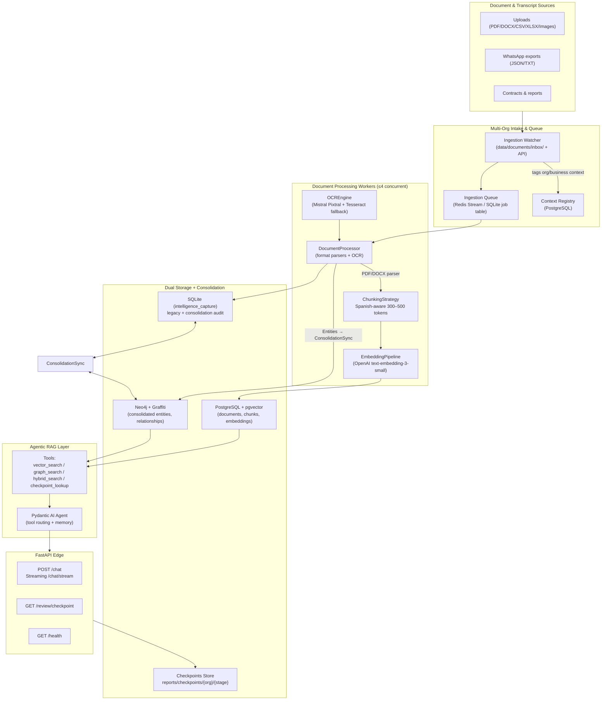
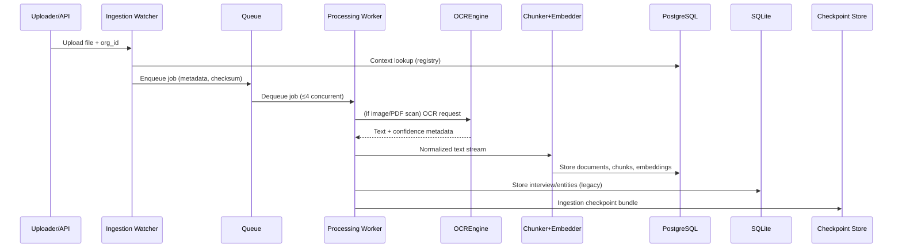
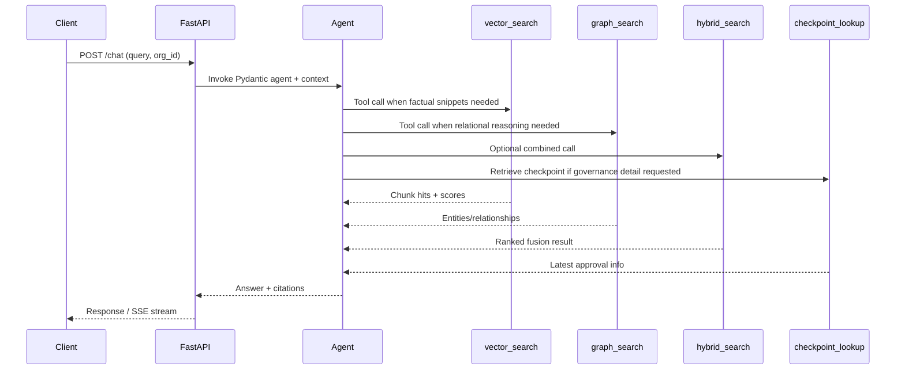

# RAG 2.0 Enhancement — System Design

This document details the architecture and implementation plan for extending the Comversa Intelligence Extraction System (see `CLAUDE.MD`, `intelligence_capture/*`) into the RAG 2.0 platform described in `.kiro/specs/rag-2.0-enhancement/requirements.md` and `.kiro/specs/knowledge-graph-consolidation/requirements.md`. The design preserves the 17 entity extractors, consolidation logic, and SQLite artifacts while adding multi-format ingestion, dual storage (PostgreSQL + pgvector and Neo4j), Mistral OCR, Pydantic AI agents, and governance checkpoints that satisfy Bolivian privacy expectations and the $500–$1,000 USD/month cost guardrail from `docs/business_validation_objectives.md`.

---

## 1. System Architecture

### 1.1 Diagram



### 1.2 Architecture Notes
- **Queue-based scaling:** Directory watcher + FastAPI upload endpoint push jobs into `ingestion_queue` (Redis Stream or SQLite-backed job table) to move from 10 docs/week to 10 docs/day without blocking the CLI. Jobs carry `org_id`, `business_context`, `source_format`, checksum, and size—validated against the context registry (R0).
- **Processing pods:** Up to four concurrent workers execute `DocumentProcessor`, reuse `intelligence_capture/processor.py` for WhatsApp transcripts, and extend it with format-specific parsers before chunking and embeddings.
- **Dual storage:** Each chunk is persisted to PostgreSQL (`documents`, `document_chunks`, `embeddings`) while consolidated entities sync through Graffiti into Neo4j namespaces keyed by `org_id`. SQLite remains the authoritative store for extraction history, audit, and fallback.
- **Agentic layer:** Pydantic AI orchestrates tool calls (`vector_search`, `graph_search`, `hybrid_search`, `checkpoint_lookup`), aligns with `prompts/system_agent_prompt.md`, and emits SSE or chunked HTTP responses.
- **Governance:** Every ingestion, OCR, consolidation, retrieval eval, and agent response writes a checkpoint bundle (`reports/checkpoints/{org}/{stage}/{timestamp}`) that `/review/checkpoint` exposes. Gatekeeping prevents promotion until checkpoints are approved (R16).

### 1.3 Source Connectors
| Channel | Mechanism | Notes |
| --- | --- | --- |
| Email attachments | Ingestion watcher polls compliance-approved inbox via IMAP OAuth every 5 min, saves attachments to `data/documents/inbox/email/{org}` with context inferred from subject tags (e.g., `[BolivianFoods][Finance]`). | Enforces allowlist of senders per org; oversized attachments rejected with Spanish notice; consent metadata linked to registry entry. |
| WhatsApp exports | Existing `intelligence_capture` workflow continues to parse JSON/TXT transcripts dropped into `data/interviews/`. New automation listens to WhatsApp Business API webhook → stores export + media references before enqueuing for DocumentProcessor. | Maintains 17-entity extraction + consolidation logic; transcript metadata stored in Postgres `documents` for cross-linking with chunks. |
| Direct APIs / system dumps | Scheduled connectors (cron workers) pull from SAP/CRM/ERP REST or SFTP endpoints defined per org; outputs normalized JSON/CSV placed into inbox with source_type `api`. | Credentials stored in Vault; connectors emit ingestion checkpoints referencing API version + consent logs. |
| SharePoint / Google Drive folders | Graph API / Drive API delta queries watch designated folders, download new/changed docs, and push to queue with `org_id` derived from folder mapping. | Uses service principals with read-only scopes; deduplicates via checksum; respects “Do not ingest” labels by skipping and logging. |
| Manual portal uploads | FastAPI `/upload` (future) or CLI adds docs directly, same queue path. | Provides immediate feedback + rate limiting to keep operator aware of budget. |

All connectors normalize metadata through the context registry before enqueueing, so downstream processing, costing, and compliance checks remain uniform regardless of ingress channel.

---

## 2. Database Schemas & Migration

### 2.1 PostgreSQL + pgvector DDL

```sql
CREATE TABLE context_registry (
    id UUID PRIMARY KEY DEFAULT gen_random_uuid(),
    org_id TEXT NOT NULL,
    business_unit TEXT NOT NULL,
    department TEXT,
    priority_tier TEXT,
    contact_owner JSONB,
    consent_metadata JSONB,
    created_at TIMESTAMPTZ DEFAULT now(),
    UNIQUE (org_id, business_unit, department)
);

CREATE TABLE documents (
    id UUID PRIMARY KEY DEFAULT gen_random_uuid(),
    org_id TEXT NOT NULL REFERENCES context_registry(org_id),
    source_type TEXT NOT NULL,  -- whatsapp, pdf, docx, csv, image, contract
    source_format TEXT NOT NULL,
    filename TEXT NOT NULL,
    checksum TEXT NOT NULL,
    language TEXT NOT NULL,
    page_count INT,
    metadata JSONB,
    storage_path TEXT NOT NULL, -- data/documents/originals/{uuid}
    ingest_status TEXT DEFAULT 'pending',
    ingest_error TEXT,
    created_at TIMESTAMPTZ DEFAULT now()
);

CREATE TABLE document_chunks (
    id UUID PRIMARY KEY DEFAULT gen_random_uuid(),
    document_id UUID NOT NULL REFERENCES documents(id) ON DELETE CASCADE,
    chunk_index INT NOT NULL,
    section_title TEXT,
    page_number INT,
    token_count INT,
    text TEXT NOT NULL,
    language TEXT NOT NULL,
    spanish_features JSONB, -- stopwords removed, stemming flags
    created_at TIMESTAMPTZ DEFAULT now()
);

CREATE TABLE embeddings (
    chunk_id UUID PRIMARY KEY REFERENCES document_chunks(id) ON DELETE CASCADE,
    model TEXT NOT NULL DEFAULT 'text-embedding-3-small',
    embedding vector(1536) NOT NULL,
    created_at TIMESTAMPTZ DEFAULT now(),
    cost_cents NUMERIC(10,2) -- for budgeting
);

CREATE INDEX idx_document_chunks_document ON document_chunks(document_id);
CREATE INDEX document_chunks_embedding_idx ON embeddings USING hnsw (embedding vector_cosine_ops) WITH (m = 16, ef_construction = 200);
```

### 2.2 Neo4j Model

| Label | Key Properties | Notes |
| --- | --- | --- |
| `Entity` (generic superclass) | `entity_id`, `org_id`, `name`, `type`, `description`, `source_count`, `consensus_confidence`, `mentioned_in` (list), `checkpoint_id` | Derived from consolidated SQLite tables |
| `System`, `Process`, `PainPoint`, `KPI`, etc. | inherit `Entity` properties plus type-specific metadata (e.g., `severity`, `frequency`) | Indexed on `(org_id, name)` |
| `DocumentChunk` | `chunk_id`, `document_id`, `section_title`, `summary`, `vector_ref` | Connects textual evidence to nodes |

Relationships (all carry `org_id`, `strength`, `source_chunks`, `last_seen_checkpoint`):
- `(:System)-[:CAUSES {strength}]->(:PainPoint)`
- `(:Process)-[:USES]->(:System)`
- `(:Department)-[:HAS]->(:Process)`
- `(:Entity)-[:MENTIONED_IN]->(:DocumentChunk)`
- `(:Entity)-[:DERIVED_FROM]->(:Entity)` (consolidation audit trail)

### 2.3 SQLite Consolidation Tables

- Reuse `intelligence_capture/database.py` tables plus add:
  - `consolidated_entities` (entity_id PK, entity_type, canonical_name, merged_entity_ids JSON, mentioned_in_interviews JSON, source_count, consensus_confidence, contradiction_details JSON, checkpoint_id).
  - `entity_mentions` (id, entity_id FK, interview_id FK, chunk_id nullable, span JSON).
  - `relationships` (existing spec fields + `neo4j_relationship_id`).
  - `consolidation_audit` (timestamp, merged_entity_ids, resulting_entity_id, similarity_score, reviewer, rollback_pointer).

These tables feed both Neo4j (via `KnowledgeGraphBuilder`) and the checkpoint artifacts while giving rollback guarantees.

### 2.4 Migration Plan (Zero Downtime)

1. **Phase 0 – Shadow Writes:** Extend `IntelligenceDB` to emit events (via `ConsolidationSync`) after each interview. Workers push normalized entities to a Kafka-lite queue (e.g., Redis Stream) consumed by the new Postgres/Neo4j writers while SQLite remains the primary read source.
2. **Phase 1 – Dual Readiness:** After Postgres and Neo4j contain backfilled data (44 interviews + new docs), enable feature flags so new retrieval endpoints query Postgres/Neo4j first but fall back to SQLite.
3. **Phase 2 – Cutover:** Update `rag_generator.py` and upcoming FastAPI endpoints to read exclusively through the RAG services. Keep SQLite-to-Postgres sync active for four weeks, then downgrade to nightly reconciliation jobs.
4. **Rollback:** If Postgres/Neo4j health checks fail, toggle feature flag to return to SQLite-only responses; ingestion jobs continue writing to SQLite because ConsolidationSync queues can be drained/replayed.

---

## 3. Component Designs

| Component | Responsibilities | Key Interfaces / Notes |
| --- | --- | --- |
| **DocumentProcessor** | Accept queued job, resolve `org_id` via context registry, detect file type, delegate to format-specific parsers, run OCR if needed, persist originals to `data/documents/originals/{uuid}`. | Extends `intelligence_capture/processor.py` with new adapters. Emits `DocumentIngested` events containing metadata + context tags. Batch size 10 docs to align with weekly ramp. |
| **WhatsApp Parser** | Convert WhatsApp TXT/JSON to structured QA pairs, map participants, attach timestamps/media references. | Reuses `IntelligenceProcessor` to push through extractors so the existing JSON transcripts remain supported; outputs chunk metadata for cross-linking with Postgres entries. |
| **CSV/XLSX Parser** | Use `pandas` with dtype inference (24 MB+ streaming), capture header semantics, detect numeric vs categorical columns, convert tables to Markdown-style chunks while preserving KPIs. | Handles multi-sheet workbooks, chunk by logical sections (sheet → table). Embeds column statistics in chunk metadata for retrieval. |
| **OCREngine** | Route images/PDF scans through Mistral Pixtral (Spanish) with Tesseract fallback. Apply thresholds: printed >= 0.90, handwritten >= 0.70; below-threshold segments go to `ocr_review_queue`. | Parallelize up to 5 concurrent API calls with rate limiter; store bounding boxes + confidence per region; escalate to manual review checkpoint when needed. |
| **ChunkingStrategy** | Spanish-aware chunk segmentation (300–500 tokens, 50-token overlap) respecting headings, paragraphs, and tables. Maintains accent integrity, uses sentence boundary detection + Snowball stemmer metadata. | Creates `chunk_metadata` JSON with `section_title`, `page_number`, `token_count`, `span_offsets`, `span_language`. Preserves table formatting via Markdown for RAG referencing. |
| **EmbeddingPipeline** | Batch embeddings (<=100 chunks/call) using `text-embedding-3-small`, caches results for 24 h keyed by `hash(chunk_text+model)`, tracks per-chunk cost to enforce monthly budget. | Retries with exponential backoff; optionally substitutes lower-cost embeddings for low-priority docs; writes to Postgres via upsert. |
| **KnowledgeGraphBuilder** | Consumes consolidation events, upserts Neo4j nodes/relationships using Graffiti (episode per document), keeps `org_id` namespaces, and writes back `neo4j_relationship_id` to SQLite. | Supports bidirectional sync: nightly job diff Neo4j → SQLite to reconcile manual edits; uses `MERGE` statements with uniqueness on `(org_id, type, canonical_name)`. |
| **AgenticRAG** | Pydantic AI agent that evaluates user intent (Spanish), chooses tools, streams reasoning. Maintains conversation state keyed by API session, respects context registry for namespace selection. | Tools: `vector_search(query:str, org_id:str, top_k:int=5)`, `graph_search(query:str, org_id:str, relationship_types:List[str]=None)`, `hybrid_search(...)`, `checkpoint_lookup(stage:str, org_id:str)`. Logs tool usage for analytics + cost tracking. |
| **ConsolidationSync** | Bridges SQLite extraction results with Postgres/Neo4j. Detects merges (requirement doc thresholds), updates `mentioned_in_interviews`, pushes `EntityMerged` events, and ensures checkpoints capture before/after snapshots. | Hooks into `intelligence_capture/consolidation_agent.py` and `entity_merger.py`, adds RowVersion column to avoid write skew, and triggers graph updates and chunk references. |

Supporting services: `IngestionMonitor` (queue depth, throughput), `CostGuard` (accumulates OCR/LLM spend, halts ingestion if projected cost exceeds monthly envelope), `CheckpointManager` (serializes stage artifacts + metadata per Bolivian compliance requirements).

---

## 4. API Design

| Endpoint | Purpose | Request Schema (JSON unless noted) | Response / Notes |
| --- | --- | --- | --- |
| `POST /chat` | Non-streaming chat with RAG agent. | `{ "org_id": "los_tajibos", "context": "operaciones", "query": "¿Qué sistemas causan más puntos de dolor?", "checkpoint_id": "optional", "session_id": "uuid" }` | `200 OK` → `{ "answer": "...", "sources": [{ "type": "document", "id": "...", "snippet": "..." }], "tool_calls": [...], "latency_ms": 1400 }`. Requires `X-API-Key`; rate-limited (60 RPM/org). |
| `POST /chat/stream` | SSE streaming version for live tool reasoning. | Same payload as `/chat` + `Accept: text/event-stream`. | Events: `meta`, `tool_call`, `chunk`, `done`. Backpressure via queue to keep <2.5 s hybrid SLA. |
| `GET /health` | Liveness/readiness (Postgres, Neo4j, SQLite, Redis). | None. | `200 OK` → `{ "status": "healthy", "components": { "postgres": "ok", ... } }`; `503` if dependency down. |
| `GET /review/checkpoint?id=<uuid>` | Fetch checkpoint bundle for governance review. | Query param, API key required. | Returns JSON metadata + signed URLs to artifacts (documents, graph snapshots), plus approval status from `model_reviews`. |

**Authentication:** per-organization API keys stored hashed in Postgres; middleware validates, maps to `org_id`, and enforces request quotas. Optional OAuth2 service tokens for internal dashboards.

**Tool Signatures (Pydantic AI):**
```python
class VectorSearchInput(BaseModel):
    org_id: str
    query: str
    top_k: int = 5

class GraphSearchInput(BaseModel):
    org_id: str
    query: str
    relationship_types: List[str] = Field(default_factory=list)

class HybridSearchInput(VectorSearchInput):
    weight_vector: float = 0.5
    weight_graph: float = 0.5

class CheckpointLookupInput(BaseModel):
    org_id: str
    stage: Literal["ingestion","ocr","consolidation","retrieval","agent"]
```

Rate limiting uses `Redis` sliding window (default 60 RPM per key) plus budget-aware throttle (auto degradations to cheaper models when >80% of monthly cost consumed).

---

## 5. Data Flow Diagrams

### 5.1 Ingestion Workflow


### 5.2 Retrieval Workflow


### 5.3 Consolidation Workflow
```mermaid
sequenceDiagram
    participant Extractor as IntelligenceExtractor
    participant SQLite as Consolidation Agent
    participant Sync as ConsolidationSync
    participant Neo as Neo4j
    participant PG as Postgres
    participant Review as Checkpoint Reviewer

    Extractor->>SQLite: Insert raw entities (17 types)
    SQLite->>SQLite: Duplicate detection (fuzzy, embedding thresholds)
    SQLite->>Sync: Emit EntityMerged / RelationshipCreated events
    Sync->>PG: Link consolidated entity to chunks (document_id, chunk_id)
    Sync->>Neo: Upsert nodes + relationships (Graffiti episodes)
    Sync->>Review: Generate consolidation checkpoint (before/after metrics)
    Review-->>Sync: Approve/Reject; rejection triggers rollback via `consolidation_audit`
```

---

## 6. Integration Points

- **IntelligenceExtractor (`intelligence_capture/extractor.py`)** remains unchanged; `DocumentProcessor` hands WhatsApp-transcript jobs to the existing `IntelligenceProcessor` so entity extraction and validation stay centralized.
- **IntelligenceDB (`intelligence_capture/database.py`)** gains hooks to publish consolidation events and to write context metadata required by the registry.
- **Processor (`intelligence_capture/processor.py`)** orchestrates ingestion for JSON interviews and now delegates to `DocumentProcessor` for files detected by the watcher; shared `ExtractionMonitor` tracks both pipelines to keep KPIs in a single dashboard.
- **Consolidation Agent (`intelligence_capture/consolidation_agent.py`, `duplicate_detector.py`, `entity_merger.py`)** becomes the canonical source for Neo4j node definitions, ensuring R5/R6 relationships reuse existing merging heuristics (thresholds, audit trail).
- **RAG generator (`intelligence_capture/rag_generator.py`)** is refactored into the FastAPI service, but keeps helper utilities for prompt construction and evaluation, avoiding rewrites.
- **Prompt/context packs (`prompts/system_agent_prompt.md`)** now consume context registry lookups via a helper that injects `org_id`, `department`, budget reminders, and checkpoint IDs before every agent run.
- **Configuration (`config/extraction_config.json`, forthcoming `config/ingestion_config.json`)** stores similarity thresholds, queue sizing, rate limits, and cost guardrails to keep parity across CLI scripts and FastAPI workers.

---

## 7. Spanish Language Considerations

- **OCR:** Mistral Pixtral invoked with `language="es"` and `handwriting=true` flags; Tesseract fallback uses `--oem 1 --psm 6 -l spa`. Confidence outputs tagged per region; anything < threshold goes to manual queue with Spanish instructions.
- **Chunking:** Sentence tokenization via `spacy[es_core_news_md]` to avoid breaking accentuated words. Stopword removal uses the list from R15 plus company-specific synonyms; stemming metadata (Snowball) stored in `spanish_features`.
- **Embedding + Agent:** Embeddings remain multilingual but we evaluate Spanish-only datasets; Pydantic agent system prompt (from `prompts/system_agent_prompt.md`) enforces Spanish responses and compliance references.
- **Search normalization:** Both vector and graph queries normalize accents (`á→a`, etc.) while storing canonical and accent-sensitive forms to avoid misranking.
- **Error / validation messages:** All API validation errors, checkpoint notices, and manual-review tickets are rendered in Spanish, referencing Bolivian privacy statutes when consent is missing.

---

## 8. Performance & Scalability

- **Vector index:** `m=16`, `ef_construction=200`, runtime `ef_search` default 60 for pgvector HNSW to keep <1 s vector queries.
- **Connection pools:** `asyncpg` pool size 20, `neo4j.AsyncGraphDatabase` pool 10, SQLite serialized via WAL + connection cache.
- **Caching:** Embedding cache (24 h TTL) stored in Redis keyed by chunk hash; hybrid query results cached for 5 minutes per `(org_id, query)` tuple; context registry cached for 1 hour but invalidated on new org onboarding to meet R0.5.
- **Parallel ingestion:** Max 4 concurrent processing workers (matching spec) controlled via queue consumer count; ensures 10 docs/day by processing ~15 min/doc worst-case (50 MB upper bound) while staying in budget.
- **Budget guardrails:** `CostGuard` tracks OCR + embeddings spend; when projected monthly cost >$900, system throttles ingestion (max 2 concurrent) and forces cheaper summarization models (`gpt-4o-mini` only). Hard stop at $1,000 w/operator override.
- **KPIs:** 10-page PDF target <2 min (DocProc parallelizing OCR + chunking); hybrid query <2.5 s by firing vector + graph in parallel (`asyncio.gather`). Queue metrics logged to evaluate ramp from 10 docs/week → 10 docs/day.

---

## 9. Error Handling & Resilience

- **OCR gating:** Confidence below thresholds triggers `ocr_review_queue` entries stored in Postgres with references to original file + region image; ingestion status halts at `needs_review` until manual approval, ensuring compliance.
- **LLM fallback chain:** Document parsing uses deterministic libraries; embeddings call OpenAI with retry/backoff and fallback to cached vectors. Agent responses degrade from `gpt-4o-mini` to `gpt-4o` only when complexity flag raised; translation is never used.
- **Ingestion resume:** Queue IDs persisted; if a worker crashes mid-job, visibility timeout returns the job to the queue. Files remain on disk (`data/documents/inbox/processing/<uuid>`) until job completes; atomic rename avoids duplicates.
- **Checkpoint rollback:** Every stage writes checksum + configuration snapshot; if evaluation metrics regress vs. R13 baseline, `/review/checkpoint` surfaces auto-block and `CheckpointManager` reverts to last approved embeddings/models/prompts.
- **Data integrity:** Foreign keys + row-level locks ensure `document_chunks` deletions cascade to `embeddings`; Neo4j upserts run inside retries with idempotent `MERGE`. Consolidation rollback replays `consolidation_audit` to restore SQLite before resyncing graph.
- **Privacy compliance:** Access to context registry enforces per-org namespaces; unauthorized API keys return 403 with Spanish notice referencing Constitution Art. 21 & Law 164. Audit logs stored for ≥12 months for Habeas Data.

---

## 10. Testing Strategy

1. **Unit Tests**
   - Parsers (PDF, DOCX, CSV/XLSX, WhatsApp) verifying metadata preservation.
   - OCR engine mocks for threshold logic + manual review queue.
   - Chunking and embedding pipeline tests covering Spanish edge cases (diacritics, tables).
   - KnowledgeGraphBuilder + ConsolidationSync verifying merge decisions and Neo4j writes.
   - Agent tool wrappers ensuring correct payloads to Postgres/Neo4j.
2. **Integration Tests**
   - End-to-end ingestion from upload → Postgres/Neo4j + checkpoint artifacts using fixture docs.
   - Retrieval regression harness that seeds Postgres/Neo4j with known data and validates vector vs graph routing decisions.
   - Consolidation scenarios (duplicate Excel systems) verifying consensus scores, rollback, and graph sync.
3. **Performance & Resilience**
   - Load tests for ingestion queue ramp (simulate 10/day) ensuring worker autoscaling stays within concurrency cap.
   - Query latency tests measuring vector, graph, hybrid responses (<1 s / <2 s / <2.5 s).
   - Failure injection (Neo4j down, OCR timeout) to confirm fallbacks and checkpoint rollbacks.
4. **Evaluation Harness**
   - 50-question Spanish benchmark dataset derived from WhatsApp + business documents.
   - Metrics: Precision@5, MRR, NDCG per org, tracked per checkpoint.
   - Automated nightly run comparing against baseline; failures halt promotion via R16.

---

### Delivery Plan Snapshot
- **Week 1:** Stand up context registry, ingestion watcher, DocumentProcessor skeleton, OCR review queue.
- **Week 2:** PostgreSQL schema, embeddings pipeline, chunking strategy + Spanish tuning.
- **Week 3:** Neo4j graph builder, ConsolidationSync, dual-write migration.
- **Week 4:** Pydantic AI agent, FastAPI endpoints, tool instrumentation, checkpoint governance.
- **Week 5:** Evaluation harness, performance tuning, documentation updates, operator training.

This plan extends the current system without rewrites, keeps Spanish-first behavior, honors privacy statutes, and ensures we can answer “¿Qué sistemas causan más puntos de dolor?” using consolidated, checkpointed evidence across Bolivian Foods, Los Tajibos, and Comversa.
