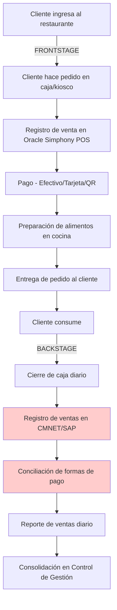
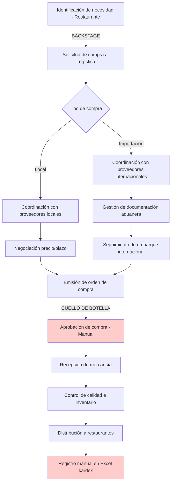
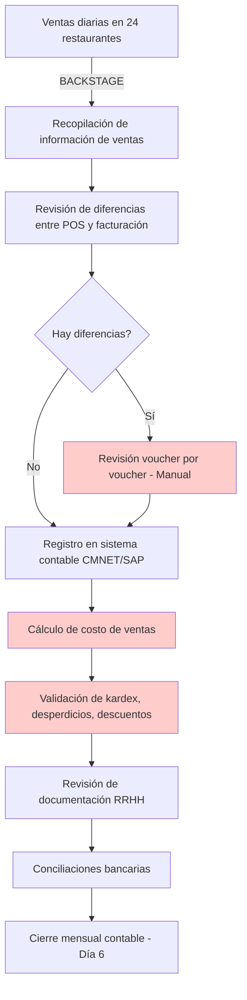
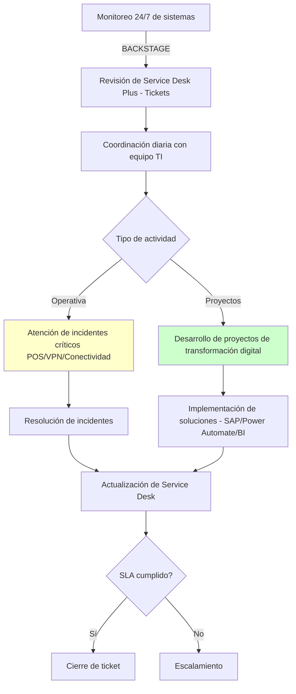
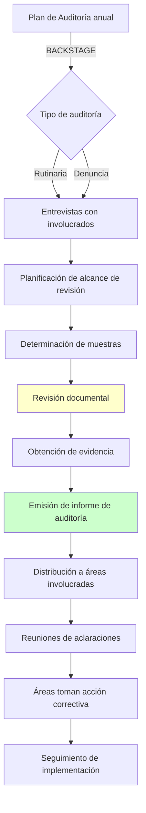

# ANÁLISIS CONTEXTUAL DE DISEÑO DE SERVICIOS
# BOLIVIAN FOODS S.A.

---

## 1. RESUMEN EJECUTIVO

Bolivian Foods S.A. opera como franquiciadora de Burger King y Subway en Bolivia, gestionando 24 restaurantes (13 Burger King, 11 Subway) con un modelo de negocio de franquicia maestra[file:3][file:27]. El análisis de 13 entrevistas con stakeholders clave revela una organización en proceso de transformación digital, con transición de sistema CMNET a SAP, y oportunidades significativas en automatización de procesos operativos, integración de sistemas POS con ERP, y gestión de datos en tiempo real[file:3][file:5][file:27].

Los **stakeholders críticos** incluyen Gerente General, Subgerente de Logística y Compras, Supervisora Nacional de Logística y Compras, Contador Senior, Jefe Nacional de Sistemas, Gerente Nacional de Administración y Finanzas, Supervisores Regionales de Entrenamiento (La Paz, Santa Cruz), Coordinadora Nacional de Control de Gestión, Supervisora Nacional de Tesorería, y Auditor Interno[file:3][file:5][file:27]. Los **procesos críticos** abarcan gestión de compras locales e importaciones (logística de abastecimiento), operaciones de restaurantes (POS, inventarios, personal), contabilidad multi-unidad (24 restaurantes), control de gestión (KPIs por restaurante), sistemas de TI (disponibilidad 24/7, analítica de datos), y auditoría interna[file:27].

Los **pain points principales** identificados incluyen: falta de integración entre sistemas POS (Oracle Simphony) y ERP (CMNET → SAP en transición)[file:27], procesos manuales intensivos en contabilidad (revisión de ventas, costo de ventas, validación de documentos)[file:27], ausencia de control de stock en sistema (se trabaja en Excel)[file:27], comunicación deficiente entre áreas operativas y soporte[file:27], alta rotación de personal en restaurantes (impacta capacitación)[file:27], y gestión de viáticos y fondos a rendir manual[file:27]. Las **oportunidades de diseño** prioritarias son: completar migración a SAP con integración POS-ERP, automatizar procesos de aprobación (viáticos, fondos, compras) con Power Automate, implementar control de stock en sistema, crear dashboards en tiempo real para KPIs operativos, y optimizar gestión de auditorías con plataforma digital[file:27][web:8].

---

## 2. ANÁLISIS CONTEXTUAL (NN/G STEP 1-2: SUPPORT & GOAL DEFINITION)

### Perfil de la Empresa

Bolivian Foods S.A. es la empresa franquiciadora maestra de Burger King (13 restaurantes) y Subway (11 restaurantes) en Bolivia, parte del Grupo Doria Medina[file:3][file:27]. La organización cuenta con 13 roles gerenciales y de supervisión entrevistados, abarcando funciones de dirección general, logística y compras (local e internacional), contabilidad multi-unidad, sistemas y tecnología, administración y finanzas, entrenamiento operativo regional, control de gestión, tesorería, y auditoría interna[file:3][file:5][file:27].

La empresa opera bajo estándares globales de las marcas Burger King (RBI - Restaurant Brands International) y Subway, con sistemas corporativos específicos: Oracle Simphony (POS), CMNET (ERP en transición a SAP), plataformas RBI (Qualtrics para satisfacción del cliente, BK University para entrenamiento, Forum para gestión de usuarios, CM Net para operaciones), Service Desk Plus (gestión de incidentes), y herramientas analíticas (Power BI, Excel)[file:27][web:8].

### Metas Estratégicas y Alineación con Diseño de Servicios

Las metas estratégicas identificadas en entrevistas incluyen[file:27][web:8]:

**Operacional**: Mantener estabilidad de sistemas 24/7 (POS, conectividad); cumplir estándares globales de calidad de marcas (auditorías RBI); optimizar eficiencia operativa por restaurante (labor cost, food cost, waste); reducir tiempos de atención al cliente; garantizar disponibilidad de productos (abastecimiento sin quiebres de stock)[file:27].

**Financiera**: Control riguroso de costo de ventas por restaurante; cumplimiento de plazos en cierre contable; optimización de flujo de caja (cobranzas, pagos a proveedores); reducción de costos logísticos (importaciones, distribución)[file:27][web:19].

**Tecnológica**: Completar migración de CMNET a SAP; integrar POS (Oracle Simphony) con ERP (SAP); automatizar procesos con Power Automate (viáticos, fondos, compras, aprobaciones); impulsar transformación digital (IA, analítica de datos, automatización); mejorar disponibilidad de servicios críticos (SLA 99.5%)[file:27].

**Personas y Cultura**: Reducir rotación de personal en restaurantes; mejorar capacitación continua (BK University); fortalecer cultura de seguridad alimentaria (inocuidad); desarrollar autonomía de líderes de área[file:27][web:8].

La alineación con diseño de servicios (user-centered goals) se enfoca en: optimizar journey del cliente final (desde ingreso al restaurante hasta consumo), reducir puntos de fricción operativa que impactan experiencia del cliente (disponibilidad de productos, tiempos de atención, calidad), automatizar procesos internos para liberar capacidad del equipo hacia tareas estratégicas, y crear visibilidad en tiempo real de KPIs críticos para toma de decisiones ágiles[web:8][web:19].

---

## 3. MAPEO DE STAKEHOLDERS (NN/G GUARDRAIL: STAKEHOLDER INVOLVEMENT)

### Tabla RACI de Stakeholders Clave

| **Proceso/Actividad** | **Gerente General** | **Subgerente Logística** | **Jefe Sistemas** | **Contador Senior** | **Gerente Admin/Finanzas** | **Supervisores Entrenamiento** |
|---|---|---|---|---|---|---|
| **Estrategia y Dirección General** | A/R | C | C | C | R | I |
| **Logística y Compras** | A | A/R | C | C | R | I |
| **Operaciones de Restaurantes** | A | C | C | I | C | A/R |
| **Sistemas y Tecnología** | A | C | A/R | C | R | C |
| **Contabilidad y Finanzas** | A | C | C | A/R | A/R | I |
| **Control de Gestión** | A | C | C | R | A/R | C |
| **Entrenamiento y Capacitación** | A | I | C | I | C | A/R |
| **Auditoría Interna** | A | C | C | C | C | I |

**Leyenda**: R = Responsible (Ejecutor), A = Accountable (Responsable final), C = Consulted (Consultado), I = Informed (Informado)[web:12][web:18].

### Roles Entrevistados y Funciones

**Gerente General** (Patricia Urdininea): Lidera operación y crecimiento estratégico de Burger King Bolivia; supervisa todas las áreas (operaciones, finanzas, marketing, RRHH, tecnología, logística, desarrollo de nuevos locales); asegura cumplimiento de estándares globales de marca; optimiza procesos operativos y financieros[file:27].

**Subgerente de Logística y Compras**: Planificación, organización, dirección y control de compras, almacenamiento y distribución; asegura funcionalidad de operaciones de abastecimiento[file:3][file:27].

**Supervisora Nacional de Logística y Compras** (Alejandra Flores): Gestión de compras locales e importaciones; relación con proveedores, negociaciones, seguimiento de pedidos; logística de importación y distribución; optimización de costos y tiempos en cadena de suministro; colaboración con áreas para abastecimiento oportuno[file:27].

**Contador Senior**: Revisión de información de ventas de 24 restaurantes; facturación de oficina central; gestión de costo de ventas (kardex, desperdicios, descuentos); revisión de documentación RRHH; estados de cuenta; transacciones de impuestos; validación de débito fiscal[file:3][file:27].

**Jefe Nacional de Sistemas** (Álvaro Coila): Disponibilidad de servicios de TI; ejecución de estrategia tecnológica; soporte técnico; dirección de proyectos de transformación digital (analítica, automatización de procesos, IA, aplicativos); desarrollo en funciones; gestión de infraestructura tecnológica (redes, servidores, POS, VPNs); implementación de SAP[file:27].

**Gerente Nacional de Administración y Finanzas** (Fabian Doria Medina): Supervisión de contabilidad multi-unidad; control de facturación; gestión de costo de ventas; revisión de documentación RRHH; conciliaciones bancarias; gestión de plazos de cierre contable (optimizado: entrega día 6 del mes)[file:27].

**Supervisores Regionales de Entrenamiento** (Danny Pinaya - La Paz): Entrenamiento de miembros del equipo, líderes, jefes de turno, gerentes para Burger King; supervisión de operaciones y entrenamiento para Subway; uso de plataformas corporativas (Qualtrics, BK University, Forum); coordinación con restaurantes para mejorar desempeño[file:27].

**Coordinadora Nacional de Control de Gestión** (Micaela Gonzales): Seguimiento a KPIs por restaurante; análisis de eficiencia operativa; reportes ejecutivos; identificación de desviaciones y acciones correctivas[file:27][web:12].

Otros roles críticos incluyen: Supervisora Nacional de Tesorería (Moisés Mamani), Auditor Interno (Mauricio Clavijo - apoya a todas las empresas del Grupo Doria Medina)[file:27].

---

## 4. MAPEO DE PROCESOS AS-IS (NN/G STEP 3: RESEARCH GATHERING)

### 4.1. Proceso de Operaciones de Restaurante (Customer Journey)

**EVIDENCIA FÍSICA**: Productos Burger King/Subway, ticket de compra impreso, mobiliario del restaurante[file:27].  
**EVIDENCIA DIGITAL**: Registro POS (Oracle Simphony), transacciones de pago, reportes de ventas CMNET/SAP[file:27].

**Pain Points Identificados**[file:27]:
- Falta de integración entre POS (Oracle Simphony) y ERP (CMNET → SAP)
- Registro manual de ventas en sistema contable
- Conciliación manual de formas de pago cuando hay diferencias
- Disponibilidad de sistemas críticos (cualquier falla afecta operación)
- Kioscos de autoservicio con incidencias frecuentes

### 4.2. Proceso de Logística y Compras (Local e Importaciones)

**EVIDENCIA FÍSICA**: Productos recibidos, órdenes de compra impresas, documentación aduanera[file:27].  
**EVIDENCIA DIGITAL**: Correos electrónicos, Excel (seguimiento de órdenes, kardex), CMNET (registros de compra), reportes logísticos[file:27].

**Pain Points Identificados**[file:27]:
- Aprobaciones de compras lentas (proceso manual)
- Doble registro de información (CMNET y Excel)
- Seguimiento manual de embarques internacionales (correos, controles manuales)
- No hay control de stock en sistema integrado (se trabaja en Excel)
- Variabilidad en tiempos de entrega de importaciones (demoras en puertos, normativa aduanera)
- Falta de integración entre áreas operativas y logística

### 4.3. Proceso de Contabilidad Multi-Unidad (24 Restaurantes)

**EVIDENCIA DIGITAL**: Reportes POS por restaurante, registros CMNET/SAP, Excel (cálculos manuales), documentos RRHH, estados de cuenta bancarios[file:27].

**Pain Points Identificados**[file:27]:
- Revisión manual de ventas de 24 restaurantes (proceso lento y propenso a errores)
- Falta de automatización en registro de ventas Subway
- Cálculo de costo de ventas manual en Excel (no hay control de stock en sistema)
- Información tarda de otras áreas (dificulta cierre contable)
- Archivos Excel pesados que ralentizan trabajo
- Procesos burocráticos en contabilidad (observaciones difieren entre contadores)

### 4.4. Proceso de Gestión de TI (Disponibilidad y Proyectos)

**EVIDENCIA DIGITAL**: Service Desk Plus (tickets), reportes de disponibilidad, documentación de proyectos, código (Power Automate, BI)[file:27].

**Pain Points Identificados**[file:27]:
- Mantener estabilidad de sistemas 24/7 (especialmente en restaurantes durante apertura/cierre)
- Alta carga de tickets durante auditorías corporativas (usuarios reportan problemas acumulados en un día)
- Alta rotación de personal en restaurantes (impacta capacitación en sistemas)
- Coordinación de múltiples proyectos simultáneos y atención operativa diaria
- Resistencia al cambio de algunos usuarios ante nuevas tecnologías

### 4.5. Proceso de Auditoría Interna (Multi-Empresa Grupo Doria Medina)

**EVIDENCIA FÍSICA**: Documentación física de procesos auditados[file:27].  
**EVIDENCIA DIGITAL**: Informes de auditoría (Word/PDF), evidencia documental digitalizada, normativa legal consultada[file:27].

**Pain Points Identificados**[file:27]:
- Falta de acceso a sistemas contables (depende de predisposición de áreas)
- Demora en entrega de información para auditorías
- Poca predisposición del personal ante revisiones (no ven auditorías como mejora)
- Empresas sin procedimientos formalmente establecidos (vacíos, desorganización)
- Documentación no digitalizada completamente (dificulta acceso ágil)

### 4.6. Pain Points Clasificados por Categoría

**PROCESO** (n=26 pain points identificados)[file:27][file:6]:
- Aprobaciones manuales lentas (compras, viáticos, fondos a rendir)
- Procesos burocráticos en contabilidad y finanzas
- Alta carga de reuniones operativas con poco valor estratégico
- Falta de procedimientos formalmente establecidos
- Alta rotación de personal en restaurantes (impacta continuidad de procesos)

**DATOS** (n=21 pain points)[file:27][file:6]:
- Información tarda de otras áreas
- Doble registro de información (POS vs CMNET/SAP, CMNET vs Excel)
- Archivos Excel pesados y manuales
- Falta de control de stock en sistema
- Datos de facturación con información incorrecta desde el origen

**SISTEMAS** (n=28 pain points)[file:27][file:6]:
- Falta de integración POS (Oracle Simphony) con ERP (CMNET → SAP en transición)
- Falta de automatización de procesos (viáticos, fondos, compras, aprobaciones)
- No hay plataforma unificada para seguimiento de proyectos
- Registro manual de ventas Subway
- Falta de acceso directo a bases de datos para auditorías

**CULTURA** (n=17 pain points)[file:27][file:6]:
- Resistencia al cambio tecnológico
- Falta de predisposición ante auditorías
- Comunicación limitada y fuera de tiempo (alta/baja/modificación usuarios)
- Alta rotación de personal (impacta capacitación y cultura)
- Falta de cultura de documentación y estandarización

---

## 5. ANÁLISIS DE GAPS Y OPORTUNIDADES (NN/G STEP 4-5: BLUEPRINT MAPPING & REFINEMENT)

### 5.1. Gaps en Customer Journey

**Journey del Cliente Final (Consumidor en Restaurante)**[web:8][web:19]:
- **Gap 1**: Experiencia fragmentada si hay falla de POS (no hay contingencia digital) - Oportunidad: Modo offline del POS
- **Gap 2**: Kioscos de autoservicio con incidencias frecuentes - Oportunidad: Mejorar estabilidad y soporte técnico
- **Gap 3**: No hay personalización en experiencia (sin CRM de cliente final) - Oportunidad: Programa de lealtad digital
- **Gap 4**: Tiempos de espera en hora pico - Oportunidad: Optimizar procesos de cocina con analítica de datos

**Journey del Personal de Restaurante**[web:8][web:19]:
- **Gap 5**: Capacitación insuficiente por alta rotación - Oportunidad: Onboarding digital automatizado
- **Gap 6**: Procesos operativos no estandarizados (faltan SOPs claros) - Oportunidad: Digitalizar SOPs con acceso móvil
- **Gap 7**: Comunicación deficiente con áreas de soporte (logística, TI, RRHH) - Oportunidad: App corporativa con solicitudes centralizadas

### 5.2. KPIs Relevantes

**Operacionales** (pendiente de validación con PHASE1_KPI_DICTIONARY.json)[web:8]:
- Satisfacción del cliente por restaurante (Qualtrics Score)
- Tiempo promedio de atención por pedido (minutos)
- Disponibilidad de productos (% sin quiebre de stock)
- Disponibilidad de sistemas POS (% - SLA 99.5%)
- Labor cost como % de ventas por restaurante
- Food cost como % de ventas por restaurante
- Waste (desperdicio) como % de ventas

**Logísticos**[web:8]:
- Tiempo de entrega de proveedores locales (días promedio)
- Tiempo de nacionalización de importaciones (días promedio)
- Costo logístico como % de valor de compras
- Número de quiebres de stock reportados por mes

**Financieros**[file:27]:
- Días para cierre contable mensual (actual: 6 días)
- Precisión de costo de ventas (% desviación vs inventario físico)
- Cumplimiento de presupuesto por restaurante (%)
- Tiempo de aprobación de pagos a proveedores (días)

**Tecnológicos**[file:27]:
- Tiempo promedio de resolución de incidentes TI (horas)
- Cumplimiento de SLA de disponibilidad (%)
- Número de tickets por restaurante por mes
- % de automatización de procesos manuales

### 5.3. Recomendaciones Prioritarias

**ALTA PRIORIDAD**[web:8][web:19]:
1. **Completar migración CMNET → SAP con integración POS-ERP**: Eliminar doble registro, datos en tiempo real, automatizar contabilidad multi-unidad (Roles: Jefe Sistemas, Gerente Admin/Finanzas, Contador Senior, Auditor Interno)
2. **Automatizar procesos de aprobación con Power Automate**: Viáticos, fondos a rendir, compras, alta/baja/modificación de usuarios (Roles: Jefe Sistemas, Gerente Admin/Finanzas, Subgerente Logística)
3. **Implementar control de stock en sistema SAP**: Eliminar kardex manual en Excel, visibilidad en tiempo real de inventarios (Roles: Contador Senior, Subgerente Logística, Jefe Sistemas)
4. **Crear dashboards en tiempo real para KPIs operativos**: Power BI con datos de SAP y POS (ventas, labor cost, food cost, waste por restaurante) (Roles: Coordinadora Control de Gestión, Jefe Sistemas)

**MEDIA PRIORIDAD**[web:8]:
5. **Digitalizar SOPs operativos**: Acceso móvil para personal de restaurantes (Rol: Supervisores Entrenamiento, Gerente General)
6. **Plataforma unificada para seguimiento de proyectos**: Microsoft Planner (reemplazar múltiples herramientas) (Rol: Jefe Sistemas)
7. **Portal del auditor**: Acceso directo a sistemas contables, documentación digitalizada (Rol: Auditor Interno, Jefe Sistemas, Gerente Admin/Finanzas)
8. **App corporativa para personal de restaurantes**: Solicitudes centralizadas (mantenimiento, logística, RRHH) (Rol: Jefe Sistemas, Gerente General)

### 5.4. Validación vía Workshops

**Workshop 1: Service Blueprint - Journey del Cliente Final** (Duración: 4 horas)[web:8]:
- Participantes: Gerente General, Supervisores Entrenamiento, Jefe Sistemas, Coordinadora Control de Gestión, gerentes de restaurantes (muestra)
- Objetivos: Mapear frontstage/backstage de ingreso a restaurante hasta consumo, identificar líneas de visibilidad/interacción, priorizar pain points
- Entregables: Blueprint digital validado, roadmap de mejoras operativas

**Workshop 2: Service Blueprint - Procesos de Soporte (Logística, Contabilidad, TI)** (Duración: 4 horas)[web:8]:
- Participantes: Subgerente Logística, Supervisora Logística/Compras, Contador Senior, Gerente Admin/Finanzas, Jefe Sistemas
- Objetivos: Mapear procesos backstage críticos, identificar cuellos de botella, priorizar automatizaciones
- Entregables: Blueprint digital validado, backlog de automatizaciones Power Automate

**Workshop 3: Integración SAP y Ecosistema Digital** (Duración: 3 horas)[web:8]:
- Participantes: Jefe Sistemas, Gerente Admin/Finanzas, Contador Senior, Auditor Interno, Coordinadora Control de Gestión
- Objetivos: Validar arquitectura de integración POS-SAP, definir dashboards en Power BI, priorizar APIs
- Entregables: Arquitectura técnica SAP validada, roadmap de integración

---

## 6. REFERENCIAS Y PRÓXIMOS PASOS

### Fuentes Utilizadas

- **Entrevistas primarias**: 13 entrevistas con stakeholders de Bolivian Foods (Gerente General, Subgerente de Logística y Compras, Supervisora Nacional de Logística y Compras, Contador Senior, Jefe Nacional de Sistemas, Gerente Nacional de Administración y Finanzas, Supervisores Regionales de Entrenamiento, Coordinadora Nacional de Control de Gestión, Supervisora Nacional de Tesorería, Auditor Interno)[file:3][file:5][file:27]
- **Metodología**: Nielsen Norman Group - 5 Steps to Service Blueprinting[web:8], Service Design 101[web:19], UX Stakeholder Engagement[web:12]
- **Documentos de análisis**: bolivianfood.md.docx, all_interviews.json, insights.json, summary.json, FINDINGS_ANALYSIS.md[file:3][file:5][file:27][file:4][file:6]

### Próximos Pasos (Roadmap 90 días)

**Semana 1-2: Preparación y Validación**[web:8]
- Socializar presente documento con Gerente General y gerencias clave
- Agendar Workshops 1, 2, 3 con stakeholders
- Solicitar acceso a PHASE1_KPI_DICTIONARY.json y PHASE1_AUTOMATION_BACKLOG.json

**Semana 3-4: Workshops y Service Blueprints**[web:8][web:19]
- Ejecutar Workshop 1: Journey del Cliente Final
- Ejecutar Workshop 2: Procesos de Soporte
- Ejecutar Workshop 3: Integración SAP y Ecosistema Digital
- Crear blueprints digitales validados (herramienta: Miro/Figma)

**Semana 5-8: Priorización y Roadmap Tecnológico**[web:8]
- Completar roadmap de migración SAP con integración POS (con Jefe Sistemas, soporte implementador SAP)
- Diseñar flujos de Power Automate para automatizaciones prioritarias (viáticos, fondos, compras, usuarios)
- Definir dashboards en Power BI (ventas, labor cost, food cost, waste por restaurante)
- Implementar control de stock en SAP (módulo de inventarios)

**Semana 9-12: Quick Wins y Pilotos**[web:8]
- Automatizar 3 procesos con Power Automate (piloto: viáticos, fondos a rendir, alta/baja usuarios)
- Crear 5 dashboards en Power BI (piloto: ventas diarias, labor cost, food cost por restaurante)
- Digitalizar 10 SOPs operativos críticos con acceso móvil (piloto: 3 restaurantes)
- Capacitar equipos en nuevas herramientas (SAP, Power BI, Power Automate)

**Próximos 90 días: Iteración y Escalamiento**[web:8][web:19]
- Completar migración a SAP fase 1 (contabilidad multi-unidad automatizada)
- Integrar POS-SAP fase 1 (ventas diarias automáticas sin registro manual)
- Implementar control de stock en sistema (eliminar Excel kardex)
- Automatizar 10+ procesos adicionales con Power Automate
- Lanzar app corporativa para personal de restaurantes (piloto: 5 restaurantes)
- Medir KPIs definidos y ajustar

---

**Elaborado por**: Equipo de Diseño de Servicios  
**Fecha**: Octubre 2025  
**Versión**: 1.0 - Entregable Fase 1  
**Metodología**: Nielsen Norman Group Service Blueprinting[web:8][web:19]  
**Próxima revisión**: Workshop de validación (Semana 3-4)
