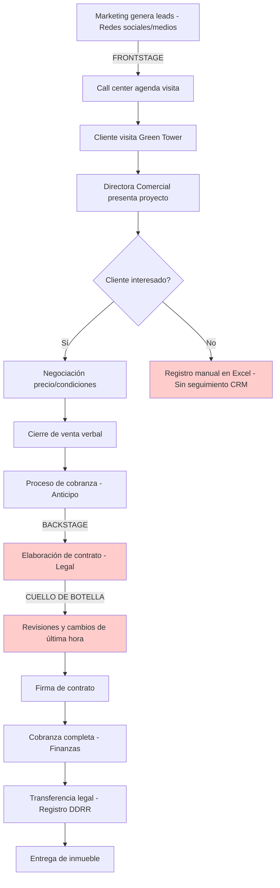
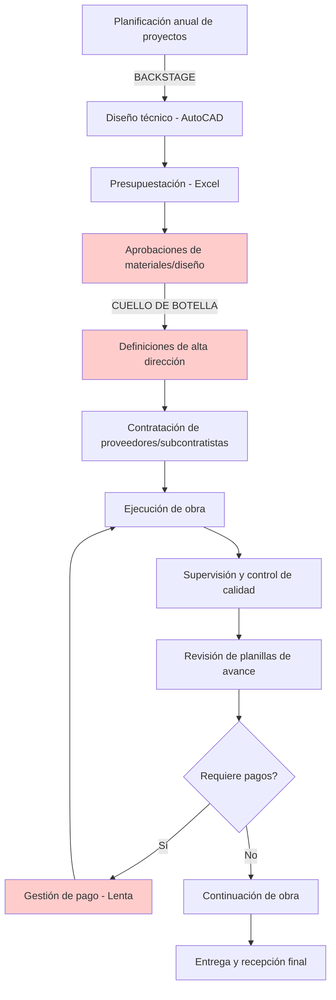
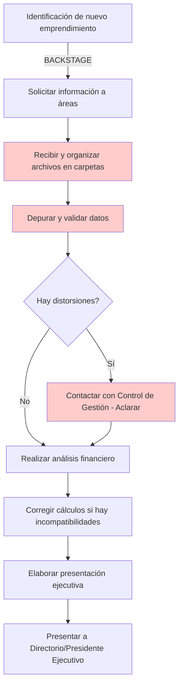
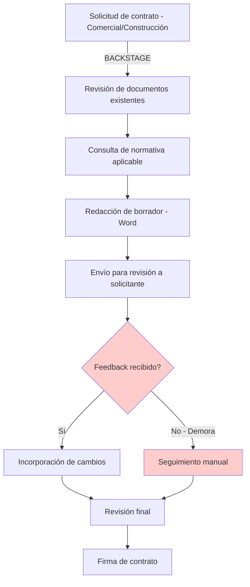

# ANÁLISIS CONTEXTUAL DE DISEÑO DE SERVICIOS
# COMPAÑÍA DE INVERSIONES COMVERSA S.A.

---

## 1. RESUMEN EJECUTIVO

Compañía de Inversiones Comversa S.A. es una empresa inmobiliaria y de construcción enfocada en el desarrollo, comercialización y gestión de proyectos de alto valor en Bolivia, con su proyecto insignia Green Tower (Santa Cruz y La Paz) - 100 millones de dólares de inversión, 100,000 m² construidos[file:2][file:27]. El análisis de 13 entrevistas con stakeholders clave revela una organización con procesos de preventa y construcción maduros pero con oportunidades significativas en digitalización, gestión de información y coordinación interdepartamental[file:2][file:5][file:27].

Los **stakeholders críticos** incluyen Presidente Ejecutivo, Directora Legal, Directora Comercial SC, Jefe de Finanzas y Proyectos, Gerente de Construcciones, Analista Financiero, Gerente Green Tower SC (operaciones y mantenimiento), y equipos de ventas, marketing y call center[file:2][file:5][file:27]. Los **procesos críticos** abarcan comercialización end-to-end de inmuebles (preventa, visitas, negociación, cierre, cobranza, contrato, transferencia), gestión de proyectos constructivos (civil, instalaciones), evaluación financiera de inversiones, gestión legal (contratos, documentación societaria), y administración de edificios (mantenimiento, seguridad, sostenibilidad)[file:27].

Los **pain points principales** identificados incluyen: gestión de clientes en Excel (sin CRM integrado)[file:27], proceso de firma de contratos lento y con cambios de última hora[file:27], falta de automatización en seguimiento de leads y oportunidades[file:27], información financiera dispersa y no actualizada en tiempo real[file:27], gestión de pagos a proveedores lenta[file:27], y falta de integración entre áreas comerciales, construcción, finanzas y legal[file:27]. Las **oportunidades de diseño** prioritarias son: implementación de CRM inmobiliario con pipeline visual, digitalización de proceso de contratos y transferencias, data warehouse centralizado para información financiera/comercial, automatización de aprobaciones con límites de autonomía, y plataforma colaborativa para gestión de proyectos constructivos[file:27][web:8].

---

## 2. ANÁLISIS CONTEXTUAL (NN/G STEP 1-2: SUPPORT & GOAL DEFINITION)

### Perfil de la Empresa

Compañía de Inversiones Comversa S.A. opera en el sector de desarrollo inmobiliario y construcción, parte del Grupo Doria Medina[file:2][file:27]. La organización cuenta con 13 roles entrevistados, abarcando funciones ejecutivas (Presidente Ejecutivo), comerciales (Directora Comercial SC con equipo de 3 personas: ventas, call center, marketing), técnicas (Gerente de Construcciones con equipo de ingenieros y arquitectos), financieras (Jefe de Finanzas y Proyectos, Analista Financiero), legales (Directora Legal), y operativas (Gerente Green Tower SC para mantenimiento, seguridad, salud ocupacional y medio ambiente)[file:2][file:5][file:27].

El proyecto Green Tower representa el activo principal: ubicado en Equipetrol Norte (Santa Cruz y La Paz), desarrollo mixto (departamentos residenciales y oficinas corporativas), con amenidades de lujo y enfoque en sostenibilidad[file:2][file:27]. La empresa utiliza herramientas como Excel personalizado para gestión de inventario inmobiliario (oficinas, departamentos, superficies, precios, vistas), iPads y televisiones para presentaciones a clientes, AutoCAD para diseño y planificación, Project para gestión de cronogramas constructivos, y herramientas analíticas como R, Power BI, SQL para evaluación financiera[file:27].

### Metas Estratégicas y Alineación con Diseño de Servicios

Las metas estratégicas identificadas en entrevistas incluyen[file:27][web:8]:

**Comercial**: Maximizar venta de m² disponibles en Green Tower SC y LP; incrementar tasa de conversión de visitas a ventas; reducir tiempo de cierre de ventas; fortalecer posicionamiento de marca en segmento de lujo; crear base de clientes para futuros proyectos[file:27].

**Constructiva**: Cumplimiento de cronogramas y presupuestos en proyectos; calidad constructiva sin observaciones; gestión eficiente de proveedores y subcontratistas; optimización de procesos de aprobación de materiales y diseños[file:27].

**Financiera**: Evaluación rigurosa de nuevos emprendimientos (compra/creación de empresas, proyectos de expansión); seguimiento a KPIs de eficiencia; generación de flujos financieros para bancos y presentaciones externas; análisis de factibilidad y modelamiento financiero[file:27][web:8].

**Legal y Regulatoria**: Seguridad jurídica en contratos y documentos societarios; agilidad en elaboración de contratos de compraventa y provisión; cumplimiento normativo en construcción, medio ambiente, seguridad y salud ocupacional[file:27].

La alineación con diseño de servicios (user-centered goals) se enfoca en: crear journey del comprador sin fricciones (desde prospección hasta transferencia legal), reducir tiempos de respuesta en negociaciones y elaboración de contratos, aumentar visibilidad de pipeline comercial para toma de decisiones, integrar información entre comercial-finanzas-legal-construcción, y asegurar experiencia post-venta (administración de edificios, atención propietarios)[web:8][web:19].

---

## 3. MAPEO DE STAKEHOLDERS (NN/G GUARDRAIL: STAKEHOLDER INVOLVEMENT)

### Tabla RACI de Stakeholders Clave

| **Proceso/Actividad** | **Presidente Ejecutivo** | **Directora Comercial SC** | **Directora Legal** | **Jefe Finanzas/Proyectos** | **Gerente Construcciones** | **Gerente GT SC** |
|---|---|---|---|---|---|---|
| **Estrategia y Decisiones de Inversión** | A/R | C | C | R | C | I |
| **Comercialización Inmuebles** | A | A/R | C | C | I | I |
| **Negociación y Cierre Ventas** | A | A/R | C | C | I | I |
| **Elaboración de Contratos** | A | C | A/R | I | I | I |
| **Gestión de Construcción** | A | I | C | C | A/R | C |
| **Evaluación Financiera Proyectos** | A | C | I | A/R | C | I |
| **Administración de Edificios** | A | I | C | I | C | A/R |
| **Cobranza y Transferencias** | A | R | R | C | I | I |

**Leyenda**: R = Responsible (Ejecutor), A = Accountable (Responsable final), C = Consulted (Consultado), I = Informed (Informado)[web:12][web:18].

### Roles Entrevistados y Funciones

**Presidente Ejecutivo** (Samuel Doria Medina Auza): Toma decisiones estratégicas (políticas de precios, nuevos proyectos, inversiones); contratación de principales ejecutivos; medición de riesgos; decisiones basadas en información[file:27].

**Directora Comercial SC** (Camila Roca): Responsable de comercialización end-to-end de Green Tower SC (preventa, visitas, negociación, cierre, cobranza, contrato, transferencia); gestión de equipo de 3 personas (ventas, call center, marketing); reportes semanales y mensuales de ventas; análisis de m² vendidos vs existentes[file:27].

**Directora Legal** (Gabriela Loza): Dirección legal corporativa; redacción y revisión de documentos societarios, contratos, reclamos; seguridad jurídica en textos legales[file:27].

**Jefe de Finanzas y Proyectos** (Luis Nogales): Evaluación financiera de emprendimientos actuales y futuros; seguimiento a KPIs; análisis de eficiencias; generación de flujos financieros; evaluación de nuevos proyectos; soporte en presupuestos e impactos; herramientas: Excel, R, Power BI, SQL[file:27].

**Gerente de Construcciones** (Gabriel Quinteros): Gestión, desarrollo, organización, planificación y ejecución de proyectos nuevos, remodelaciones, refacciones; gestión técnica de obras civiles (obra gruesa/fina) e instalaciones (eléctricas, hidrosanitarias, termomecánicas, gas, combate contra incendios); coordinación de equipo de ingenieros y arquitectos; gestión de contratistas externos[file:27].

**Analista Financiero** (Nicolas Monje): Elaboración y actualización de presentaciones para Directorio (Comversa, Los Tajibos, Grupo Doria Medina); participación en equipos de proyectos (análisis de factibilidad, modelamiento financiero)[file:27].

**Gerente Green Tower SC** (Enzo Negron): Gestión de mantenimiento y mejora continua de edificios; supervisión de áreas verdes; coordinación de equipos de mantenimiento; proyectos de sostenibilidad y eficiencia energética; responsable de seguridad y salud ocupacional; gestión ambiental[file:27][web:12].

---

## 4. MAPEO DE PROCESOS AS-IS (NN/G STEP 3: RESEARCH GATHERING)

### 4.1. Proceso de Comercialización de Inmuebles (Preventa a Transferencia)

**EVIDENCIA FÍSICA**: Planos impresos, folletos del proyecto, contratos físicos firmados[file:27].  
**EVIDENCIA DIGITAL**: Excel personalizado (inventario inmuebles), iPads (presentaciones), videos 360° del proyecto, correos electrónicos, contratos PDF[file:27].

**Pain Points Identificados**[file:27]:
- No hay CRM: leads no registrados sistemáticamente, no hay seguimiento de oportunidades perdidas, no se mide conversión por etapa del funnel
- Proceso de negociación largo (dificultad para identificar presupuesto real del cliente)
- Elaboración de contratos lenta con cambios de última hora (legal)
- Falta de agilidad en firma de contratos (puede perder ventas por aspectos administrativos)
- No hay métricas de: número de llamadas, visitas agendadas, visitas concretadas, tasa de conversión

### 4.2. Proceso de Gestión de Proyectos Constructivos

**EVIDENCIA FÍSICA**: Planos constructivos, contratos con proveedores, planillas de avance impresas, certificados de calidad[file:27].  
**EVIDENCIA DIGITAL**: AutoCAD (diseño), Project (planificación), Excel (presupuestos, seguimiento financiero), Word (contratos, informes)[file:27].

**Pain Points Identificados**[file:27]:
- Demoras en aprobaciones y definiciones (materiales, diseño, funcionalidad, presupuesto) - "el tiempo es lo más valioso"
- Gestión de pago lenta a proveedores y subcontratistas
- Incumplimiento o atrasos de empresas subcontratadas
- Presión por acelerar trabajos sin considerar procesos constructivos (genera costos adicionales)
- Falta de planificación anual clara de proyectos
- Procesos de solicitud de compra o pago sin plazos fijos

### 4.3. Proceso de Evaluación Financiera de Proyectos

**EVIDENCIA DIGITAL**: Archivos Excel (análisis financiero), PowerPoint (presentaciones ejecutivas), reportes de Control de Gestión, herramientas analíticas (R, Power BI, SQL)[file:27].

**Pain Points Identificados**[file:27]:
- Información dispersa en múltiples archivos (no hay data warehouse centralizado)
- Tareas repetitivas: actualizar conexiones a nuevas fuentes de datos
- Falta de acceso directo a bases de datos (dificulta control cruzado)
- Datos reportados que no coinciden o no representan cálculo correcto
- Proceso manual de recopilación y organización de información (debería automatizarse)
- Archivos Excel pesados que ralentizan análisis

### 4.4. Proceso de Elaboración de Contratos (Legal)

**EVIDENCIA FÍSICA**: Contratos impresos firmados[file:27].  
**EVIDENCIA DIGITAL**: Word (documentos legales), archivos físicos y digitales de contratos anteriores, normativa legal[file:27].

**Pain Points Identificados**[file:27]:
- Tiempos lentos para recibir feedback de otras áreas
- Falta de claridad en la información de lo que se quiere lograr
- No hay responsable único para revisión del producto legal
- Proceso de firma lento (puede comprometer cierre de ventas)

### 4.5. Pain Points Clasificados por Categoría

**PROCESO** (n=22 pain points identificados)[file:27][file:6]:
- Aprobaciones lentas y sin plazos fijos (materiales, diseños, presupuestos, pagos)
- Procesos burocráticos en construcción (múltiples niveles de aprobación)
- Falta de planificación anual de proyectos
- Seguimiento manual de leads comerciales (sin CRM)
- Proceso de firma de contratos lento con cambios de última hora

**DATOS** (n=16 pain points)[file:27][file:6]:
- Información financiera dispersa y no actualizada
- Falta de data warehouse centralizado
- Datos no estructurados (Excel personalizado)
- Dificultad de acceso a bases de datos
- Información tarda de otras áreas

**SISTEMAS** (n=18 pain points)[file:27][file:6]:
- Ausencia de CRM inmobiliario
- No hay plataforma colaborativa para gestión de proyectos
- Falta de sistema de firma digital
- No hay automatización de seguimiento de oportunidades comerciales
- Herramientas no integradas (Excel, AutoCAD, Project, Power BI operan de forma aislada)

**CULTURA** (n=12 pain points)[file:27][file:6]:
- Resistencia a sistematizar información
- Falta de cultura de datos (no todos entienden uso de bases de datos)
- Comunicación deficiente entre áreas (comercial-legal-finanzas-construcción)
- Dependencia de aprobación ejecutiva para decisiones operativas
- Falta de definición de responsables únicos por proceso

---

## 5. ANÁLISIS DE GAPS Y OPORTUNIDADES (NN/G STEP 4-5: BLUEPRINT MAPPING & REFINEMENT)

### 5.1. Gaps en Customer Journey

**Journey del Comprador de Inmueble**[web:8][web:19]:
- **Gap 1**: Lead no registrado sistemáticamente (llamada/visita sin seguimiento) - Oportunidad: CRM inmobiliario con captura automática
- **Gap 2**: No hay nurturing de leads tibios (interesados pero sin cierre inmediato) - Oportunidad: Automatización de seguimiento con contenido relevante
- **Gap 3**: Negociación sin visibilidad de histórico de interacciones - Oportunidad: CRM con registro completo de comunicaciones
- **Gap 4**: Proceso de contrato lento (semanas) - Oportunidad: Templates estandarizados + firma digital
- **Gap 5**: No hay onboarding post-venta (administración edificio, comunidad propietarios) - Oportunidad: Portal del propietario con servicios digitales

**Journey del Proveedor/Subcontratista**[web:8][web:19]:
- **Gap 6**: Gestión de pago lenta (impacta relación comercial) - Oportunidad: Automatización de aprobaciones + plazos fijos
- **Gap 7**: No hay visibilidad de estado de planillas de avance - Oportunidad: Portal del proveedor con seguimiento en tiempo real
- **Gap 8**: Proceso de contratación burocrático - Oportunidad: Onboarding digital con documentación estandarizada

### 5.2. KPIs Relevantes

**Comerciales** (pendiente de validación con PHASE1_KPI_DICTIONARY.json)[web:8]:
- M² vendidos vs disponibles (%)
- Tasa de conversión: Leads → Visitas → Ventas (%)
- Tiempo promedio de cierre de venta (días)
- Ticket promedio de venta (USD/m²)
- Número de llamadas/visitas agendadas/concretadas por semana
- NPS de compradores (post-venta)

**Constructivos**[web:8]:
- Cumplimiento de cronograma de obra (%)
- Cumplimiento de presupuesto de proyecto (%)
- Tiempo promedio de aprobación de materiales/diseños (días)
- Número de incumplimientos de proveedores/subcontratistas
- Índice de calidad constructiva (observaciones por m²)

**Financieros**[file:27]:
- ROI de proyectos inmobiliarios (%)
- Tiempo de respuesta en análisis financiero (días)
- Precisión de proyecciones financieras (% desviación)
- Flujo de caja operativo mensual

**Legales**[file:27]:
- Tiempo promedio de elaboración de contratos (días)
- Número de contratos con observaciones legales post-firma
- Tiempo de respuesta a consultas legales (horas)

### 5.3. Recomendaciones Prioritarias

**ALTA PRIORIDAD**[web:8][web:19]:
1. **Implementar CRM inmobiliario**: Gestión completa de pipeline (leads, visitas, negociaciones, cierres), métricas de conversión, base de datos para futuros proyectos (Roles: Directora Comercial SC, Presidente Ejecutivo, Jefe Finanzas)
2. **Digitalizar proceso de contratos**: Firma digital, templates estandarizados, seguimiento automatizado (Roles: Directora Legal, Directora Comercial SC, Gerente Construcciones)
3. **Crear data warehouse centralizado**: Información financiera, comercial y constructiva actualizada en tiempo real, accesible para análisis (Roles: Jefe Finanzas, Analista Financiero, Presidente Ejecutivo)
4. **Automatizar aprobaciones con límites de autonomía**: Pagos, materiales, diseños con plazos fijos según monto/tipo (Roles: Presidente Ejecutivo, Gerente Construcciones)

**MEDIA PRIORIDAD**[web:8]:
5. **Plataforma colaborativa para proyectos**: Integración AutoCAD-Project-Excel, visibilidad para todos los stakeholders (Rol: Gerente Construcciones, Jefe Finanzas)
6. **Portal del propietario post-venta**: Servicios de administración, comunicación con Gerente GT, solicitudes de mantenimiento (Rol: Gerente GT SC, Directora Comercial SC)
7. **Automatizar métricas comerciales**: Dashboard en tiempo real (llamadas, visitas, conversión, m² vendidos) (Rol: Directora Comercial SC, Jefe Finanzas)
8. **Portal del proveedor**: Seguimiento de planillas de avance, pagos, documentación (Rol: Gerente Construcciones)

### 5.4. Validación vía Workshops

**Workshop 1: Service Blueprint - Journey del Comprador** (Duración: 4 horas)[web:8]:
- Participantes: Presidente Ejecutivo, Directora Comercial SC, Directora Legal, Jefe Finanzas, equipo comercial (ventas, marketing, call center)
- Objetivos: Mapear frontstage/backstage de preventa a transferencia, identificar líneas de visibilidad/interacción, priorizar pain points
- Entregables: Blueprint digital validado, roadmap CRM inmobiliario

**Workshop 2: Service Blueprint - Gestión de Proyectos Constructivos** (Duración: 4 horas)[web:8]:
- Participantes: Presidente Ejecutivo, Gerente Construcciones, Jefe Finanzas, Directora Legal, equipo de ingenieros
- Objetivos: Mapear proceso de planificación a entrega, identificar cuellos de botella en aprobaciones
- Entregables: Blueprint digital validado, definición de límites de autonomía, plazos fijos

**Workshop 3: Integración de Datos y Sistemas** (Duración: 3 horas)[web:8]:
- Participantes: Jefe Finanzas, Analista Financiero, Directora Comercial SC, Gerente Construcciones, TI (apoyo de Los Tajibos)
- Objetivos: Definir arquitectura de data warehouse, priorizar integraciones, identificar APIs necesarias
- Entregables: Arquitectura de datos, roadmap de implementación

---

## 6. REFERENCIAS Y PRÓXIMOS PASOS

### Fuentes Utilizadas

- **Entrevistas primarias**: 13 entrevistas con stakeholders de Comversa (Presidente Ejecutivo, Directora Legal, Directora Comercial SC, Jefe de Finanzas y Proyectos, Gerente de Construcciones, Analista Financiero, Gerente Green Tower SC)[file:2][file:5][file:27]
- **Metodología**: Nielsen Norman Group - 5 Steps to Service Blueprinting[web:8], Service Design 101[web:19], UX Stakeholder Engagement[web:12], Frontstage/Backstage Mapping[web:13][web:16]
- **Documentos de análisis**: comversa.md.docx, all_interviews.json, insights.json, summary.json, FINDINGS_ANALYSIS.md[file:2][file:5][file:27][file:4][file:6]

### Próximos Pasos (Roadmap 90 días)

**Semana 1-2: Preparación y Validación**[web:8]
- Socializar presente documento con Presidente Ejecutivo y directores
- Agendar Workshops 1, 2, 3 con stakeholders
- Solicitar acceso a PHASE1_KPI_DICTIONARY.json y PHASE1_AUTOMATION_BACKLOG.json

**Semana 3-4: Workshops y Service Blueprints**[web:8][web:19]
- Ejecutar Workshop 1: Journey del Comprador
- Ejecutar Workshop 2: Gestión de Proyectos Constructivos
- Ejecutar Workshop 3: Integración de Datos y Sistemas
- Crear blueprints digitales validados (herramienta: Miro/Figma)

**Semana 5-8: Priorización y Roadmap Tecnológico**[web:8]
- Definir roadmap de implementación CRM inmobiliario (RFP proveedores: Salesforce Real Estate Cloud, Properati, Zoho CRM)
- Diseñar arquitectura de data warehouse (con Jefe Finanzas, apoyo TI de Los Tajibos)
- Evaluar plataformas de firma digital (DocuSign, Adobe Sign)
- Definir límites de autonomía para aprobaciones (matriz RACI actualizada)

**Semana 9-12: Quick Wins y Pilotos**[web:8]
- Implementar firma digital en contratos de compraventa (piloto: 10 ventas)
- Automatizar 5 métricas comerciales en Power BI (leads, visitas, conversión, m² vendidos, ticket promedio)
- Estandarizar templates de contratos (reducir cambios de última hora)
- Crear dashboard financiero con datos actualizados semanalmente

**Próximos 90 días: Iteración y Escalamiento**[web:8][web:19]
- Implementar CRM inmobiliario fase 1 (pipeline comercial completo)
- Crear data warehouse centralizado fase 1 (datos financieros y comerciales)
- Automatizar aprobaciones con plazos fijos (pagos, materiales)
- Lanzar portal del proveedor (piloto: 5 proveedores clave)
- Medir KPIs definidos y ajustar

---

**Elaborado por**: Equipo de Diseño de Servicios  
**Fecha**: Octubre 2025  
**Versión**: 1.0 - Entregable Fase 1  
**Metodología**: Nielsen Norman Group Service Blueprinting[web:8][web:19]  
**Próxima revisión**: Workshop de validación (Semana 3-4)
