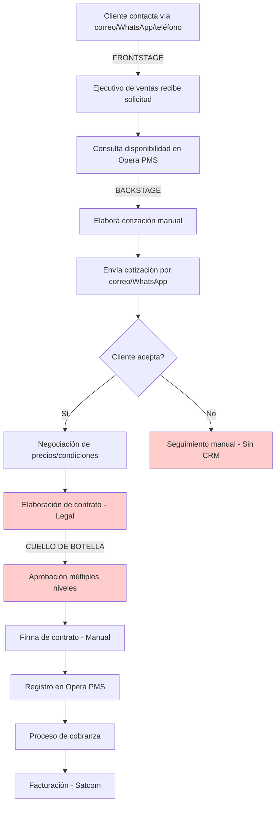
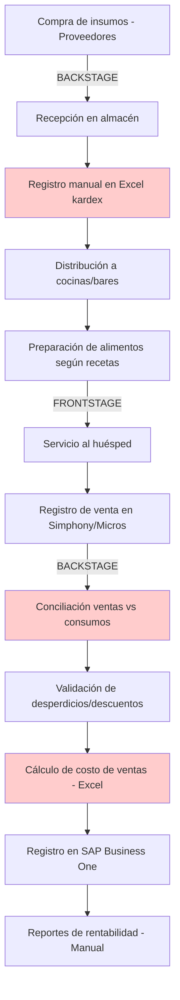
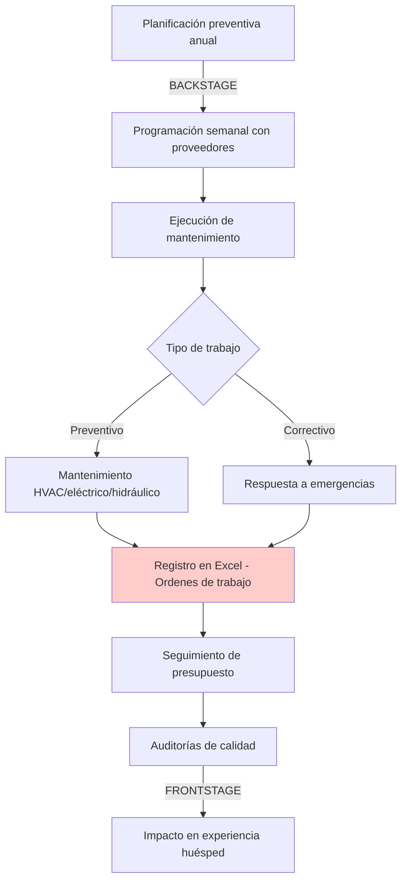
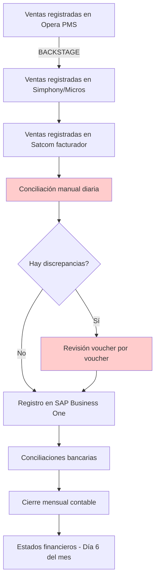

# ANÁLISIS CONTEXTUAL DE DISEÑO DE SERVICIOS
# SOCIEDAD HOTELERA LOS TAJIBOS S.A.

---

## 1. RESUMEN EJECUTIVO

Sociedad Hotelera Los Tajibos S.A. opera como el hotel líder en Santa Cruz de la Sierra, Bolivia, con un enfoque en hospitalidad de lujo, eventos corporativos y sociales, y servicios de alimentos y bebidas[file:1]. El análisis de 18 entrevistas con stakeholders clave revela una organización con procesos operativos maduros pero fragmentados por sistemas no integrados, procesos manuales intensivos y cuellos de botella en la coordinación interdepartamental[file:27].

Los **stakeholders críticos** incluyen Directora de Marketing y Ventas, Gerente de Ingeniería, Chef Ejecutivo, Gerente de Contabilidad, Gerente de TI, Sub Gerente General, y líderes de áreas operativas (Housekeeping, Recepción, Centro de Convenciones, Bar)[file:1][file:5]. Los **procesos críticos** abarcan gestión de reservas/eventos (Opera PMS), control de costos de alimentos (SAP/Simphony), mantenimiento de infraestructura crítica (HVAC, eléctrico, hidráulico), conciliaciones contables multi-sistema (Opera/Satcom/Simphony vs SAP), y gestión de ventas B2B/B2C[file:27].

Los **pain points principales** identificados incluyen: falta de integración entre sistemas (Opera, SAP, Simphony, Micros, Satcom)[file:27], procesos de aprobación lentos para contratos y cotizaciones[file:27], ausencia de CRM para seguimiento comercial[file:27], necesidad de automatización en procesos manuales (especialmente contabilidad y ventas)[file:27], y deficiencias en la red de comunicaciones del hotel[file:27]. Las **oportunidades de diseño** prioritarias son: implementación de CRM comercial, automatización de atención al cliente vía chatbot con IA, integración de sistemas de gestión (Opera-SAP-Simphony), optimización de procesos de aprobación con firmas digitales, y mejora de infraestructura de red y monitoreo proactivo[file:27][web:8].

---

## 2. ANÁLISIS CONTEXTUAL (NN/G STEP 1-2: SUPPORT & GOAL DEFINITION)

### Perfil de la Empresa

Sociedad Hotelera Los Tajibos S.A. es una empresa hotelera de cinco estrellas ubicada en Santa Cruz de la Sierra, Bolivia, parte del Grupo Doria Medina[file:1][file:27]. La organización cuenta con 18 roles gerenciales y de jefatura entrevistados, abarcando 15 funciones operativas críticas desde ingeniería y tecnología hasta ventas, marketing, operaciones de hospitalidad, alimentos y bebidas, y funciones de soporte (contabilidad, control de gestión, cajas)[file:5].

El hotel opera con sistemas tecnológicos clave: Opera PMS para gestión hotelera, SAP Business One para contabilidad, Simphony/Micros para punto de venta en restaurantes, Satcom como sistema facturador, y herramientas de monitoreo como Zabbix para infraestructura de red[file:27]. Los restaurantes bajo la marca incluyen La Suisse, Cielo Bar (Santa Cruz y La Paz), Jardín de Asia, Nina, Café Caliente, y Ecko[file:27][web:8].

### Metas Estratégicas y Alineación con Diseño de Servicios

Las metas estratégicas identificadas en entrevistas incluyen[file:27][web:8]:

**Comercial y Marketing**: Maximizar ocupación hotelera, ingreso promedio por habitación (ADR), y RevPAR; fortalecer posicionamiento de marca; incrementar lealtad de clientes corporativos; optimizar segmentación de mercado (corporativo, grupos, agencias, OTA, consumidor final)[file:27].

**Operacional**: Garantizar excelencia en experiencia del huésped; mantener estándares de calidad en alimentos y bebidas; optimizar eficiencia energética y gestión de mantenimiento preventivo; asegurar disponibilidad 24/7 de sistemas tecnológicos críticos[file:27][web:19].

**Financiera**: Control riguroso de costos (especialmente costo de alimentos); cumplimiento de presupuestos anuales; optimización de rentabilidad por evento y departamento; reducción de tiempos de cierre contable (logrado: de día 23 a día 6 del mes siguiente)[file:27][web:8].

La alineación con diseño de servicios (user-centered goals) se enfoca en: reducir puntos de fricción en el journey del huésped (desde reserva hasta check-out), mejorar tiempos de respuesta comercial (cotizaciones, contratos), automatizar interacciones repetitivas para liberar capacidad del equipo hacia tareas estratégicas, y crear visibilidad end-to-end de procesos críticos para identificar gaps y optimizaciones[web:8][web:19].

---

## 3. MAPEO DE STAKEHOLDERS (NN/G GUARDRAIL: STAKEHOLDER INVOLVEMENT)

### Tabla RACI de Stakeholders Clave

| **Proceso/Actividad** | **Directora Marketing/Ventas** | **Gerente TI** | **Chef Ejecutivo** | **Gerente Contabilidad** | **Gerente Ingeniería** | **Sub Gerente General** |
|---|---|---|---|---|---|---|
| **Estrategia Comercial** | A/R | I | I | I | I | A |
| **Gestión de Reservas/Grupos** | A | C | I | I | I | C |
| **Control de Costos A&B** | C | I | A/R | R | I | A |
| **Mantenimiento Infraestructura** | I | C | C | I | A/R | A |
| **Sistemas y Tecnología** | C | A/R | C | R | C | A |
| **Contabilidad y Finanzas** | C | I | C | A/R | C | A |
| **Operaciones Hospitalidad** | C | C | R | I | C | A/R |
| **Eventos y Convenciones** | A | C | R | C | C | R |

**Leyenda**: R = Responsible (Ejecutor), A = Accountable (Responsable final), C = Consulted (Consultado), I = Informed (Informado)[web:12][web:18].

### Roles Entrevistados y Funciones

**Directora de Marketing y Ventas** (Andrea Ayaviri Del Carpio): Lidera estrategia comercial, supervisa 15 personas (Reservas, Ventas, Revenue Management, Call Center, Marketing); responsable de cumplimiento de presupuesto de ingresos, ocupación, ADR, RevPAR[file:27].

**Gerente de TI** (Pavel Josue Arias Zuleta): Gestiona red de comunicaciones, sistemas (Opera, Simphony, Micros, Satcom), equipamiento tecnológico en Los Tajibos, Green Tower, y restaurantes del grupo; equipo de 5 colaboradores[file:27].

**Chef Ejecutivo** (Diego Omar Alcantara Menacho): Control de costo de alimentos, creación y estandarización de recetas, gestión de proveedores, programación de horarios, coordinación con SAP[file:1][file:27].

**Gerente de Contabilidad** (Pamela Lucia Mejia Mangudo): Registro contable de ventas/compras/gastos en SAP Business One, conciliaciones Opera/Simphony/Micros vs Satcom, control de plazos[file:1][file:27].

**Gerente de Ingeniería** (Javier Ferrufino Hurtado): Mantenimiento de equipos críticos (eléctrico, hidráulico, HVAC), proyectos de mejora, eficiencia energética/agua, presupuesto anual, auditorías[file:1][file:27].

**Sub Gerente General** (Patricia Griselda Barroso Sanchez): Supervisión operativa general, coordinación interdepartamental, resolución de conflictos[file:5][web:12].

Otros roles críticos incluyen: Director Centro de Convenciones (Fridda Roca), Jefe de Housekeeping (Selva Araceli Perez Gutierrez), Gerente de Control de Gestión, Jefe de Recepción, Gerente de Costos CC, Jefe de Cajas (Gualberto Santillan Pizarro), Gerente de Ventas B2B (Marcia Gaby Coimbra Noriega), Gerente de Bar y Centro de Producción (Juan Pablo Caceres)[file:1][file:5][file:27].

---

## 4. MAPEO DE PROCESOS AS-IS (NN/G STEP 3: RESEARCH GATHERING)

### 4.1. Proceso de Reserva y Venta B2B (Corporativo/Grupos)

**EVIDENCIA FÍSICA**: Cotizaciones PDF, contratos impresos, cartas corporativas con fotografías[file:27].  
**EVIDENCIA DIGITAL**: Correos electrónicos, mensajes WhatsApp, registros Opera PMS, facturas Satcom[file:27].

**Pain Points Identificados**[file:27]:
- Ausencia de CRM: no hay trazabilidad de cotizaciones, no se sabe tasa de conversión, ni razones de pérdida de ventas
- Demoras en elaboración y aprobación de contratos (proceso manual, múltiples revisiones)
- Seguimiento ineficiente de oportunidades comerciales
- Respuestas lentas a clientes (cotizaciones, contratos)
- Falta de automatización en envío de cartas corporativas

### 4.2. Proceso de Control de Costos de Alimentos y Bebidas

**EVIDENCIA FÍSICA**: Recetas estandarizadas, órdenes de compra impresas, inventarios físicos[file:27].  
**EVIDENCIA DIGITAL**: Registros Excel, transacciones Simphony/Micros, asientos SAP[file:27].

**Pain Points Identificados**[file:27]:
- Exceso de trabajo manual que podría automatizarse (kardex, conciliaciones)
- No hay control de stock en sistema integrado (se trabaja en Excel)
- Proceso lento de conciliación entre sistemas (Opera/Simphony/Micros vs Satcom vs SAP)
- Falta de rentabilidad por evento en tiempo real
- Necesidad de capacitación en sistemas electrónicos para personal operativo

### 4.3. Proceso de Mantenimiento de Infraestructura Crítica

**EVIDENCIA FÍSICA**: Órdenes de trabajo impresas, manuales de equipos, certificados de auditorías[file:27].  
**EVIDENCIA DIGITAL**: Planillas Excel, correos de coordinación[file:1][file:27].

**Pain Points Identificados**[file:27]:
- Gestión de órdenes de trabajo en Excel (no hay sistema CMMS)
- Falta de monitoreo proactivo de equipos críticos
- Demoras en aprobaciones y pagos a proveedores
- Necesidad de renovación de equipamiento tecnológico de red

### 4.4. Proceso de Contabilidad y Conciliaciones Multi-Sistema

**EVIDENCIA DIGITAL**: Reportes Opera/Simphony/Micros/Satcom, asientos SAP, conciliaciones Excel[file:27].

**Pain Points Identificados**[file:27]:
- Conciliaciones manuales entre 4 sistemas diferentes (Opera, Simphony, Micros, Satcom, SAP)
- Revisión manual de formas de pago cuando hay diferencias (voucher por voucher)
- Proceso lento y propenso a errores
- Necesidad de automatización de reportes de ventas

### 4.5. Pain Points Clasificados por Categoría

**PROCESO** (n=28 pain points identificados)[file:27][file:6]:
- Cuellos de botella en aprobaciones (contratos, cotizaciones, pagos)
- Exceso de reuniones operativas con bajo valor estratégico
- Procesos burocráticos lentos (RRHH, legal, finanzas)
- Falta de autonomía de líderes de área
- Comunicación centralizada en exceso (sobrecarga gerencial)

**DATOS** (n=18 pain points)[file:27][file:6]:
- Información tarda de otras áreas
- Datos no actualizados o no organizados
- Falta de acceso directo a bases de datos
- Discrepancias entre sistemas
- Archivos Excel pesados y manuales

**SISTEMAS** (n=24 pain points)[file:27][file:6]:
- Falta de integración entre Opera, SAP, Simphony, Micros, Satcom
- Ausencia de CRM comercial
- No hay chatbot con IA para atención al cliente
- Equipamiento tecnológico no adecuado (red, switching, wireless)
- Falta de sistema CMMS para mantenimiento

**CULTURA** (n=14 pain points)[file:27][file:6]:
- Resistencia al cambio tecnológico
- Falta de capacitación en sistemas electrónicos
- Dependencia de aprobación gerencial para decisiones operativas
- Comunicación deficiente entre áreas
- Falta de cultura de documentación de procesos

---

## 5. ANÁLISIS DE GAPS Y OPORTUNIDADES (NN/G STEP 4-5: BLUEPRINT MAPPING & REFINEMENT)

### 5.1. Gaps en Customer Journey

**Journey del Huésped Corporativo (B2B)**[web:8][web:19]:
- **Gap 1**: No hay registro de interacciones pre-venta (sin CRM) - Oportunidad: Implementar CRM con pipeline visible
- **Gap 2**: Tiempos de respuesta lentos en cotizaciones (manual) - Oportunidad: Templates automatizados + aprobaciones digitales
- **Gap 3**: Proceso de contrato lento y manual - Oportunidad: Firmas digitales + contratos estandarizados
- **Gap 4**: No hay seguimiento post-evento automático - Oportunidad: Automatizar encuestas NPS + seguimiento comercial

**Journey del Huésped Directo (B2C)**[web:8][web:19]:
- **Gap 5**: Atención 24/7 limitada por capacidad humana - Oportunidad: Chatbot con IA para consultas frecuentes
- **Gap 6**: No hay visibilidad de disponibilidad en tiempo real para call center - Oportunidad: Integración Opera-CRM en tiempo real
- **Gap 7**: Experiencia fragmentada entre canales (teléfono, correo, WhatsApp, web) - Oportunidad: Plataforma omnicanal

### 5.2. KPIs Relevantes

**Comerciales** (pendiente de validación con PHASE1_KPI_DICTIONARY.json)[web:8][web:19]:
- Tasa de ocupación (%)
- ADR - Average Daily Rate (Bs/USD)
- RevPAR - Revenue per Available Room (Bs/USD)
- Tasa de conversión de cotizaciones (%)
- Tiempo promedio de respuesta a cotizaciones (horas)
- NPS - Net Promoter Score

**Operacionales**[web:8]:
- Tiempo promedio de check-in/check-out (minutos)
- Disponibilidad de sistemas críticos (%) - SLA 99.5%
- Tiempo de resolución de incidentes TI (horas)
- Eficiencia energética (kWh/habitación ocupada)

**Financieros**[file:27]:
- Costo de alimentos como % de ventas A&B
- Cumplimiento de presupuesto mensual (%)
- Días para cierre contable (actual: 6 días)
- Margen de rentabilidad por evento (%)

### 5.3. Recomendaciones Prioritarias

**ALTA PRIORIDAD**[web:8][web:19]:
1. **Implementar CRM comercial**: Centralizar gestión de oportunidades, automatizar seguimientos, medir conversión (Roles: Directora Marketing/Ventas, Gerente TI)
2. **Automatizar atención con chatbot IA**: Consultas frecuentes, disponibilidad, cotizaciones básicas 24/7 (Roles: Gerente TI, Directora Marketing/Ventas)
3. **Integrar sistemas Opera-SAP-Simphony**: Eliminar conciliaciones manuales, datos en tiempo real (Roles: Gerente TI, Gerente Contabilidad)
4. **Firmas digitales para contratos**: Reducir tiempos de aprobación de semanas a días (Roles: Sub Gerente General, Legal)

**MEDIA PRIORIDAD**[web:8]:
5. **Mejorar infraestructura de red**: Switching 1Gbps, wireless estable, monitoreo proactivo (Rol: Gerente TI, Gerente Ingeniería)
6. **Implementar sistema CMMS**: Gestión de mantenimiento preventivo/correctivo digitalizado (Rol: Gerente Ingeniería)
7. **Automatizar reportes de ventas**: Dashboards en tiempo real en Power BI (Rol: Gerente Control de Gestión, Gerente TI)
8. **Optimizar procesos de aprobación**: Definir límites de autonomía por nivel (Rol: Sub Gerente General)

### 5.4. Validación vía Workshops

**Workshop 1: Service Blueprint - Journey Huésped B2B** (Duración: 4 horas)[web:8]:
- Participantes: Directora Marketing/Ventas, Gerente Ventas B2B, Gerente TI, Gerente Contabilidad, Legal
- Objetivos: Mapear frontstage/backstage completo, identificar líneas de visibilidad/interacción, priorizar pain points
- Entregables: Blueprint digital validado, roadmap de quick wins

**Workshop 2: Service Blueprint - Operaciones Hospitalidad** (Duración: 4 horas)[web:8]:
- Participantes: Sub Gerente General, Directora Operaciones, Jefe Recepción, Jefe Housekeeping, Gerente TI
- Objetivos: Mapear touchpoints críticos check-in/out, housekeeping, mantenimiento
- Entregables: Blueprint digital validado, identificación de gaps tecnológicos

**Workshop 3: Integración de Sistemas y Automatización** (Duración: 3 horas)[web:8]:
- Participantes: Gerente TI, Gerente Contabilidad, Gerente Control de Gestión, Analista TI
- Objetivos: Definir arquitectura de integración Opera-SAP-Simphony, priorizar APIs
- Entregables: Arquitectura técnica, backlog de automatizaciones

---

## 6. REFERENCIAS Y PRÓXIMOS PASOS

### Fuentes Utilizadas

- **Entrevistas primarias**: 18 entrevistas con stakeholders de Los Tajibos (Gerente de Ingeniería, Gerente de Contabilidad, Analista TI, Chef Ejecutivo, Jefe de Ingeniería, Sub Gerente General, Director Centro de Convenciones, Jefe de Housekeeping, Gerente de Control de Gestión, Directora de Operaciones, Asist. Subgerencia, Jefe de Recepción, Gerente de Costos CC, Jefe de Cajas, Gerente de TI, Gerente de Ventas B2B, Directora de Marketing y Ventas, Gerente de Bar y Centro de Producción)[file:1][file:5][file:27]
- **Metodología**: Nielsen Norman Group - 5 Steps to Service Blueprinting[web:8], Service Design 101[web:19], UX Stakeholder Engagement[web:12]
- **Documentos de análisis**: lostajibos.md.docx, all_interviews.json, insights.json, summary.json, FINDINGS_ANALYSIS.md[file:1][file:5][file:27][file:4][file:6]

### Próximos Pasos (Roadmap 90 días)

**Semana 1-2: Preparación y Validación**[web:8]
- Socializar presente documento con dirección ejecutiva
- Agendar Workshops 1, 2, 3 con stakeholders
- Solicitar acceso a PHASE1_KPI_DICTIONARY.json y PHASE1_AUTOMATION_BACKLOG.json

**Semana 3-4: Workshops y Service Blueprints**[web:8][web:19]
- Ejecutar Workshop 1: Journey B2B
- Ejecutar Workshop 2: Operaciones Hospitalidad
- Ejecutar Workshop 3: Integración Sistemas
- Crear blueprints digitales validados (herramienta: Miro/Figma)

**Semana 5-8: Priorización y Roadmap Tecnológico**[web:8]
- Definir roadmap de implementación CRM (RFP proveedores)
- Diseñar arquitectura de integración Opera-SAP-Simphony (con Gerente TI)
- Prototipar chatbot IA (casos de uso: consultas disponibilidad, cotizaciones básicas)
- Evaluar plataformas de firma digital (DocuSign, Adobe Sign)

**Semana 9-12: Quick Wins y Pilotos**[web:8]
- Implementar firma digital en contratos (piloto: eventos corporativos)
- Automatizar 3 reportes de ventas en Power BI (piloto: Ventas B2B)
- Mejorar templates de cotizaciones (diseño + carga automática desde Opera)
- Capacitar equipo en nuevas herramientas

**Próximos 90 días: Iteración y Escalamiento**[web:8][web:19]
- Implementar CRM fase 1 (pipeline comercial)
- Integrar Opera-SAP fase 1 (ventas diarias automáticas)
- Lanzar chatbot IA (web + WhatsApp)
- Medir KPIs definidos y ajustar

---

**Elaborado por**: Equipo de Diseño de Servicios  
**Fecha**: Octubre 2025  
**Versión**: 1.0 - Entregable Fase 1  
**Metodología**: Nielsen Norman Group Service Blueprinting[web:8][web:19]  
**Próxima revisión**: Workshop de validación (Semana 3-4)
