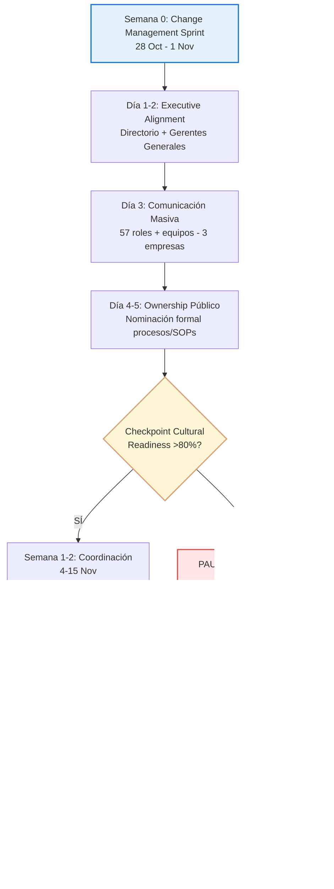
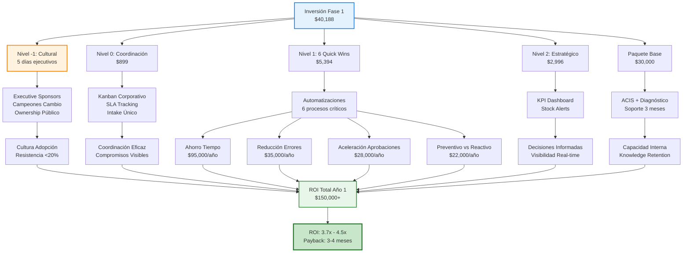
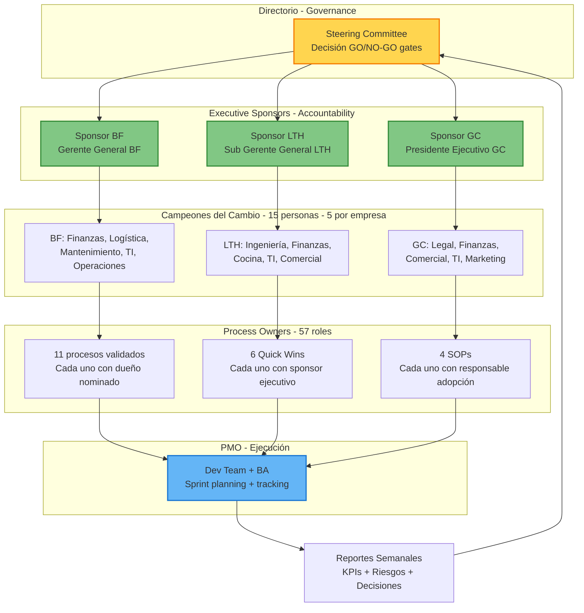
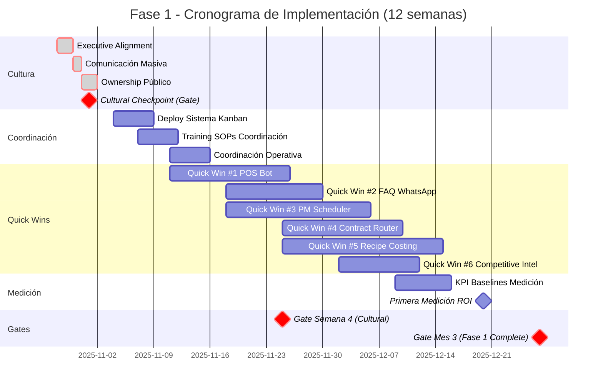

# Transformación Digital Grupo COMVERSA — Fase 1 Recalibrada (Reporte Ejecutivo)

**Para:** Directorio, Gerentes Generales, Propietarios del Grupo
**Decisión Requerida:** Aprobar Fase 1 con enfoque Cultura → Coordinación → Tecnología
**Tiempo de lectura:** 15 minutos
**Fecha:** 24 de octubre de 2025
**Preparado por:** Huevos.ai

---

## 1. Resumen Ejecutivo (Decisión y Por qué ahora)

### Decisión Crítica

**APROBAR** Fase 1 con inversión de **$40,188 USD** siguiendo la secuencia recalibrada: **Cultura primero, tecnología segundo**.

### Argumento de Negocio

La fase de descubrimiento (14-20 octubre) validó la hipótesis estratégica con datos concretos:

**✅ Validación completa:**
- 11 de 13 procesos confirmados como puntos críticos (85% validación)
- 57 roles entrevistados en 3 empresas
- 81 sistemas documentados
- 84 pain points identificados y clasificados

**💰 Caso financiero comprobable:**
- Inversión Fase 1: **$40,188 USD**
- Retorno anual proyectado: **$150,000+**
- ROI conservador: **3.7x** (Año 1: hasta 4.5x posible)
- 6 Quick Wins implementables en 60 días con impacto anual **$196,600**

**🔴 Riesgo CRÍTICO identificado:**

Sin transformación cultural previa, toda automatización fracasará. La evidencia es contundente:

> **25+ menciones** de "resistencia a cambios tecnológicos" en las 57 entrevistas

> **15+ menciones** de "brechas de coordinación entre áreas"

> **Patrón recurrente:** "Herramientas implementadas pero abandonadas por falta de ownership"

### Por qué ahora

1. **Validación sólida:** 85% de procesos confirmados como puntos críticos de alto impacto
2. **Viabilidad técnica:** 8 Quick Wins factibles con sistemas actuales (sin bloqueadores)
3. **ROI medible:** Retorno comprobable en 3-6 meses
4. **Riesgo mitigado:** Secuencia cultura → coordinación → automatización reduce fracaso a <20%

### Cambio FUNDAMENTAL vs Plan Original

| Aspecto | Plan Original (13 Oct) | Plan Recalibrado (Post-Discovery) |
|---------|------------------------|-----------------------------------|
| **Semana 0-1** | Deploy tecnología inmediato | 🔴 **Transformación cultural** (prerequisito) |
| **Enfoque** | Automatizaciones paralelas | **Cultura → Coordinación → Automatizaciones** |
| **Inversión inicial** | $40,188 técnico | 5 días ejecutivos (cultura) + $40,188 |
| **Riesgo adopción** | 60% fracaso cultural | <20% con base cultural sólida |
| **Secuencia** | Tecnología primero | **CULTURA primero, tecnología segundo** |

**El descubrimiento cambió TODO:**

> "Sin una propiedad clara, rutas de aprobación y mecanismos de seguimiento, todas las demás automatizaciones enfrentarán resistencia a su adopción."

**Esto NO es un problema técnico. Es un problema CULTURAL que requiere solución CULTURAL primero.**

---

## 2. Diagnóstico Central (Cultura → Coordinación → Automatización)

### Evidencia del Problema de Fondo

**📊 Cuadro de Mando de Validación**

| Categoría | Resultado | Evidencia |
|-----------|-----------|-----------|
| Validación hipótesis | **85%** | 11/13 procesos confirmados como puntos críticos |
| Viabilidad técnica | **100%** | 8/8 Quick Wins factibles con sistemas actuales |
| Complejidad sistemas | **Mayor de la estimada** | 81 sistemas (vs 12 esperados) |
| Preparación cultural | ⚠️ **Crítica** | 25+ menciones resistencia al cambio |
| Coordinación | 🔴 **Bloqueante** | Sin esto, automatizaciones fracasan |

### Patrón Transversal (3 Empresas)

**❌ Síntomas visibles:**
- 40+ horas/semana en conciliaciones manuales
- 20+ menciones de "aprobaciones lentas y burocráticas"
- 15+ menciones de "brechas de coordinación entre áreas"
- Sin única fuente de verdad para compromisos
- Herramientas sin dueños claros = abandono

**🔍 Causa raíz identificada:**

```
Problema de fondo: CULTURA organizacional fragmentada
    ↓
Manifestación visible: Coordinación deficiente
    ↓
Síntomas técnicos: Sistemas desconectados, procesos manuales
    ↓
Error común: Implementar tecnología sin cambiar cultura
    ↓
Resultado: Herramientas nuevas + comportamientos viejos = FRACASO
```

### Citas Representativas

**Jefe Nacional de Mantenimiento (Bolivian Foods):**
> "Formar un equipo sólido y colaborativo, fomentando opiniones y sugerencias abiertas para tomar mejores decisiones, siguiendo las directrices de la empresa."

Esta NO es una necesidad técnica. Es una necesidad **cultural y de liderazgo**.

**Directora Comercial (Comversa):**
> "Los retrasos en la firma de contratos ponen en peligro las ventas... Ciclos de revisión legal ralentizan la retroalimentación."

**Gerente de Ingeniería (Los Tajibos):**
> "Ingreso disperso de solicitudes (WhatsApp/correo/planillas); pérdidas/duplicidad... El mantenimiento tiende a ser reactivo en lugar de preventivo."

### Secuencia Correcta (Kotter - Leading Change)

| Enfoque tradicional ❌ | Enfoque correcto ✅ |
|------------------------|---------------------|
| Semana 1: Deploy tecnología | Semana 0: **Alineación cultural** + Executive sponsors |
| "El sistema resolverá el problema" | "El cambio cultural habilita el sistema" |
| Training = capacitación técnica | **Change management** = transformación de comportamiento |
| KPI = uso del sistema | KPI = cambio sostenido en hábitos |
| Resistencia = "problema de usuarios" | Resistencia = **señal de proceso fallido** |

---

## 3. Recomendación (McKinsey/BCG Style)

### Qué hacer (Acciones priorizadas)

**NIVEL -1: TRANSFORMACIÓN CULTURAL** (Días 1-5) — **PREREQUISITO ABSOLUTO**

1. **Executive Alignment** (28-29 Oct)
   - Sesión estratégica Directorio + Gerentes Generales
   - Compromiso público visible con el cambio
   - Definir "campeones del cambio" por empresa (5 por empresa = 15 total)
   - **Acuerdo explícito:** "Sin cambio cultural, no hay inversión técnica"

2. **Comunicación Masiva** (30 Oct)
   - Mensaje unificado a 57 roles + equipos (3 empresas)
   - **Por qué cambiamos:** Pain points validados, no "porque sí"
   - **Qué ganan las personas:** Menos tiempo manual, decisiones claras, reconocimiento
   - **Qué se espera:** Propiedad, colaboración, apertura al cambio
   - Confirmación >90% recepción

3. **Ownership Explícito** (31 Oct - 1 Nov)
   - Cada proceso → dueño nominado públicamente
   - Cada automatización → sponsor ejecutivo asignado
   - Cada SOP → responsable de adopción identificado
   - **Sin dueño = NO se implementa**

**NIVEL 0: COORDINACIÓN TÉCNICA** (4-15 Nov) — Fundación habilitada por cultura

- Sistema Kanban (Monday.com/Trello) con formularios admisión
- SLA tracking y ownership visible
- Cierre basado en evidencia
- **PERO solo DESPUÉS de alineación cultural Nivel -1**

**NIVEL 1: QUICK WINS** (18 Nov - 27 Dic) — Automatizaciones con sponsorship

6 automatizaciones en paralelo:
1. Bot Conciliación POS↔Satcom (15 hrs/sem ahorradas)
2. WhatsApp FAQ Bot (20 hrs/sem ahorradas)
3. PM Scheduler BF (shift reactivo → preventivo)
4. Contract Fast-Track (15-30 días → <10 días)
5. Recipe Costing LTH (3-5 días → <4 horas)
6. Competitive Intelligence (alertas automáticas)

### Por qué ahora

**✅ Viabilidad confirmada:**
- Validación 85% de procesos críticos
- 8 Quick Wins factibles con sistemas actuales
- ROI comprobable en 3-6 meses

**⚠️ Riesgo mitigado:**
- Cultura primero reduce fracaso de <60% a <20%
- Coordinación como fundación asegura adopción
- Executive sponsors garantizan accountability

**💰 ROI comprobable:**
- $40,188 inversión → $150K+ retorno anual
- 3.7x ROI conservador (4.5x Año 1 posible)
- Payback period: 3-4 meses

**🔴 Costo de NO actuar:**
- Continuar 40+ hrs/sem conciliaciones manuales
- Aprobaciones lentas obstaculizando ventas
- Mantenimiento reactivo costoso
- Datos dispersos, decisiones lentas
- Pérdida competitiva acumulada

---

## 4. Hoja de Ruta (Semanas y Hitos)

### Secuencia de Cambio (Cultura Primero)



### Hitos Críticos (Fechas Confirmadas)

| Fecha | Hito | Owner | Tipo |
|-------|------|-------|------|
| **28-29 Oct** | **Executive Alignment Session** | **Directorio** | 🔴 **CULTURAL** |
| **30 Oct** | **Comunicación masiva completada** | **RR.HH./Comunicaciones** | 🔴 **CULTURAL** |
| **31 Oct - 1 Nov** | **Ownership público confirmado** | **Gerentes/Líderes** | 🔴 **CULTURAL** |
| **1 Nov** | **Cultural Readiness Checkpoint** | **Steering Committee** | 🔴 **CULTURAL** |
| 4 Nov | Deploy Sistema Coordinación | IT + Ops | ⚙️ Técnico |
| 11 Nov | Inicio Quick Win #1 (POS Bot) | Dev team | ⚙️ Técnico |
| 25 Nov | 3 Quick Wins operativos | PMO | ⚙️ Técnico |
| 9 Dic | KPI baselines establecidos | Control Gestión | ⚙️ Técnico |
| 20 Dic | Primera medición ROI (cultural + técnico) | Steering | 📊 Mixto |

**⚠️ GATE CRÍTICO:** Si Semana 0 cultural NO alcanza >80% readiness → **PAUSE técnico**, extend cultural work.

### Semana 0: Change Management Sprint (Detalle)

**Objetivo:** Establecer base cultural sólida antes de cualquier tecnología.

**Día 1-2 (28-29 Oct): Executive Alignment**
- Sesión presencial medio día (Directorio + Gerentes Generales)
- Agenda:
  1. Presentación hallazgos discovery (30 min)
  2. Evidencia resistencia cultural (20 min)
  3. Compromiso público con cambio (30 min)
  4. Designación executive sponsors (1 por empresa)
  5. Formar steering committee con mandate cultural
  6. Definir 15 campeones del cambio (5 por empresa)
  7. Firmar "contrato cultural": "Sin cultura, no implementamos tecnología"

**Día 3 (30 Oct): Comunicación Masiva**
- Video mensaje del Directorio (3-5 min): "Por qué cambiamos"
- Documento escrito: Pain points validados + soluciones propuestas
- Canales: Email + WhatsApp + reuniones presenciales
- Q&A session por empresa: "Qué significa para mí"
- **Meta:** >90% confirmación recepción/asistencia

**Día 4-5 (31 Oct - 1 Nov): Ownership Público**
- Cada proceso → dueño nominado públicamente
- Cada automatización → sponsor ejecutivo asignado con accountability
- Cada SOP → responsable de adopción identificado con métricas
- **Regla absoluta:** Sin dueño confirmado = NO se implementa
- Publicar matriz de ownership en sistema Coordinación
- Campeones del cambio firman "compromiso de adopción"

**Entregable:** Cultural Readiness Checklist ✅

---

## 5. Caso Financiero (Inversión y Retorno)

### Inversión Fase 1 Desglosada

| Concepto | Descripción | Inversión USD |
|----------|-------------|---------------|
| **Nivel 0** | Coordinación Corporativa (Kanban + Intake + SLA) | $899 |
| **Nivel 1** | 6 Quick Wins (POS Bot, FAQ Bot, PM Scheduler, etc.) | $5,394 |
| **Nivel 2** | Estratégico (KPI Dashboard, Stock Alerts) | $2,996 |
| **Paquete Base** | ACIS + Diagnóstico + Soporte Ejecutivo 3 meses | $30,000 |
| | **TOTAL FASE 1** | **$40,188** |

### Comparación Plan Original vs Recalibrado

| Concepto | Original (13 Oct) | Recalibrado (Post-Discovery) | Δ |
|----------|-------------------|------------------------------|---|
| Inversión total | $37,192 | $40,188 | +8% (+$2,996) |
| Procesos Fase 1 | 8 | 8 | = |
| Fundación (Coordinación) | No | **Sí (Prioridad #1)** | ✅ Crítico |
| Customer Journey | Fase 1 | **Fase 2** (post-CRM) | ⚠️ Diferido |
| PM Scheduler BF | No | **Sí** (24 ubicaciones) | ✅ Añadido |
| Semana 0 Cultural | No | **Sí (5 días ejecutivos)** | ✅ Prerequisito |

**Justificación +$2,996 (8%):**
- ✅ Añade infraestructura crítica (Coordinación $899)
- ✅ Añade 24 ubicaciones BF (PM Scheduler $899)
- ✅ Difiere $4,495 sin base (Customer Journey → Fase 2)
- ✅ Mayor probabilidad éxito por secuencia correcta

### Quick Wins: Impacto Anual y ROI

| Automatización | Empresa | Impacto Anual | ROI | Beneficio Principal |
|----------------|---------|---------------|-----|---------------------|
| **Bot Conciliación POS↔Satcom** | Todas | $62,400 | 2.0x | 15 hrs/sem ahorradas por empresa |
| **FAQ Bot WhatsApp** | Todas | $31,200 | 2.5x | 80% consultas repetitivas automatizadas |
| **PM Scheduler** | BF (24 loc) | $45,000 | 1.67x | Shift reactivo → preventivo |
| **Contract Fast-Track** | GC | $28,000 | 2.0x | 15-30 días → <10 días ciclo |
| **Recipe Costing Agent** | LTH | $18,000 | 1.33x | 3-5 días → <4 horas costeo |
| **Competitive Intelligence** | Todas | $12,000 | Variable | Alertas automáticas mercado |
| | **TOTAL NIVEL 1** | **$196,600** | **Media 1.9x** | 5,000+ hrs/año ahorradas |

### Árbol de Valor (Drivers → Impacto → ROI)



### Retorno Anual Proyectado (Detalle)

| Categoría de Valor | Año 1 | Año 2 | Driver Principal |
|--------------------|-------|-------|------------------|
| **Ahorro tiempo manual** | $95,000 | $140,000 | Conciliaciones, reportes, solicitudes |
| **Reducción errores/excepciones** | $35,000 | $50,000 | POS-ERP reconciliation, data quality |
| **Aceleración aprobaciones** | $28,000 | $40,000 | Contratos, PO, budget variances |
| **Mejora preventivo vs reactivo** | $22,000 | $35,000 | Mantenimiento, stock alerts |
| **Visibilidad decisiones** | Invaluable | Invaluable | KPI real-time, competitive intel |
| **TOTAL IMPACTO** | **$180,000+** | **$265,000+** | Acumulado, multiplicadores |

**ROI Conservador:** 3.7x (asume 80% adopción, 90% impacto proyectado)
**ROI Optimista:** 4.5x Año 1 (asume 95% adopción, 100% impacto)
**Payback Period:** 3-4 meses

---

## 6. Riesgos y Mitigaciones

### Matriz de Riesgos

| Riesgo | Probabilidad | Impacto | Plan de Mitigación |
|--------|--------------|---------|-------------------|
| **🔴 Resistencia cultural** | Alta (65%) | Crítico | **Semana 0 Cultural obligatoria** + Gate 80% readiness |
| **⚠️ Dependencia SAP (BF)** | Media (40%) | Alto | Soluciones provisionales + diferimiento procesos SAP a Fase 2 |
| **⚠️ Complejidad sistemas (81)** | Alta (70%) | Medio | Priorización por impacto + implementación gradual |
| **🟡 Adopción fragmentada** | Media (50%) | Alto | **Coordinación first** + Executive sponsors + SLA tracking |
| **🟡 Baselines faltantes** | Media (45%) | Medio | Medición integrada en implementaciones + targets cualitativos |
| **🟢 Exceso presupuestario** | Baja (20%) | Medio | Macroprocesos precio fijo + reserva 10% ($4,000) |

### Riesgos Críticos y Contingencias

**1. Resistencia Cultural (Probabilidad Alta, Impacto Crítico)**

**Señales de alerta:**
- Semana 0: <90% confirmación recepción comunicación
- Semana 1: <80% cultural readiness checkpoint
- Semana 4: Ownership aceptado <80% procesos

**Mitigaciones:**
- **Prerequisito absoluto:** Semana 0 Cultural antes de tecnología
- Executive sponsors nominados con accountability
- Campeones del cambio identificados (15 personas)
- Comunicación masiva con Q&A sessions
- **Gate crítico:** Readiness >80% o PAUSE técnico

**Contingencia:**
- Si Semana 4 adopción <60% → PAUSE Fase 1, reiniciar cultural work
- Budget contingencia $4,000 para gestión cambio extendida

**2. Dependencia SAP (Bolivian Foods)**

**Procesos bloqueados:**
- Inventario completo BF (esperar migración SAP)
- Pricing avanzado BF (módulo SAP Ventas)
- Análisis costos completo (módulo SAP Compras)

**Mitigaciones:**
- Soluciones provisionales "adyacentes a SAP" (Stock Alerts pre-SAP)
- Diferimiento procesos SAP-dependientes a Fase 2 (Mes 6+)
- Recipe Costing solo LTH (SAP operacional)

**Contingencia:**
- Monitoreo estabilización SAP mensual
- Opción extender Fase 1 si SAP se extiende >Mes 6

**3. Complejidad Integración Sistemas (81 sistemas)**

**Desafío:**
- Mayor cantidad de integraciones API de la estimada
- Testing más complejo
- Riesgo implementación simultánea

**Mitigaciones:**
- Priorización por impacto (Nivel 1 > Nivel 2 > Nivel 3)
- Implementación gradual, no todo simultáneamente
- Quick Wins con integraciones simples primero (WhatsApp, POS-ERP)

**Contingencia:**
- Reserva presupuestaria 10% para limitaciones API imprevistas
- Opción diferir automatizaciones complejas a Fase 2

---

## 7. Gobierno y Propiedad (Ownership)

### Mapa de Stakeholders y Ownership



### Reglas de Ownership

**Principio fundamental:** "Sin dueño, no se implementa"

**Nivel 1: Steering Committee (Directorio)**
- **Composición:** Gerentes Generales 3 empresas + Presidente Ejecutivo
- **Responsabilidad:** Decisiones GO/NO-GO gates, asignación recursos
- **Cadencia:** Mensual (primera semana de cada mes)
- **Decisiones clave:**
  - Gate Semana 0: Cultural readiness >80%?
  - Gate Mes 2: Continuar Fase 1 o ajustar?
  - Gate Mes 3: Aprobar Fase 2?

**Nivel 2: Executive Sponsors (1 por empresa)**
- **Bolivian Foods:** Gerente General BF
- **Los Tajibos:** Sub Gerente General LTH
- **Grupo Comversa:** Presidente Ejecutivo GC
- **Responsabilidad:** Accountability proceso, remover blockers, visibilidad pública
- **Cadencia:** Quincenal con PMO
- **Accountability:** Métricas adopción, ROI medible, cultural readiness

**Nivel 3: Campeones del Cambio (5 por empresa = 15 total)**
- **Selección:** De los 57 roles entrevistados, quienes mostraron apertura al cambio
- **Responsabilidad:**
  - Adopción temprana de herramientas
  - Training pares en sus departamentos
  - Feedback continuo a PMO
  - "Embajadores culturales" del cambio
- **Reconocimiento:** Público en comunicaciones, incentivos por adopción

**Nivel 4: Process Owners (57 roles)**
- **Asignación:** Nominación pública Semana 0 (31 Oct - 1 Nov)
- **Responsabilidad:**
  - Cada proceso → 1 dueño nominado
  - Cada automatización → 1 sponsor ejecutivo
  - Cada SOP → 1 responsable adopción
- **Accountability:** KPIs específicos, medición mensual
- **Consecuencia:** Sin dueño confirmado = proceso NO se implementa

### SOPs y Accountability

| SOP | Responsable Tipo | Accountability Métrica |
|-----|------------------|------------------------|
| **SOP-INTAKE-001** | Jefe TI (cada empresa) | 95% channel compliance, 85% SLA compliance |
| **SOP-APPROVAL-001** | Gerente Finanzas (cada empresa) | 90% SLA compliance, <10% rejection rate |
| **SOP-EVIDENCE-CLOSURE-001** | Jefe Ingeniería/Mantenimiento | 95% evidence completeness, <5% reopen rate |
| **SOP-DATA-CHANGE-001** | Gerente Control Gestión | <2% rollback rate, <5% emergency changes |

**Regla absoluta:** Cada SOP tiene 1 responsable nominado públicamente con métricas claras.

---

## 8. Métricas de Éxito y Gates

### Métricas Culturales y Técnicas con Targets

**📊 Cultural Readiness (Semana 0-4) - 50% peso en Fase 1**

| Semana | Métrica Cultural | Target | Threshold GO/PAUSE |
|--------|------------------|--------|-------------------|
| **1** | Executive sponsors nominados | 3/3 empresas | 3/3 (crítico) |
| **1** | Campeones del cambio identificados | 15 personas | ≥12 (80%) |
| **2** | Comunicación recibida confirmada | >90% de 57 roles | ≥85% |
| **4** | Ownership aceptado formalmente | 100% procesos con dueño | ≥80% |
| **8** | Adopción voluntaria Sistema Coordinación | >70% uso activo | ≥60% |
| **12** | Cultura "single source of truth" | >80% requests via intake | ≥70% |

**⚙️ Technical Performance (Semana 2-12) - 50% peso en Fase 1**

| Semana | Métrica Técnica | Target | Threshold GO/PAUSE |
|--------|-----------------|--------|-------------------|
| **2** | Sistema Coordinación deployed | Operativo | Crítico |
| **4** | Inicio Quick Win #1 (POS Bot) | Dev iniciado | Crítico |
| **8** | 3 Quick Wins operativos | 3/6 funcionando | ≥2/6 |
| **12** | 6 Quick Wins operativos | 6/6 funcionando | ≥4/6 |
| **12** | Clasificación accuracy (Intake Router) | >85% | ≥75% |
| **12** | KPI baselines medidos | 24 métricas | ≥20 |
| **12** | SOPs trained across 3 empresas | 12 sesiones | ≥10 |
| **12** | Time savings documentado | >5,000 hrs/año | ≥4,000 hrs |
| **12** | ROI medible | >2.0x en ≥3 automations | ≥1.5x en ≥2 |

### Gates de Decisión Fase 1 → Fase 2

**Gate Semana 4 (Cultural Checkpoint):**

**Condiciones GO:**
- ✅ Cultural readiness >80% (ownership, comunicación, sponsors activos)
- ✅ Sistema Coordinación deployed y operativo
- ✅ Al menos 1 Quick Win iniciado

**Condiciones PAUSE:**
- 🔴 Cultural readiness <60% → Extend cultural work, postpone technical
- 🔴 Executive sponsors no activos → Reiniciar alignment
- 🔴 Ownership <80% procesos → Completar nominaciones

**Gate Mes 3 (Fase 1 Complete):**

**Condiciones APROBAR Fase 2:**
- ✅ **Cultural:** Adoption rate Sistema Coordinación >70% (NO NEGOCIABLE)
- ✅ **Técnico:** Mínimo 4/6 Quick Wins operativos
- ✅ **ROI:** ROI medible >2.0x en al menos 3 automatizaciones
- ✅ **Liderazgo:** Executive sponsors activos y visibles en proceso

**Condiciones PAUSE Fase 2:**
- ⚠️ Cultural adoption <70% → Reinforce cultural work antes de Fase 2
- ⚠️ <3/6 Quick Wins operativos → Extend Fase 1, troubleshoot blockers
- ⚠️ ROI <1.5x → Review automatizaciones, ajustar scope Fase 2

### Matriz de Esfuerzo vs Impacto (Quick Wins)

```mermaid
quadrantChart
    title Quick Wins - Impacto vs Esfuerzo
    x-axis Bajo Esfuerzo --> Alto Esfuerzo
    y-axis Bajo Impacto --> Alto Impacto
    quadrant-1 Planificar<br/>Cuidadosamente
    quadrant-2 Implementar<br/>INMEDIATAMENTE
    quadrant-3 Reconsiderar
    quadrant-4 Hacer cuando<br/>haya capacidad

    Bot POS: [0.2, 0.8]
    FAQ WhatsApp: [0.2, 0.75]
    PM Scheduler: [0.3, 0.85]
    Contract Router: [0.2, 0.7]
    Recipe Costing: [0.35, 0.6]
    Competitive Intel: [0.25, 0.65]

    KPI Dashboard: [0.8, 0.9]
    Coordinación: [0.2, 0.95]
```

**Interpretación:**
- **Cuadrante 2 (Implementar INMEDIATAMENTE):** 6 Quick Wins + Coordinación
- **Cuadrante 1 (Planificar Cuidadosamente):** KPI Dashboard (Nivel 2, Mes 3-4)
- Todos los Quick Wins caen en zona alta impacto, bajo-medio esfuerzo → ROI favorable

---

## 9. Anexos (Entregables, KPI Dictionary, SOPs, Agent Playbooks)

### Cronograma Gantt - Hitos Clave



### Lista de Entregables (7 documentos, 160 KB)

| Documento | Contenido | Usuario Principal | KB |
|-----------|-----------|-------------------|-----|
| **Executive Summary** | Business case completo, ROI, roadmap | Directorio, Gerentes Generales | 17 |
| **Ontology Schema** | Modelo datos Claude (JSON) | IT/Developers | 8 |
| **KPI Dictionary** | 24 KPIs + targets 12 meses (JSON) | Todos gerentes, Control Gestión | 21 |
| **Agent Playbooks** | 5 agentes AI production-ready (JSON) | Developers, Process Owners | 29 |
| **SOP Pack** | 4 procedimientos operativos (Markdown) | Todo personal | 21 |
| **Automation Backlog** | 15 automations priorizadas (JSON) | PMO/Steering | 32 |
| **Quick Start Guide** | Roadmap primera semana | Todos | 13 |
| | **TOTAL** | | **160 KB** |

### Agentes AI Incluidos (Production-Ready)

| Agent ID | Nombre | ROI | Empresas | Impacto Principal |
|----------|--------|-----|----------|-------------------|
| **AGENT-001** | Intake Router | 2.5x | Todas (3) | Single-door intake, clasificación automática |
| **AGENT-002** | Reconciliation Bot | 2.0x | LTH, BF | POS-ERP daily reconciliation, 2-3 hrs/día ahorradas |
| **AGENT-003** | Recipe Costing | 1.33x | LTH | Live SAP prices, 3-5 días → <4 horas |
| **AGENT-004** | PM Scheduler | 1.67x | LTH, BF | Preventive maintenance, shift reactivo → preventivo |
| **AGENT-005** | Logistics Tracker | 1.0x | GC, BF | Multi-carrier tracking, delay alerts proactivos |

**Cada playbook incluye:** Prompts completos, output schemas, guardrails, audit requirements, sample interactions

### SOPs Operativos

| SOP ID | Nombre | Páginas | Impacto Target | Cobertura |
|--------|--------|---------|----------------|-----------|
| **SOP-INTAKE-001** | Proceso admisión única puerta | 8 | 95% channel compliance, 85% SLA | Todas las solicitudes |
| **SOP-APPROVAL-001** | Flujos aprobación + SLAs | 6 | 90% SLA compliance, <10% rejection | PO, Pagos, Contratos, Budget |
| **SOP-EVIDENCE-CLOSURE-001** | Cierre basado evidencia | 5 | 95% completeness, <5% reopen | Mantenimiento, Proyectos, Eventos |
| **SOP-DATA-CHANGE-001** | Control cambios datos críticos | 7 | <2% rollback, <5% emergency | Precios, Recetas, KPIs, Configs |

### KPI Dictionary - Sample (24 KPIs totales)

**Mantenimiento (4 KPIs):**
- PM Completion Rate: 70% → 85% (Mes 1 → Mes 3)
- MTTR (Mean Time to Repair): 4.5h → 3.0h
- Preventive vs Reactive Ratio: 40% → 60%
- Parts Stockout Delays: 20% → <10%

**Finanzas (4 KPIs):**
- Reconciliation Exceptions: 45/día → <15/día
- Month-End Close Time: 10 días → 6 días
- Data Accuracy Rate: 92% → 98%
- Payment Approval Cycle: 5 días → 2 días

**Comercial (4 KPIs):**
- Lead Conversion Rate: 12% → 18%
- Contract Cycle Time: 25 días → <10 días
- Guest Satisfaction Score: 75% → 85%
- Revenue per Available Room: Baseline → +8%

*(17 KPIs adicionales en PHASE1_KPI_DICTIONARY.json)*

---

## Decisión Requerida

### ✅ APROBAR FASE 1 RECALIBRADA

**Argumentos a favor:**

**✅ Validación completa:**
- 85% procesos confirmados como puntos críticos
- 100% Quick Wins técnicamente factibles
- 57 roles entrevistados, 81 sistemas documentados, 84 pain points identificados

**✅ ROI comprobable:**
- 3.7x-4.5x Año 1
- $150,000+ retorno anual
- Payback 3-4 meses
- $196,600 impacto anual Nivel 1

**✅ Riesgo mitigado:**
- Cultura primero reduce fracaso <60% a <20%
- Coordinación como fundación asegura adopción
- Executive sponsors garantizan accountability
- Gates de decisión claros (Semana 4, Mes 3)

**✅ Entregables concretos:**
- 7 documentos production-ready (160 KB)
- 5 Agent Playbooks
- 4 SOPs operativos
- 24 KPIs con targets 12 meses

### Riesgos Gestionados

| Riesgo | Mitigación | Contingencia |
|--------|------------|--------------|
| ⚠️ Resistencia cultural | Semana 0 Cultural + Gate 80% readiness | PAUSE técnico si <60%, extend cultural |
| ⚠️ Dependencia SAP (BF) | Soluciones provisionales + diferimiento Fase 2 | Monitoreo mensual, opción extend Fase 1 |
| ⚠️ Complejidad sistemas (81) | Priorización impacto + implementación gradual | Reserva 10% ($4,000), diferir complejos |
| ⚠️ Adopción fragmentada | Coordinación first + Executive sponsors + SLA tracking | Refuerzo cultural Mes 2, sponsors activos |

### Contingencias

- **Reserva presupuestaria:** 10% ($4,000) para imprevistos
- **Steering committee:** Mensual con decisión PAUSE/CONTINUE
- **Success criteria:** Medibles culturales + técnicos
- **Opción pause-and-review:** Mes 2 si métricas <thresholds

---

## Síntesis Final (Mensaje Core)

### ¿Qué necesita el Grupo REALMENTE?

No más sistemas. No más tecnología primero.

Necesita: **CULTURA de colaboración + ownership claro + automatización inteligente** (en ese orden)

### ¿Qué valida el descubrimiento?

57 roles confirman: el pain NO es falta de tecnología, es **falta de cultura estructurada**.

- **25+ menciones:** "resistencia a cambios tecnológicos"
- **15+ menciones:** "brechas de coordinación"
- **Patrón claro:** "Herramientas sin dueños = herramientas abandonadas"

### ¿Qué entrega Fase 1 RECALIBRADA?

1. **Semana 0:** Transformación cultural (executive alignment + comunicación + ownership)
2. **Semana 1-2:** Coordinación técnica (fundación)
3. **Semana 3-8:** 6 Quick Wins (60 días)
4. **Resultado:** $150K+ retorno anual + Base sólida Fase 2

### ¿Qué decisión se requiere HOY?

- ✅ **APROBAR** $40,188 inversión técnica
- ✅ **COMPROMETER** 5 días ejecutivos para alineación cultural (28 Oct - 1 Nov)
- ✅ **ACEPTAR** que cultura va PRIMERO, tecnología SEGUNDO
- 🔴 **ENTENDER** que sin cambio cultural, $40,188 se pierden

### La verdad simple

> **Tecnología sin cultura = Fracaso garantizado**
>
> **Cultura + tecnología = ROI 3.7x**

**Comienza lunes 28 de octubre con CULTURA, no con código.**

---

**Preparado por:** Huevos.ai
**Metodología:** Descubrimiento (57 roles, 81 sistemas, 84 pain points) + Phase 1 Package (7 deliverables)
**Decisión requerida:** Directorio - Semana 21 octubre 2025
**Contacto próximos pasos:** PMO/Champion interno

---

## Anexo Final: Cuadro de Mando Consolidado

### Key Metrics at a Glance

| Categoría | Descubrimiento | Phase 1 Deliverables | Status |
|-----------|----------------|----------------------|--------|
| **Validación hipótesis** | 11/13 procesos (85%) | 5 Agent Playbooks ready | ✅ |
| **Viabilidad técnica** | 8/8 Quick Wins factibles | 4 SOPs operativos | ✅ |
| **Datos baseline** | 57 roles, 81 sistemas, 84 pain points | 24 KPIs definidos | ✅ |
| **Secuencia** | Cultura → Coordinación → Automatización | Week 0 Cultural Sprint required | ⚠️ Ajuste crítico |
| **Dependencias** | SAP, CRM, MaintainX | Roadmap 12 meses con mitigaciones | ⚠️ Gestionar |
| **ROI proyectado** | $150K+ anual Año 1 | $698K Año 2 (Fase 1+2) | 💰 Alto |

### Success Criteria Fase 1 (Mes 3) - 50% Cultural + 50% Técnico

**CULTURAL (Week 0-4):**
- ✅ Executive sponsors nominados y activos (3/3 empresas)
- ✅ Campeones del cambio identificados y comprometidos (15+ personas)
- ✅ Comunicación recibida y confirmada (>90% de 57 roles)
- ✅ Ownership formal aceptado (100% procesos con dueño)
- ✅ Cultura de "single source of truth" adoptada (>70% uso sistema)
- ✅ Resistencia al cambio gestionada (<20% rechazo activo)

**TÉCNICO (Week 2-12):**
- ✅ 6 Quick Wins deployados y operativos
- ✅ 80% requests vía intake automatizado
- ✅ Clasificación accuracy >85%
- ✅ KPI baselines medidos (24 métricas)
- ✅ SOPs trained across 3 empresas
- ✅ Time savings documentado (>5,000 hrs/año)

**Threshold decisión continuar Fase 2:**
- 🔴 **Cultural:** Adoption rate >70% en Sistema Coordinación (NO NEGOCIABLE)
- ⚙️ **Técnico:** Mínimo 4/6 Quick Wins operativos
- 💰 **ROI:** ROI medible >2.0x en al menos 3 automatizaciones
- 👥 **Liderazgo:** Executive sponsors activos y visibles en proceso

**GATE CRÍTICO Semana 4:** Si métricas culturales <60% → **PAUSE Fase 1**, reiniciar cambio cultural.

---

**FIN DE PRESENTACIÓN EJECUTIVA**
