# SYSTEM0 FRONTEND REQUIREMENTS
## Intelligence Delivery Platform for Conversa Phase 1

**Version:** 1.0  
**Date:** November 11, 2025  
**Priority:** Ship in 14 days  
**Context:** 44 interviews processed, knowledge graph populated, $18,596 already paid

---

## EXECUTIVE SUMMARY

We're building the **minimum viable frontend** to deliver on Conversa's $37K Phase 1 contract. The system already has:
- ✅ 44 interviews extracted ($2 cost)
- ✅ 17 entity types in SQLite
- ✅ Knowledge graph with relationships
- ✅ BPMN/process visualization capability
- ✅ Service design principles applied

**What we're building:** Three interfaces that turn this intelligence into client deliverables.

---

## ARCHITECTURE OVERVIEW

```
┌─────────────────────────────────────────────────────────┐
│                    CLIENT INTERFACES                    │
├─────────────────────────────────────────────────────────┤
│  1. Intelligence Dashboard (Executive View)             │
│  2. Process Explorer (Manager Drill-Down)               │
│  3. Automation Monitor (ROI Tracking)                   │
└─────────────────────────────────────────────────────────┘
                          │
                          ▼
┌─────────────────────────────────────────────────────────┐
│                   BACKEND (EXISTING)                     │
├─────────────────────────────────────────────────────────┤
│  • FastAPI endpoints                                     │
│  • SQLite knowledge base (17 entity types)              │
│  • RAG system (vector + keyword search)                 │
│  • BPMN generator (from entities)                       │
│  • Process extraction engine                            │
└─────────────────────────────────────────────────────────┘
```

---

## DELIVERABLES (IN ORDER)

### **DELIVERABLE 1: Process Intelligence Report** 
**Timeline:** Days 1-2  
**Format:** PDF/DOCX  
**Purpose:** Fulfill "Process Diagnosis" contract item ($5,000)

### **DELIVERABLE 2: Intelligence Dashboard**
**Timeline:** Days 3-5  
**Format:** Web interface  
**Purpose:** Fulfill "KPI Dashboard" contract item ($4,000)

### **DELIVERABLE 3: WhatsApp FAQ Bot**
**Timeline:** Days 6-7  
**Format:** n8n workflow + WhatsApp integration  
**Purpose:** Fulfill "Quick Wins - Bot WhatsApp FAQ" ($1,000-1,500)

### **DELIVERABLE 4: Process Explorer**
**Timeline:** Days 8-10  
**Format:** Web interface  
**Purpose:** Make intelligence actionable for managers

### **DELIVERABLE 5: Automation Monitor**
**Timeline:** Days 11-12  
**Format:** Web interface  
**Purpose:** Track ROI of deployed automations

---

## INTERFACE 1: INTELLIGENCE DASHBOARD

### Overview
Executive view showing insights from 44 interviews at a glance.

### User Stories

**US-1.1:** As an executive, I want to see how many interviews were processed and at what cost, so I can understand the scale of intelligence captured.

**US-1.2:** As an executive, I want to see counts of each entity type extracted (pain points, processes, systems, KPIs, roles, etc.), so I can understand the breadth of knowledge captured.

**US-1.3:** As an executive, I want to see the top 10 pain points across all interviews, so I can prioritize where to focus improvement efforts.

**US-1.4:** As an executive, I want to see which systems are mentioned most frequently, so I can understand our technology landscape.

**US-1.5:** As an executive, I want to see which processes have the most pain points associated with them, so I can identify bottlenecks.

**US-1.6:** As an executive, I want to see a heat map of inefficiencies by department, so I can allocate resources appropriately.

**US-1.7:** As an executive, I want to see estimated ROI from process improvements, so I can justify continued investment.

### Technical Requirements

**TR-1.1:** THE System SHALL query the SQLite database for entity counts across all 17 types.

**TR-1.2:** THE System SHALL calculate and display total processing cost (number of interviews × cost per interview).

**TR-1.3:** THE System SHALL generate visualizations using Recharts or similar library.

**TR-1.4:** THE System SHALL load dashboard data in <2 seconds on broadband connection.

**TR-1.5:** THE System SHALL refresh data automatically when new interviews are processed.

**TR-1.6:** THE System SHALL export dashboard as PDF on demand.

**TR-1.7:** THE System SHALL be accessible via web browser (Chrome, Firefox, Safari, Edge - last 2 versions).

**TR-1.8:** THE System SHALL be responsive for tablet/desktop (mobile optional for Phase 1).

### Data Sources

- `/api/entities/summary` - Entity counts by type
- `/api/painpoints/top` - Most frequent pain points
- `/api/systems/frequency` - System mention counts
- `/api/processes/bottlenecks` - Processes with most issues
- `/api/interviews/stats` - Processing stats and costs

### UI Components

```
┌────────────────────────────────────────────────────────┐
│  INTELLIGENCE DASHBOARD - GRUPO CONVERSA               │
├────────────────────────────────────────────────────────┤
│                                                         │
│  📊 OVERVIEW                                            │
│  ├─ 44 Interviews Processed                            │
│  ├─ $2.00 Total Cost ($0.05 per interview)             │
│  ├─ 317 Entities Extracted                             │
│  └─ 89 Relationships Identified                        │
│                                                         │
│  🎯 TOP INSIGHTS                                        │
│  ├─ [Bar Chart] Entity Distribution                    │
│  ├─ [Table] Top 10 Pain Points                         │
│  ├─ [Network Graph] System Interconnections            │
│  └─ [Heat Map] Department Inefficiency Scores          │
│                                                         │
│  💰 ROI PROJECTIONS                                     │
│  ├─ 40 hrs/week → 10 hrs/week in reporting            │
│  ├─ $60,000/year estimated savings                     │
│  └─ 3-5x faster strategic decisions                    │
│                                                         │
│  [Export PDF] [View Full Report] [Explore Processes]   │
└────────────────────────────────────────────────────────┘
```

### Acceptance Criteria

**AC-1.1:** WHEN I navigate to the dashboard URL, THEN I see the overview section with interview counts and costs within 2 seconds.

**AC-1.2:** WHEN I view the entity distribution chart, THEN I see bars for all 17 entity types with accurate counts.

**AC-1.3:** WHEN I click on a pain point in the top 10 list, THEN I navigate to the Process Explorer filtered to that pain point.

**AC-1.4:** WHEN I click "Export PDF", THEN a PDF of the dashboard downloads within 5 seconds.

**AC-1.5:** WHEN new interviews are processed, THEN the dashboard updates automatically without page refresh.

**AC-1.6:** IF no data exists, THEN the dashboard displays "No interviews processed yet" with instructions to start extraction.

---

## INTERFACE 2: PROCESS EXPLORER

### Overview
Drill-down interface for managers to explore specific processes, entities, and relationships.

### User Stories

**US-2.1:** As a manager, I want to search for a specific process by name, so I can see all information related to it.

**US-2.2:** As a manager, I want to see which pain points are associated with a process, so I can understand what's broken.

**US-2.3:** As a manager, I want to see which systems are involved in a process, so I can understand technical dependencies.

**US-2.4:** As a manager, I want to see which roles/people are involved in a process, so I can coordinate improvements.

**US-2.5:** As a manager, I want to see a BPMN diagram of a process, so I can visualize the workflow.

**US-2.6:** As a manager, I want to see which interviews mentioned a process, so I can review source context.

**US-2.7:** As a manager, I want to filter entities by type, confidence score, or department, so I can focus my analysis.

**US-2.8:** As a manager, I want to see relationships between entities in a graph view, so I can understand interdependencies.

**US-2.9:** As a manager, I want to request a macroprocess visualization with swim lanes and actors, so I can see cross-functional flows.

### Technical Requirements

**TR-2.1:** THE System SHALL provide full-text search across all entity types.

**TR-2.2:** THE System SHALL display entity details including: name, type, description, confidence score, source interviews.

**TR-2.3:** THE System SHALL generate BPMN diagrams on-demand using existing BPMN generator.

**TR-2.4:** THE System SHALL display Mermaid flowcharts for macroprocesses with swim lanes.

**TR-2.5:** THE System SHALL show entity relationships in an interactive graph (using React Flow or D3.js).

**TR-2.6:** THE System SHALL support filtering by: entity type, confidence score (>0.7, >0.8, >0.9), department, interview source.

**TR-2.7:** THE System SHALL load entity detail views in <1 second.

**TR-2.8:** THE System SHALL support deep linking to specific entities (shareable URLs).

**TR-2.9:** THE System SHALL export process views as PNG, PDF, or Mermaid code.

### Data Sources

- `/api/entities/search?q={query}` - Full-text search
- `/api/entities/{id}` - Entity details
- `/api/entities/{id}/relationships` - Related entities
- `/api/processes/{id}/bpmn` - BPMN diagram generation
- `/api/macroprocesses/{id}/mermaid` - Mermaid diagram with swim lanes
- `/api/interviews/{id}` - Interview source content

### UI Components

```
┌────────────────────────────────────────────────────────┐
│  PROCESS EXPLORER                                       │
├────────────────────────────────────────────────────────┤
│                                                         │
│  [Search: "reportes mensuales"]  [Filter ▼]            │
│                                                         │
│  ┌─ SEARCH RESULTS ────────────────────────────────┐   │
│  │                                                  │   │
│  │  📋 Process: "Generación de Reportes Mensuales" │   │
│  │     Confidence: 92% | Mentioned in: 8 interviews│   │
│  │     [View Details] [Generate BPMN]              │   │
│  │                                                  │   │
│  │  ⚠️  Pain Point: "40 horas/semana en reportes"  │   │
│  │     Severity: High | Related to: 3 processes    │   │
│  │     [View Context] [See Solutions]              │   │
│  │                                                  │   │
│  │  💻 System: "SAP"                                │   │
│  │     Used in: 12 processes | Integration issues: 5│  │
│  │     [View Dependencies]                         │   │
│  └──────────────────────────────────────────────────┘   │
│                                                         │
│  ┌─ SELECTED: Generación de Reportes Mensuales ────┐   │
│  │                                                  │   │
│  │  [BPMN View] [Mermaid View] [Relationships]     │   │
│  │                                                  │   │
│  │  📊 BPMN DIAGRAM                                 │   │
│  │  [Interactive BPMN visualization]               │   │
│  │                                                  │   │
│  │  🔗 RELATIONSHIPS                                │   │
│  │  Pain Points (3) | Systems (2) | Roles (4)      │   │
│  │  [Graph visualization]                          │   │
│  │                                                  │   │
│  │  📄 SOURCE INTERVIEWS                            │   │
│  │  • Interview #23 (CFO) - Lines 45-67           │   │
│  │  • Interview #31 (Controller) - Lines 12-34    │   │
│  │  [View Full Context]                            │   │
│  └──────────────────────────────────────────────────┘   │
│                                                         │
│  [Export PNG] [Generate Macroprocess] [Share Link]     │
└────────────────────────────────────────────────────────┘
```

### Macroprocess Visualization Requirements

**TR-2.10:** WHEN a user requests a macroprocess view, THE System SHALL:
1. Query all related entities (processes, roles, systems, artifacts)
2. Generate Mermaid diagram with swim lanes by role/department
3. Include decision points from pain points and process descriptions
4. Show artifacts/documents at each step
5. Highlight systems used at each stage
6. Calculate and display estimated time per step (if data available)

**Example Mermaid Output:**

```mermaid
graph TB
    subgraph "Finanzas"
        A[Iniciar Cierre Mensual] --> B[Exportar datos SAP]
        B --> C[Reconciliar en Excel]
    end
    
    subgraph "Operaciones"
        D[Enviar reportes departamentales] --> C
    end
    
    subgraph "Gerencia"
        C --> E{Aprobación}
        E -->|Rechazado| C
        E -->|Aprobado| F[Distribuir reporte]
    end
    
    style B fill:#ff6b6b
    style C fill:#ff6b6b
```


### Acceptance Criteria

**AC-2.1:** WHEN I search for "reportes", THEN I see all entities containing that term ranked by relevance.

**AC-2.2:** WHEN I click "Generate BPMN" on a process, THEN a BPMN diagram renders within 3 seconds.

**AC-2.3:** WHEN I click "Generate Macroprocess", THEN a Mermaid diagram with swim lanes renders showing all actors, systems, and artifacts.

**AC-2.4:** WHEN I hover over an entity in the relationship graph, THEN I see its name and type.

**AC-2.5:** WHEN I click an entity in the relationship graph, THEN I navigate to that entity's detail view.

**AC-2.6:** WHEN I filter by confidence score >0.8, THEN only entities meeting that threshold appear.

**AC-2.7:** WHEN I click "View Full Context" on an interview reference, THEN I see the relevant excerpt highlighted.

**AC-2.8:** WHEN I click "Share Link", THEN I get a URL that opens this exact view for others.

---

## INTERFACE 3: AUTOMATION MONITOR

### Overview
Real-time tracking of deployed automations and their ROI.

### User Stories

**US-3.1:** As a stakeholder, I want to see a list of all deployed automations, so I know what's working.

**US-3.2:** As a stakeholder, I want to see how many times each automation has been triggered, so I can measure adoption.

**US-3.3:** As a stakeholder, I want to see ROI metrics (time saved, costs avoided), so I can justify the investment.

**US-3.4:** As a stakeholder, I want to see automation health status (working, degraded, failing), so I can address issues.

**US-3.5:** As a stakeholder, I want to see recent execution logs, so I can verify correctness.

**US-3.6:** As an admin, I want to manually trigger an automation for testing, so I can validate functionality.

### Technical Requirements

**TR-3.1:** THE System SHALL integrate with n8n API to fetch workflow execution stats.

**TR-3.2:** THE System SHALL poll n8n every 30 seconds for status updates.

**TR-3.3:** THE System SHALL calculate and display ROI metrics based on: executions × time saved per execution × hourly rate.

**TR-3.4:** THE System SHALL show execution history for the last 30 days.

**TR-3.5:** THE System SHALL display error rates and success rates per automation.

**TR-3.6:** THE System SHALL allow filtering by: automation type, status, date range.

**TR-3.7:** THE System SHALL send alerts when automation error rate exceeds 10%.

### Data Sources

- `/api/automations/list` - All deployed automations
- `/api/automations/{id}/stats` - Execution statistics
- `/api/automations/{id}/logs` - Recent execution logs
- `/api/automations/{id}/roi` - Calculated ROI metrics
- n8n API: `/workflows/{id}/executions` - Execution history

### UI Components

```
┌────────────────────────────────────────────────────────┐
│  AUTOMATION MONITOR                                     │
├────────────────────────────────────────────────────────┤
│                                                         │
│  📈 OVERALL METRICS                                     │
│  ├─ 4 Automations Deployed                             │
│  ├─ 1,247 Total Executions (Last 30 Days)              │
│  ├─ 156 Hours Saved                                    │
│  └─ $7,800 Cost Savings (@ $50/hr)                     │
│                                                         │
│  ┌─ DEPLOYED AUTOMATIONS ────────────────────────────┐ │
│  │                                                    │ │
│  │  ✅ WhatsApp FAQ Bot                              │ │
│  │     Status: Active | Uptime: 99.2%                │ │
│  │     Executions: 847 | Avg Response Time: 1.2s    │ │
│  │     ROI: 84 hrs saved = $4,200                    │ │
│  │     [View Logs] [Test] [Configure]                │ │
│  │                                                    │ │
│  │  ✅ Template Generator (Cartas/Contratos)         │ │
│  │     Status: Active | Uptime: 100%                 │ │
│  │     Executions: 234 | Avg Generation Time: 3.4s  │ │
│  │     ROI: 47 hrs saved = $2,350                    │ │
│  │     [View Logs] [Test] [Configure]                │ │
│  │                                                    │ │
│  │  ✅ Kanban Corporativo (Sync)                     │ │
│  │     Status: Active | Uptime: 98.7%                │ │
│  │     Executions: 142 | Last Sync: 2 min ago       │ │
│  │     ROI: 18 hrs saved = $900                      │ │
│  │     [View Logs] [Test] [Configure]                │ │
│  │                                                    │ │
│  │  ⚠️  Alertas Vencimientos                         │ │
│  │     Status: Degraded | Uptime: 94.1%              │ │
│  │     Executions: 24 | Last Error: 1 hour ago      │ │
│  │     Error: Email delivery failed (3 times)       │ │
│  │     [View Logs] [Troubleshoot] [Configure]       │ │
│  └────────────────────────────────────────────────────┘ │
│                                                         │
│  📊 EXECUTION HISTORY (Last 7 Days)                     │
│  [Line chart showing executions over time]              │
│                                                         │
│  📋 RECENT ACTIVITY                                     │
│  • 3 min ago - WhatsApp FAQ answered: "Horarios hotel" │
│  • 8 min ago - Template generated: Contrato servicio   │
│  • 12 min ago - Kanban sync completed                  │
│  • 15 min ago - WhatsApp FAQ answered: "Menu BK"       │
│  [View All Logs]                                        │
└────────────────────────────────────────────────────────┘
```

### Acceptance Criteria

**AC-3.1:** WHEN I view the monitor, THEN I see all deployed automations with current status.

**AC-3.2:** WHEN an automation executes, THEN the execution count updates within 30 seconds.

**AC-3.3:** WHEN I click "View Logs", THEN I see the last 100 executions with timestamps and outcomes.

**AC-3.4:** WHEN an automation error rate exceeds 10%, THEN I see a red "⚠️ Degraded" status indicator.

**AC-3.5:** WHEN I click "Test" on an automation, THEN it executes once and shows me the result.

**AC-3.6:** WHEN I view ROI metrics, THEN they update based on actual execution counts.

---

## DELIVERABLE 1: PROCESS INTELLIGENCE REPORT

### Overview
Comprehensive PDF/DOCX report generated from the 44 interviews.

### Requirements

**TR-4.1:** THE System SHALL generate a report containing:
1. Executive Summary (1 page)
2. Methodology (1 page)
3. Interview Statistics (1 page)
4. Entity Analysis by Type (2-3 pages)
5. Top 10 Pain Points with Context (2 pages)
6. System Landscape Map (1 page)
7. Process Bottleneck Analysis (2 pages)
8. Department Heat Map (1 page)
9. Recommendations Prioritized by Impact/Effort (2 pages)
10. Appendix: Interview List (1 page)

**TR-4.2:** THE System SHALL use the docx skill for professional formatting.

**TR-4.3:** THE System SHALL include visualizations exported as PNG from the dashboard.

**TR-4.4:** THE System SHALL generate the report in Spanish (client's language).

**TR-4.5:** THE System SHALL support both PDF and DOCX output formats.

**TR-4.6:** THE System SHALL complete report generation within 60 seconds.

### Content Requirements

**Executive Summary:**
- Number of interviews and participants
- Total entities extracted by category
- Top 3 insights
- Estimated ROI from recommendations
- Next steps

**Entity Analysis:**
For each of the 17 entity types, include:
- Total count
- Top 5 most mentioned
- Confidence score distribution
- Key themes

**Pain Points Analysis:**
For top 10 pain points:
- Description
- Severity (based on mention frequency)
- Affected departments
- Related processes/systems
- Proposed solutions
- Estimated impact if resolved

**Recommendations:**
Prioritization matrix (Effort vs Impact) showing:
- Quick Wins (low effort, high impact) - implement immediately
- Strategic (high effort, high impact) - plan carefully
- Fill-ins (low effort, low impact) - do when capacity exists
- Reconsider (high effort, low impact) - defer or redefine

### Template Structure

```markdown
# REPORTE DE INTELIGENCIA DE PROCESOS
## Grupo Conversa - Fase 1 Diagnóstico

### RESUMEN EJECUTIVO
[1-page overview]

### METODOLOGÍA
- Entrevistas conversacionales vía WhatsApp
- 44 participantes de 3 empresas
- Extracción automática mediante IA
- Análisis de relaciones y patrones

### ESTADÍSTICAS
- 44 Entrevistas Procesadas
- $2.00 Costo Total ($0.05 por entrevista)
- 317 Entidades Extraídas
- 89 Relaciones Identificadas
- 17 Tipos de Entidades

[Charts: Entity distribution, confidence scores]

### ANÁLISIS POR TIPO DE ENTIDAD

#### 1. Puntos de Dolor (42 identificados)
[Top 10 table with severity, department, frequency]

#### 2. Procesos (38 identificados)
[Analysis of documented vs actual processes]

[Continue for all 17 types...]

### MAPA DE SISTEMAS TECNOLÓGICOS
[Diagram showing 81 systems and interconnections]

### ANÁLISIS DE CUELLOS DE BOTELLA
[Heat map by department]
[Top 5 bottlenecks with impact analysis]

### RECOMENDACIONES PRIORIZADAS

#### ⚡ Quick Wins (Implementar Inmediatamente)
1. Bot WhatsApp FAQ - $1,500 inversión, 50% reducción consultas
2. Templates Legales - $1,000 inversión, 20 hrs/mes ahorradas
[...]

#### 🎯 Estratégicos (Planificar Cuidadosamente)
1. Dashboard KPIs Tiempo Real - Alto impacto, requiere integración
[...]

[Continue with Mejoras Incrementales and Reconsiderar quadrants]

### PRÓXIMOS PASOS
1. Implementar Quick Wins (Mes 1-2)
2. Diseñar automatizaciones estratégicas (Mes 2-3)
3. Desplegar Director AI (Mes 4-6)

### APÉNDICE: LISTA DE ENTREVISTAS
[Table of 44 interviews with date, role, company, duration]
```

### Generation Process

```python
# Pseudocode for report generation
def generate_report():
    # Query data
    interviews = db.query("SELECT * FROM interviews")
    entities = db.query("SELECT * FROM entities")
    relationships = db.query("SELECT * FROM relationships")
    
    # Generate sections
    exec_summary = generate_executive_summary(interviews, entities)
    stats = generate_statistics(interviews, entities)
    entity_analysis = generate_entity_analysis_by_type(entities)
    pain_points = generate_pain_point_analysis(entities)
    systems_map = generate_systems_landscape(entities, relationships)
    bottlenecks = generate_bottleneck_analysis(entities, relationships)
    recommendations = generate_recommendations(entities, pain_points)
    
    # Create document
    doc = create_docx_document()
    doc.add_section(exec_summary)
    doc.add_section(stats)
    doc.add_section(entity_analysis)
    doc.add_section(pain_points)
    doc.add_section(systems_map)
    doc.add_section(bottlenecks)
    doc.add_section(recommendations)
    doc.add_appendix(interviews)
    
    # Export
    doc.save("/mnt/user-data/outputs/Conversa_Process_Intelligence_Report.docx")
    doc.export_pdf("/mnt/user-data/outputs/Conversa_Process_Intelligence_Report.pdf")
```

### Acceptance Criteria

**AC-4.1:** WHEN I request report generation, THEN a DOCX file is created in <60 seconds.

**AC-4.2:** WHEN I open the report, THEN it contains all 10 required sections.

**AC-4.3:** WHEN I view visualizations, THEN they are high-resolution PNGs (300 DPI minimum).

**AC-4.4:** WHEN I view the recommendations section, THEN items are organized in the 2×2 matrix (effort vs impact).

**AC-4.5:** WHEN I export to PDF, THEN formatting is preserved and file is <10 MB.

---

## DELIVERABLE 3: WHATSAPP FAQ BOT

### Overview
Automated FAQ system using RAG to answer common questions based on extracted knowledge.

### Requirements

**TR-5.1:** THE System SHALL integrate with WhatsApp Business API.

**TR-5.2:** THE System SHALL use RAG to query the knowledge base for answers.

**TR-5.3:** THE System SHALL fall back to a human operator if confidence < 0.7.

**TR-5.4:** THE System SHALL track all questions asked and answers given.

**TR-5.5:** THE System SHALL identify the top 20 most common questions automatically.

**TR-5.6:** THE System SHALL support Spanish language naturally.

**TR-5.7:** THE System SHALL respond within 3 seconds average.

**TR-5.8:** THE System SHALL handle concurrent users (target: 50 simultaneous).

### n8n Workflow Structure

```
Trigger: WhatsApp Webhook (incoming message)
  ↓
Check: Is this a known user? (lookup in DB)
  ↓
Extract: Question intent and entities
  ↓
RAG Query: Search knowledge base
  ├─ Vector search (semantic)
  ├─ Keyword search (exact match)
  └─ Combine results
  ↓
LLM: Generate answer from context
  ↓
Confidence Check: Score >= 0.7?
  ├─ YES → Send answer to user via WhatsApp
  └─ NO → Forward to human operator + notify user
  ↓
Log: Question, answer, confidence, response time
  ↓
Analytics: Update FAQ frequency counter
```

### Knowledge Base Structure

The FAQ bot queries:
- **Pain points** → Problems users face
- **Processes** → How things work
- **Systems** → What tools to use
- **KPIs** → What metrics matter
- **Policies** → Rules and regulations
- **Contacts** → Who to ask for what

### Example Interactions

```
User: "Cuáles son los horarios del hotel?"
Bot: [RAG finds "horarios" in Hotel Los Tajibos entities]
Bot: "El Hotel Los Tajibos opera 24/7. El check-in es a las 
      15:00 y check-out a las 12:00. ¿Necesitas información 
      sobre algún servicio específico?"
[Confidence: 0.95 | Response time: 1.2s | Source: Interview #12]

User: "Cómo genero un reporte mensual?"
Bot: [RAG finds "reporte mensual" process]
Bot: "Para generar reportes mensuales:
      1. Exporta datos de SAP (Finanzas)
      2. Reconcilia en Excel (toma 8-10 horas)
      3. Envía a Gerencia para aprobación
      
      ⚠️ Nota: Este proceso tiene una automatización en 
      desarrollo que reducirá el tiempo a 2 horas.
      
      ¿Necesitas ayuda con algún paso específico?"
[Confidence: 0.88 | Response time: 2.1s | Source: Interviews #23, #31]

User: "Quién aprueba las órdenes de compra?"
Bot: [RAG finds approval workflows]
Bot: "Las aprobaciones dependen del monto:
      • <$5,000: Gerente de Área
      • $5,000-$25,000: Gerente General
      • >$25,000: CFO + Gerente General
      
      ¿En qué rango está tu orden de compra?"
[Confidence: 0.92 | Response time: 1.8s | Source: Interview #18]

User: "Necesito el manual de procedimientos de calidad"
Bot: [RAG confidence too low - 0.45]
Bot: "No encuentro información específica sobre ese manual.
      Te estoy conectando con un operador que puede ayudarte.
      
      Mientras tanto, ¿puedes decirme para qué área o 
      proceso lo necesitas?"
[Forwarded to operator | Logged for knowledge base improvement]
```

### Analytics Dashboard Integration

The FAQ bot feeds data into the Automation Monitor showing:
- Questions asked per day/week/month
- Top 10 most common questions
- Average response time
- Confidence score distribution
- Human escalation rate
- User satisfaction (optional: thumbs up/down)

### Acceptance Criteria

**AC-5.1:** WHEN a user sends a WhatsApp message, THEN they receive a response within 5 seconds.

**AC-5.2:** WHEN the bot's confidence is ≥0.7, THEN it answers automatically without human intervention.

**AC-5.3:** WHEN the bot's confidence is <0.7, THEN it forwards to a human operator and notifies the user.

**AC-5.4:** WHEN I view FAQ analytics, THEN I see the top 20 questions ranked by frequency.

**AC-5.5:** WHEN a question is answered, THEN it is logged with: question text, answer text, confidence score, response time, source interviews.

**AC-5.6:** WHEN I ask the same question twice, THEN I get consistent answers.

**AC-5.7:** WHEN I ask in Spanish, THEN I receive answers in Spanish.

---

## TECHNICAL ARCHITECTURE

### Frontend Stack

**Framework:** React 18 + TypeScript  
**UI Library:** Shadcn/ui (accessible, customizable)  
**Charts:** Recharts  
**Graphs:** React Flow (for entity relationships)  
**Diagrams:** Mermaid (for BPMN/process flows)  
**State:** TanStack Query (server state) + Zustand (client state)  
**Styling:** Tailwind CSS  
**Build:** Vite  

### Backend Stack (Existing)

**API:** FastAPI  
**Database:** SQLite (17 entity tables + relationships)  
**Vector Search:** Existing RAG implementation  
**Process Generation:** Existing BPMN/Mermaid generator  
**Automation:** n8n workflows  

### Deployment

**Location:** `/home/claude` (development)  
**Output:** `/mnt/user-data/outputs` (production files)  
**Access:** `computer://` links for client  
**Hosting:** TBD (Vercel, Netlify, or client infrastructure)  

### API Endpoints Needed

```
# Core Data
GET  /api/interviews/stats
GET  /api/entities/summary
GET  /api/entities/search?q={query}&type={type}&confidence={min}
GET  /api/entities/{id}
GET  /api/entities/{id}/relationships

# Process Visualization
GET  /api/processes/{id}/bpmn
GET  /api/macroprocesses/{id}/mermaid
POST /api/processes/generate-diagram
     Body: { entity_ids: [...], format: "bpmn|mermaid" }

# Analytics
GET  /api/painpoints/top?limit=10
GET  /api/systems/frequency
GET  /api/processes/bottlenecks
GET  /api/departments/heatmap

# Report Generation
POST /api/reports/generate
     Body: { format: "pdf|docx", sections: [...] }
GET  /api/reports/{id}/download

# Automations
GET  /api/automations/list
GET  /api/automations/{id}/stats
GET  /api/automations/{id}/logs?limit=100
GET  /api/automations/{id}/roi
POST /api/automations/{id}/test

# FAQ Bot
POST /api/faq/query
     Body: { question: "...", user_id: "..." }
GET  /api/faq/analytics
GET  /api/faq/top-questions?limit=20
```

### Data Models (Reference)

```typescript
interface Entity {
  id: string
  type: EntityType // One of 17 types
  name: string
  description: string
  confidence: number
  source_interviews: string[]
  created_at: string
}

interface Relationship {
  id: string
  source_entity_id: string
  target_entity_id: string
  relationship_type: RelationshipType // causes, uses, measures, addresses
  confidence: number
}

interface ProcessDiagram {
  entity_id: string
  format: "bpmn" | "mermaid"
  diagram_code: string
  actors: string[]
  systems: string[]
  artifacts: string[]
  estimated_time?: number
}

interface Automation {
  id: string
  name: string
  type: "whatsapp_faq" | "template_generator" | "kanban_sync" | "alert"
  status: "active" | "degraded" | "failed"
  total_executions: number
  success_rate: number
  avg_response_time: number
  roi_hours_saved: number
  roi_cost_savings: number
}

interface FAQLog {
  id: string
  question: string
  answer: string
  confidence: number
  response_time_ms: number
  source_interviews: string[]
  escalated_to_human: boolean
  user_id: string
  timestamp: string
}
```

---

## IMPLEMENTATION PRIORITIES

### Week 1 (Days 1-7)

**Day 1-2: Report Generation**
- [ ] Read docx skill documentation
- [ ] Query all entities from SQLite
- [ ] Generate Executive Summary section
- [ ] Generate Statistics section
- [ ] Generate Entity Analysis section
- [ ] Generate Pain Points section
- [ ] Generate Recommendations matrix
- [ ] Export as DOCX and PDF
- [ ] Send to Conversa

**Day 3-5: Intelligence Dashboard**
- [ ] Set up React + Vite + TypeScript project
- [ ] Install Shadcn/ui + Recharts
- [ ] Create API client for backend
- [ ] Build Overview section (stats cards)
- [ ] Build Entity Distribution chart
- [ ] Build Top Pain Points table
- [ ] Build System Interconnections graph
- [ ] Build Department Heat Map
- [ ] Add PDF export functionality
- [ ] Deploy to /mnt/user-data/outputs
- [ ] Share link with Conversa

**Day 6-7: WhatsApp FAQ Bot**
- [ ] Design n8n workflow
- [ ] Set up WhatsApp Business API webhook
- [ ] Implement RAG query logic
- [ ] Add confidence threshold check
- [ ] Add human escalation flow
- [ ] Create FAQ logging table
- [ ] Test with sample questions
- [ ] Deploy to production
- [ ] Train Conversa team on operation

### Week 2 (Days 8-14)

**Day 8-10: Process Explorer**
- [ ] Build search interface
- [ ] Implement entity detail views
- [ ] Add BPMN diagram generation
- [ ] Add Mermaid diagram generation
- [ ] Build relationship graph visualization
- [ ] Add filtering (type, confidence, dept)
- [ ] Add export functionality (PNG, PDF)
- [ ] Implement deep linking
- [ ] Deploy and test

**Day 11-12: Automation Monitor**
- [ ] Integrate with n8n API
- [ ] Build automation list view
- [ ] Build metrics dashboard
- [ ] Add execution history chart
- [ ] Add recent activity log
- [ ] Implement real-time polling (30s)
- [ ] Add ROI calculations
- [ ] Add alert system for failures
- [ ] Deploy and test

**Day 13-14: Integration & Polish**
- [ ] Connect all three interfaces
- [ ] Add unified navigation
- [ ] Test all workflows end-to-end
- [ ] Fix bugs and edge cases
- [ ] Write user documentation
- [ ] Record demo video
- [ ] Prepare presentation for Conversa
- [ ] Deploy final version

---

## SUCCESS METRICS

### Technical Metrics
- [ ] All interfaces load in <2 seconds
- [ ] Dashboard updates automatically
- [ ] BPMN generation works for 100% of processes
- [ ] FAQ bot responds in <3 seconds average
- [ ] Zero critical bugs at launch

### Business Metrics
- [ ] Report delivered by Day 2
- [ ] Dashboard live by Day 5
- [ ] FAQ bot handling 50+ queries/day by Day 10
- [ ] Process Explorer being used by managers by Day 10
- [ ] All deliverables accepted by Conversa by Day 14

### Client Satisfaction
- [ ] Conversa confirms Phase 1 value delivered
- [ ] Approval to proceed with Phase 2
- [ ] Testimonial or case study permission granted
- [ ] Referral to another potential client

---

## RISKS & MITIGATIONS

| Risk | Impact | Probability | Mitigation |
|------|--------|-------------|------------|
| Backend API incomplete | High | Medium | Document needed endpoints Day 1, build stubs if needed |
| WhatsApp API issues | High | Low | Have fallback to Telegram/web interface |
| Client changes priorities | Medium | Medium | Lock Phase 1 scope in contract, defer changes to Phase 2 |
| Data quality issues | Medium | Low | Validate entities during report generation, flag low-confidence items |
| Performance problems | Medium | Low | Optimize queries, add caching, use pagination |
| Scope creep | High | High | Refer to contract, defer enhancements to Phase 2 |

---

## APPENDIX: ENTITY TYPES REFERENCE

From your system (17 types):

1. **Pain Points** - Problems and inefficiencies
2. **Processes** - Workflows and procedures
3. **Systems** - Technology and tools
4. **KPIs** - Metrics and measurements
5. **Roles** - People and responsibilities
6. **Decisions** - Choice points and approvals
7. **Artifacts** - Documents and deliverables
8. **Policies** - Rules and regulations
9. **Risks** - Threats and vulnerabilities
10. **Opportunities** - Improvement areas
11. **Dependencies** - Interconnections and prerequisites
12. **Bottlenecks** - Constraints and delays
13. **Stakeholders** - Key people and groups
14. **Goals** - Objectives and targets
15. **Resources** - Assets and capacity
16. **Timeline** - Schedules and deadlines
17. **Costs** - Expenses and budgets

---

## NEXT STEPS

1. **TODAY:** Review and approve this requirements document
2. **DAY 1:** Start report generation
3. **DAY 3:** Start dashboard development
4. **DAY 6:** Start FAQ bot implementation
5. **DAY 8:** Start process explorer
6. **DAY 11:** Start automation monitor
7. **DAY 14:** Final delivery to Conversa

**Let's ship this.**
